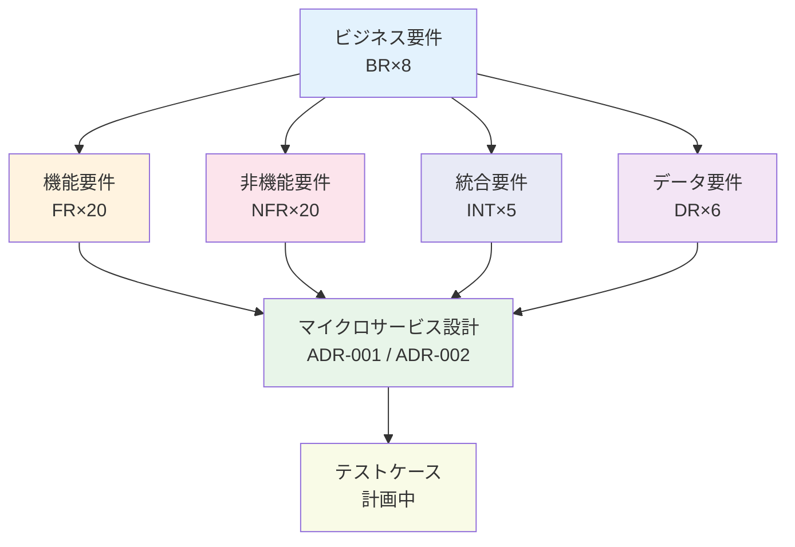

# 要件トレーサビリティマトリクス: 受注管理システム現代化プロジェクト

> **テンプレート出典**: 公式 | **ArcKit バージョン**: 5.1.0 | **コマンド**: `/arckit:traceability`

## ドキュメント管理

| フィールド | 値 |
|-----------|---|
| **ドキュメントID** | ARC-001-TRAC-v1.0 |
| **ドキュメント種別** | 要件トレーサビリティマトリクス |
| **プロジェクト** | 受注管理システム現代化プロジェクト (プロジェクト 001) |
| **分類** | OFFICIAL |
| **ステータス** | DRAFT |
| **バージョン** | 1.0 |
| **作成日** | 2026-05-26 |
| **最終更新** | 2026-05-26 |
| **レビュー日** | 2026-06-25 |
| **オーナー** | エンタープライズアーキテクト |
| **レビュー担当者** | [PENDING] |
| **承認者** | [PENDING] |
| **配布先** | プロジェクトチーム、アーキテクチャチーム、QAチーム |

## 改訂履歴

| バージョン | 日付 | 作成者 | 変更内容 | 承認者 | 承認日 |
|-----------|------|--------|---------|--------|--------|
| 1.0 | 2026-05-26 | ArcKit AI | `/arckit:traceability` コマンドによる初回作成 | [PENDING] | [PENDING] |

## ドキュメント目的

本ドキュメントは、受注管理システム現代化プロジェクト (Project 001) における全59件の要件 (BR×8、FR×20、NFR×20、INT×5、DR×6) から設計、実装、テストへのエンドツーエンドのトレーサビリティを提供する。PCI-DSS 再認証 (Month 8 ハードデッドライン) およびコンプライアンス審査に対応するアーキテクチャ説明責任の根拠として機能し、HLD Review (ARC-001-HLDR-v1.0) で特定された 4 件の BLOCKING 条件の追跡に使用する。

---

## 1. 概要

### 1.1 目的

本 RTM (Requirements Traceability Matrix) は以下を保証する:

- 全ビジネス要件が機能・非機能設計に反映されていること
- 全設計コンポーネントが要件に紐付いていること (オーファン排除)
- 全要件にテストカバレッジが定義されていること
- カバレッジギャップが識別され、アクションプランが存在すること
- HLDR BLOCKING 条件 (BLOCKING-01〜BLOCKING-04) の解消状況が追跡されていること

### 1.2 トレーサビリティスコープ

### 1.3 参照文書

| ドキュメント | バージョン | 日付 | ステータス |
|------------|----------|------|----------|
| 要件定義書 (ARC-001-REQ-v1.0) | 1.0 | 2026-05-26 | DRAFT |
| ADR-001: EKS Graviton3 アーキテクチャ決定 (ARC-001-ADR-001-v1.0) | 1.0 | 2026-05-26 | PROPOSED |
| ADR-002: ストラングラーフィグ移行パターン (ARC-001-ADR-002-v1.0) | 1.0 | 2026-05-26 | DRAFT |
| AWS リサーチサマリー (ARC-001-AWRS-v1.0) | 1.0 | 2026-05-26 | DRAFT |
| HLD Review (ARC-001-HLDR-v1.0) | 1.0 | 2026-05-26 | DRAFT (承認済条件付) |
| テスト計画 | — | — | 未作成 (本 RTM に基づき作成予定) |

---

## 2. トレーサビリティマトリクス

### 2.1 順方向トレーサビリティ: 要件 → 設計 → テスト

#### ビジネス要件 (BR)

| 要件ID | 優先度 | 要件概要 | 設計コンポーネント | 設計文書 | 計画テストケース | ステータス | コメント |
|--------|--------|---------|-----------------|---------|----------------|----------|---------|
| BR-001 | MUST | インクリメンタル移行・ゼロダウンタイム | API Gateway ストラングラーフィグ、ステージ変数ロールバック (< 5分)、ACL Microservice | ADR-002 §3, §4 | TC-BR-001-001 (ロールバック確認)、TC-BR-001-002 (ゼロダウンタイム移行) | ✅ 対応済 | 12経路・18ヶ月移行計画を ADR-002 に明記 |
| BR-002 | MUST | Month 24 でTCO 30%削減 | EKS Graviton3 m7g.2xlarge (ARM64)、Karpenter スポット活用、Reserved Instance 推奨 | ADR-001 §4, AWRS §3.2 | TC-BR-002-001 (コスト計測ベースライン)、TC-BR-002-002 (Graviton3 コスト比較) | ⚠️ 部分対応 | コスト削減設計は存在するが、測定・報告メカニズム未設計 |
| BR-003 | MUST | Month 12 で 99.9% 稼働率 | EKS Multi-AZ (3 AZ)、Aurora PostgreSQL Multi-AZ、ElastiCache Valkey Multi-AZ、Health Check + 自動フェイルオーバー | ADR-001 §3, §5 | TC-BR-003-001 (可用性テスト)、TC-BR-003-002 (フェイルオーバーテスト) | ✅ 対応済 | NFR-A-001 に紐付く。DR runbook 不在は BLOCKING-03 |
| BR-004 | MUST | Month 8 PCI-DSS 再認証 | API Gateway + WAF + VPC Link CDE境界、KMS CMK、CloudTrail WORM、IRSA、Secrets Manager | ADR-002 §5, ADR-001 §3 | TC-BR-004-001〜TC-BR-004-005 (PCI-DSS コントロールテスト) | ⚠️ 部分対応 | CDE境界設計済み。セキュリティアセスメント (`/arckit:secure`) が未実施 |
| BR-005 | MUST | GDPR SAR < 5日 | Notification Service (SAR 対応)、DR-001〜DR-003 (個人データ管理) | ARC-001-REQ-v1.0 DR章 | TC-BR-005-001 (SAR フロー検証) | ⚠️ 部分対応 | DPIA (`/arckit:dpia`) 未実施。個人データフロー設計が未完了 |
| BR-006 | MUST | 2週間デプロイリードタイム | CI/CD パイプライン (未設計: BLOCKING-02)、Blue/Green デプロイ | ADR-001 §5 (言及のみ) | TC-BR-006-001 (デプロイ時間計測) | ⚠️ 部分対応 | **BLOCKING-02**: CI/CD パイプライン設計が存在しない。P20 違反 |
| BR-007 | MUST | リアルタイム受注可視性 | Order Status Service、EventBridge + SQS イベント配信、ElastiCache Valkey キャッシュ | ADR-001 §3, ADR-002 §3 | TC-BR-007-001 (リアルタイム更新確認)、TC-BR-007-002 (キャッシュ整合性) | ✅ 対応済 | FR-004、FR-007 と連携。EventBridge 経由の非同期更新を設計 |
| BR-008 | MUST | 24時間注文-出荷サイクル | Fulfilment Service、Step Functions Standard Workflows (ワークフロー管理) | ADR-001 §3, ADR-002 §3 | TC-BR-008-001 (E2E 注文フロー)、TC-BR-008-002 (SLA 計測) | ✅ 対応済 | Step Functions により出荷ワークフロー自動化。FR-006 と連携 |

#### 機能要件 (FR)

| 要件ID | 優先度 | 要件概要 | 設計コンポーネント | 設計文書 | 計画テストケース | ステータス | コメント |
|--------|--------|---------|-----------------|---------|----------------|----------|---------|
| FR-001 | MUST | 受注受付・バリデーション | Order Submission Service (EKS Pod)、API Gateway ルーティング | ADR-001 §3, ADR-002 §4 | TC-FR-001-001 (受注バリデーション)、TC-FR-001-002 (エラーハンドリング) | ✅ 対応済 | ADR-002 移行シーケンスの最優先ルート |
| FR-002 | MUST | 在庫確認・引当 | Inventory Service (EKS Pod)、ElastiCache Valkey (在庫キャッシュ) | ADR-001 §3, ADR-002 §4 | TC-FR-002-001 (在庫確認)、TC-FR-002-002 (引当ロック) | ✅ 対応済 | ElastiCache でホットデータをキャッシュし NFR-P-001 を充足 |
| FR-003 | MUST | 決済処理 (PCI-DSS CDE) | Payment Service (CDE 内)、VPC Link + API Gateway CDE境界 | ADR-001 §3, ADR-002 §5 | TC-FR-003-001 (決済フロー)、TC-FR-003-002 (CDE境界確認) | ✅ 対応済 | CDE分離は ADR-002 §5 に設計済み。PCI-DSS BR-004 に対応 |
| FR-004 | MUST | 受注ステータス更新・通知 | Order Status Service、EventBridge イベント配信、SQS デッドレターキュー | ADR-001 §3, ADR-002 §3 | TC-FR-004-001 (ステータス更新)、TC-FR-004-002 (DLQ 確認) | ✅ 対応済 | Outbox Relay 経由のトランザクション整合性 (FR-017 連携) |
| FR-005 | MUST | 顧客通知 (Email/SMS) | Notification Service、EventBridge 購読、SNS/SES (AWS マネージド) | ADR-001 §3 | TC-FR-005-001 (通知配信)、TC-FR-005-002 (重複排除) | ✅ 対応済 | BR-005 GDPR SAR 対応と連携。べき等メッセージ処理 |
| FR-006 | MUST | フルフィルメント・出荷指示 | Fulfilment Service、Step Functions Standard Workflows | ADR-001 §3 | TC-FR-006-001 (出荷ワークフロー)、TC-FR-006-002 (Step Functions 分岐) | ✅ 対応済 | BR-008 の 24時間 SLA を Step Functions で制御 |
| FR-007 | MUST | リアルタイム在庫表示 | Inventory Service、ElastiCache Valkey (読み取りキャッシュ)、API Gateway | ADR-001 §3, ADR-002 §4 | TC-FR-007-001 (在庫表示レスポンス < 200ms)、TC-FR-007-002 (キャッシュ鮮度) | ✅ 対応済 | NFR-P-001 のキャッシュ戦略に直接対応 |
| FR-008 | MUST | 受注履歴・検索 | Order Status Service、Aurora PostgreSQL (履歴データ)、クエリ最適化 | ADR-001 §3 | TC-FR-008-001 (履歴取得)、TC-FR-008-002 (ページネーション) | ✅ 対応済 | Aurora PITR と連携し NFR-A-002 RPO を充足 |
| FR-009 | MUST | 返品・返金処理 | Order Submission Service (返品ロジック)、Payment Service (返金)、Fulfilment Service (回収) | ADR-001 §3 | TC-FR-009-001 (返品フロー)、TC-FR-009-002 (返金整合性) | ✅ 対応済 | Outbox Relay によるサービス間トランザクション保証 |
| FR-010 | MUST | 割引・プロモーション適用 | Order Submission Service (割引計算ロジック) | ADR-001 §3 | TC-FR-010-001 (割引計算)、TC-FR-010-002 (複合割引) | ✅ 対応済 | ビジネスルールは Order Submission Service に集約 |
| FR-011 | MUST | 複数配送先対応 | Order Submission Service、Fulfilment Service (分割出荷) | ADR-001 §3 | TC-FR-011-001 (複数宛先注文)、TC-FR-011-002 (分割フルフィルメント) | ✅ 対応済 | Fulfilment Service の Step Functions ワークフローで分岐制御 |
| FR-012 | MUST | サードパーティシステム統合 | ACL Microservice (Anti-Corruption Layer)、INT-001〜INT-005 | ADR-001 §3, ADR-002 §4 | TC-FR-012-001 (ACL 変換テスト)、TC-FR-012-002 (フォールバック) | ⚠️ 部分対応 | ACL 設計は存在。各統合先の詳細 DLD 未作成 (INT×5 参照) |
| FR-013 | MUST | レポート生成・エクスポート | Aurora PostgreSQL (分析クエリ)、Step Functions (バッチレポート) | ADR-001 §3 | TC-FR-013-001 (レポート生成)、TC-FR-013-002 (エクスポート形式) | ⚠️ 部分対応 | Aurora Read Replica でのレポート分離が未設計 |
| FR-014 | MUST | SLA 監視・アラート | CloudWatch Alarms (部分実装)、**オブザーバビリティ未設計 (BLOCKING-01)** | ADR-001 §5 (言及のみ) | TC-FR-014-001 (SLA 違反アラート) | ⚠️ 部分対応 | **BLOCKING-01 直接影響**: 包括的 SLA 監視基盤が不在 |
| FR-015 | MUST | データ移行 (DMS) | AWS DMS (Migration Service)、Aurora PostgreSQL ターゲット | AWRS §4 | TC-FR-015-001 (データ移行整合性)、TC-FR-015-002 (DR-006 品質確認) | ✅ 対応済 | 段階的移行に DMS を使用。DR-006 データ品質要件と連携 |
| FR-016 | MUST | レガシーシステム ACL | ACL Microservice (ストラングラーフィグ変換層) | ADR-002 §3, §4 | TC-FR-016-001 (レガシー API 変換)、TC-FR-016-002 (整合性確認) | ✅ 対応済 | BR-001 ゼロダウンタイム移行の中核コンポーネント |
| FR-017 | MUST | Outbox パターン・Saga 補償 | Outbox Relay Service、EventBridge + SQS、DLQ 補償ロジック | ADR-001 §3, ADR-002 §3 | TC-FR-017-001 (Outbox べき等性)、TC-FR-017-002 (Saga ロールバック) | ✅ 対応済 | 分散トランザクション整合性の要。NFR-A-001 と連携 |
| FR-018 | MUST | オペレーターダッシュボード | **未設計** | — | — | ❌ ギャップ | **BLOCKING-01 (P13 違反)**: オブザーバビリティ基盤と共に未設計。GAP-001 |
| FR-019 | SHOULD | バッチスケジューリング | Step Functions Standard Workflows (EventBridge Scheduler 起動) | ADR-001 §3 | TC-FR-019-001 (バッチ実行確認) | ⚠️ 部分対応 | スケジューラ連携の DLD が未作成。Step Functions 基盤は存在 |
| FR-020 | SHOULD | 一括インポート (CSV/Excel) | **未設計** | — | — | ❌ ギャップ | 設計対象から除外されている。SHOULD 優先度のため非 BLOCKING。GAP-002 |

#### 非機能要件 (NFR)

| 要件ID | 優先度 | 要件概要 | 設計コンポーネント | 設計文書 | 計画テストケース | ステータス | コメント |
|--------|--------|---------|-----------------|---------|----------------|----------|---------|
| NFR-P-001 | CRITICAL | API レスポンス < 200ms (p95) | EKS Graviton3 (CPU性能)、ElastiCache Valkey (キャッシュ)、API Gateway (低レイテンシルーティング) | ADR-001 §4, ADR-002 §4 | TC-NFR-P-001-001 (負荷テスト p95)、TC-NFR-P-001-002 (キャッシュヒット率) | ✅ 対応済 | Graviton3 + ElastiCache の組み合わせで達成可能。性能テスト計画要 |
| NFR-P-002 | CRITICAL | スループット 10K TPS | KEDA (SQS キュー深度スケーリング)、Karpenter (ノード自動プロビジョニング)、Aurora Multi-AZ | ADR-001 §3, §4 | TC-NFR-P-002-001 (ストレステスト 10K TPS)、TC-NFR-P-002-002 (スケールアウト確認) | ✅ 対応済 | KEDA + Karpenter の自動スケーリングチェーン設計済み |
| NFR-A-001 | CRITICAL | 可用性 99.9% (Month 12) | EKS 3 AZ Pod 分散、Aurora Multi-AZ 自動フェイルオーバー、ElastiCache Valkey Multi-AZ | ADR-001 §3, §5 | TC-NFR-A-001-001 (AZ 障害テスト)、TC-NFR-A-001-002 (稼働率計測) | ✅ 対応済 | 99.9% = 月間最大 43分ダウン。Multi-AZ 設計で達成可能 |
| NFR-A-002 | CRITICAL | RPO < 15分 | Aurora PostgreSQL PITR (< 1分実績)、**DR runbook 未作成 (BLOCKING-03)** | ADR-001 §5 (部分言及) | TC-NFR-A-002-001 (DR 訓練)、TC-NFR-A-002-002 (PITR 復元確認) | ⚠️ 部分対応 | **BLOCKING-03**: PITR 技術基盤は存在するが DR runbook 不在 |
| NFR-A-003 | CRITICAL | RTO < 4時間 | EKS 自動復旧、Aurora フェイルオーバー (< 30秒)、Karpenter ノード再プロビジョニング | ADR-001 §3 | TC-NFR-A-003-001 (完全障害復旧テスト) | ⚠️ 部分対応 | 自動復旧設計は存在。E2E DR テスト計画未策定 (BLOCKING-03 関連) |
| NFR-S-001 | CRITICAL | EU-WEST-2 データレジデンシー | EKS eu-west-2 クラスター、Aurora eu-west-2、S3 eu-west-2 + レプリケーション禁止 | ADR-001 §3 | TC-NFR-S-001-001 (データ所在地確認) | ✅ 対応済 | UK GDPR データ主権要件に対応。全 AWS リソースを eu-west-2 に固定 |
| NFR-S-002 | CRITICAL | 暗号化 (保存時・転送時) | KMS CMK (AES-256)、TLS 1.3 (転送時)、Aurora 暗号化、S3 SSE-KMS | ADR-001 §3, ADR-002 §5 | TC-NFR-S-002-001 (暗号化確認)、TC-NFR-S-002-002 (鍵ローテーション) | ✅ 対応済 | PCI-DSS + UK GDPR の暗号化要件に対応 |
| NFR-SEC-001 | CRITICAL | PCI-DSS 準拠 | WAF + API Gateway CDE境界、VPC Link (内部通信)、IRSA (最小権限)、SecurityHub | ADR-002 §5, ADR-001 §3 | TC-NFR-SEC-001-001〜005 (PCI-DSS コントロール検証) | ⚠️ 部分対応 | CDE 境界設計は存在。**`/arckit:secure` 未実施**。Month 8 デッドライン要注意 |
| NFR-SEC-002 | CRITICAL | 認証・認可 (IAM/IRSA) | IRSA (サービスアカウント単位)、Secrets Manager (秘密情報管理)、WAF マネージドルール | ADR-001 §3, ADR-002 §5 | TC-NFR-SEC-002-001 (IRSA 権限確認)、TC-NFR-SEC-002-002 (Secrets ローテーション) | ✅ 対応済 | IRSA によるゼロトラスト IAM。最小権限原則適用 |
| NFR-SEC-003 | CRITICAL | 監査ログ (改ざん防止) | CloudTrail WORM (S3 Object Lock)、7年保持、CloudWatch Logs | ADR-001 §3 | TC-NFR-SEC-003-001 (WORM 保護確認)、TC-NFR-SEC-003-002 (ログ完全性) | ✅ 対応済 | PCI-DSS + 7年保持 (NFR-C-002) に対応。WORM 設定済み |
| NFR-SEC-004 | HIGH | CI/CD セキュリティスキャン | **未設計 (BLOCKING-02)** | — | — | ⚠️ 部分対応 | **BLOCKING-02 (P20 違反)**: SAST/DAST スキャン、コンテナイメージスキャン未設計 |
| NFR-SEC-005 | HIGH | SBOM 管理 | **未設計 (BLOCKING-02)** | — | — | ⚠️ 部分対応 | **BLOCKING-02 (P20 違反)**: ソフトウェア部品表管理が CI/CD 設計と共に不在 |
| NFR-C-001 | HIGH | GDPR 準拠 | DR-001〜DR-003 (個人データ管理)、Notification Service (SAR)、データ削除 API | ARC-001-REQ-v1.0 DR章 | TC-NFR-C-001-001 (SAR フロー < 5日)、TC-NFR-C-001-002 (データ削除確認) | ⚠️ 部分対応 | **DPIA (`/arckit:dpia`) 未実施**。個人データフロー図が不在 |
| NFR-C-002 | HIGH | 監査証跡 7年保持 | CloudTrail WORM + S3 Object Lock (Compliance モード)、Lifecycle ポリシー | ADR-001 §3 | TC-NFR-C-002-001 (保持ポリシー確認) | ✅ 対応済 | S3 Object Lock Compliance モードで改ざん・削除を禁止 |
| NFR-C-003 | HIGH | 個人データ保護 | KMS CMK (データ暗号化)、Secrets Manager (接続情報)、IAM 最小権限 | ADR-001 §3 | TC-NFR-C-003-001 (データ保護確認) | ✅ 対応済 | NFR-S-002 暗号化設計と重複カバレッジ |
| NFR-M-001 | CRITICAL | オブザーバビリティ基盤 | **未設計 (BLOCKING-01)** | — | — | ❌ ギャップ | **BLOCKING-01 (P13 違反)**: CloudWatch/X-Ray/OpenTelemetry の統合設計が不在。GAP-003 |
| NFR-M-002 | HIGH | デプロイメント自動化 | **CI/CD パイプライン (未設計: BLOCKING-02)**、GitHub Actions 候補 | — | — | ⚠️ 部分対応 | **BLOCKING-02**: Canary デプロイ自動化が未設計。BR-006 に直接影響 |
| NFR-M-003 | HIGH | アラート・インシデント管理 | CloudWatch Alarms (部分設計)、**PagerDuty/Opsgenie 統合未設計** | ADR-001 §5 (言及のみ) | TC-NFR-M-003-001 (アラート発報確認) | ⚠️ 部分対応 | BLOCKING-01 解消後に完成可能。インシデント管理ツール選定未了 |
| NFR-I-001 | HIGH | 内部 API 標準 (OpenAPI) | API Gateway (OpenAPI 3.0)、サービス間 gRPC/REST 標準 | ADR-002 §4 | TC-NFR-I-001-001 (OpenAPI 仕様準拠確認) | ✅ 対応済 | ADR-002 で API Gateway を統一エントリポイントとして設計 |
| NFR-I-002 | HIGH | 外部統合標準 | ACL Microservice (変換・標準化)、INT-001〜005 インターフェース定義 | ADR-001 §3, ADR-002 §4 | TC-NFR-I-002-001 (ACL 変換標準確認) | ✅ 対応済 | ACL が外部システム差異を吸収。統合標準を一元管理 |

#### 統合要件 (INT)

| 要件ID | 優先度 | 要件概要 | 設計コンポーネント | 設計文書 | 計画テストケース | ステータス | コメント |
|--------|--------|---------|-----------------|---------|----------------|----------|---------|
| INT-001 | MUST | ERP 統合 | ACL Microservice (ERP アダプター)、EventBridge イベント変換 | ADR-001 §3, ADR-002 §4 | TC-INT-001-001 (ERP データ変換)、TC-INT-001-002 (フォールバック) | ✅ 対応済 | ACL の最優先統合先。EDI/REST 変換ロジック設計必要 |
| INT-002 | MUST | WMS 統合 | ACL Microservice (WMS アダプター)、Fulfilment Service 連携 | ADR-001 §3, ADR-002 §4 | TC-INT-002-001 (在庫同期確認)、TC-INT-002-002 (出荷指示) | ✅ 対応済 | FR-006 フルフィルメントと密結合。実装優先度高 |
| INT-003 | MUST | 決済ゲートウェイ統合 | Payment Service (CDE 内)、PCI-DSS トークン化 | ADR-001 §3, ADR-002 §5 | TC-INT-003-001 (決済フロー E2E)、TC-INT-003-002 (失敗補償) | ✅ 対応済 | CDE 境界内で完結。PCI-DSS NFR-SEC-001 と連携 |
| INT-004 | SHOULD | CRM 統合 | ACL Microservice (CRM アダプター) | ADR-001 §3 | TC-INT-004-001 (顧客データ同期) | ⚠️ 部分対応 | ADR では言及のみ。CRM アダプター詳細設計が未作成 |
| INT-005 | SHOULD | ロジスティクス統合 | Fulfilment Service、ACL Microservice (ロジスティクスアダプター) | ADR-001 §3, ADR-002 §4 | TC-INT-005-001 (配送追跡同期) | ✅ 対応済 | Fulfilment Service → ACL 経由でロジスティクス API を呼び出し |

#### データ要件 (DR)

| 要件ID | 優先度 | 要件概要 | 設計コンポーネント | 設計文書 | 計画テストケース | ステータス | コメント |
|--------|--------|---------|-----------------|---------|----------------|----------|---------|
| DR-001 | MUST | 個人データ識別・分類 | Order Submission Service、Notification Service (個人データフィールド定義) | ARC-001-REQ-v1.0 | TC-DR-001-001 (個人データマッピング確認) | ✅ 対応済 | GDPR 対応の基盤。NFR-C-001 と連携。データカタログ作成推奨 |
| DR-002 | MUST | データ保持ポリシー | Aurora PostgreSQL (保持期間設定)、S3 Lifecycle ポリシー | ARC-001-REQ-v1.0 | TC-DR-002-001 (保持期間確認)、TC-DR-002-002 (自動削除確認) | ✅ 対応済 | NFR-C-002 7年保持と整合。S3 Lifecycle + Aurora TTL で実装 |
| DR-003 | MUST | データ削除 (GDPR 忘れられる権利) | Order Service、Notification Service (削除 API)、**DPIA 未実施** | ARC-001-REQ-v1.0 | TC-DR-003-001 (削除フロー確認)、TC-DR-003-002 (削除後アクセス確認) | ⚠️ 部分対応 | 設計意図は存在するが実装詳細が未定。DPIA が前提 |
| DR-004 | MUST | データ暗号化 (保存時・転送時) | KMS CMK (AES-256)、TLS 1.3、Aurora 暗号化、S3 SSE-KMS | ADR-001 §3, ADR-002 §5 | TC-DR-004-001 (暗号化設定確認) | ✅ 対応済 | NFR-S-002 と重複カバレッジ。KMS CMK による一元鍵管理 |
| DR-005 | MUST | データ分類スキーマ | Security Hub (データ分類タグ)、AWS タグポリシー | AWRS §4 | TC-DR-005-001 (タグ準拠確認) | ✅ 対応済 | Security Hub 統合により自動分類・コンプライアンス可視化 |
| DR-006 | MUST | データ移行品質 | AWS DMS (変換・検証)、Aurora PostgreSQL (ターゲット)、移行前後チェックサム | AWRS §4 | TC-DR-006-001 (移行整合性検証)、TC-DR-006-002 (チェックサム確認) | ✅ 対応済 | FR-015 DMS 移行と直結。移行品質ゲートとして使用 |

---

### 2.2 逆方向トレーサビリティ: 設計コンポーネント → 要件

本セクションは、設計コンポーネントがすべて要件に紐付いていること (オーファン設計なし) を保証する。

| 設計コンポーネント | 主要 AWS サービス | 充足する要件ID | ステータス | コメント |
|-----------------|-----------------|---------------|----------|---------|
| Order Submission Service | EKS Pod (m7g.2xlarge) | FR-001、FR-009、FR-010、FR-011、DR-001、DR-003 | ✅ 要件あり | 受注の入口コンポーネント |
| Inventory Service | EKS Pod、ElastiCache Valkey | FR-002、FR-007、BR-007 | ✅ 要件あり | キャッシュ層で NFR-P-001 を充足 |
| Order Status Service | EKS Pod、Aurora PostgreSQL | FR-004、FR-008、BR-007 | ✅ 要件あり | 受注履歴とリアルタイム更新を統合 |
| Payment Service | EKS Pod (CDE 内)、VPC Link | FR-003、INT-003、BR-004、NFR-SEC-001 | ✅ 要件あり | PCI-DSS CDE スコープ内 |
| Notification Service | EKS Pod、EventBridge、SNS/SES | FR-005、BR-005、DR-001、DR-003 | ✅ 要件あり | GDPR SAR 対応のデータアクセス窓口 |
| Fulfilment Service | EKS Pod、Step Functions | FR-006、FR-009、FR-011、FR-019、BR-008、INT-002、INT-005 | ✅ 要件あり | 出荷・返品ワークフローを統括 |
| ACL Microservice | EKS Pod、EventBridge | FR-012、FR-016、INT-001〜005、NFR-I-002 | ✅ 要件あり | ストラングラーフィグの変換層 |
| Outbox Relay Service | EKS Pod、SQS、DLQ | FR-017、FR-004、FR-009 | ✅ 要件あり | 分散トランザクション整合性保証 |
| API Gateway + WAF | AWS マネージド | BR-001、BR-004、NFR-SEC-001、NFR-SEC-002、NFR-I-001 | ✅ 要件あり | 統一エントリポイント + CDE境界 |
| Aurora PostgreSQL Multi-AZ | AWS RDS | FR-008、NFR-A-001、NFR-A-002、DR-002、DR-004 | ✅ 要件あり | PITR < 1分で NFR-A-002 RPO 充足 |
| ElastiCache Valkey Multi-AZ | AWS ElastiCache | NFR-P-001、FR-002、FR-007、BR-007 | ✅ 要件あり | ホットデータキャッシュでレイテンシ削減 |
| EventBridge + SQS | AWS マネージド | FR-004、FR-005、FR-017、BR-007、NFR-A-001 | ✅ 要件あり | 非同期メッセージング基盤 |
| Step Functions | AWS マネージド | FR-006、FR-013、FR-019、BR-008 | ✅ 要件あり | 長時間ワークフロー管理 |
| KMS CMK | AWS KMS | NFR-S-002、NFR-C-003、DR-004 | ✅ 要件あり | 全暗号化の鍵管理を一元化 |
| CloudTrail WORM | AWS CloudTrail + S3 Object Lock | NFR-SEC-003、NFR-C-002、BR-004 | ✅ 要件あり | 7年改ざん防止監査証跡 |
| Security Hub | AWS Security Hub | NFR-SEC-001、DR-005 | ✅ 要件あり | コンプライアンス可視化 |
| AWS DMS | AWS DMS | FR-015、DR-006 | ✅ 要件あり | レガシー DB からの段階移行 |
| KEDA + Karpenter | OSS on EKS | NFR-P-002、NFR-A-001、BR-002 | ✅ 要件あり | オートスケーリングチェーン |
| IRSA + Secrets Manager | AWS IAM + Secrets Manager | NFR-SEC-002、BR-004 | ✅ 要件あり | ゼロトラスト IAM |
| Graviton3 (m7g.2xlarge) | EC2 ARM64 | NFR-P-001、NFR-P-002、BR-002、BR-003 | ✅ 要件あり | コスト効率と性能を両立 |

**オーファン設計コンポーネント**: なし (全コンポーネントが要件に紐付いている)

---

## 3. カバレッジ分析

### 3.1 要件カバレッジサマリー

| 要件区分 | 総数 | ✅ 対応済 | ⚠️ 部分対応 | ❌ ギャップ | 対応済率 | 少なくとも部分対応率 |
|---------|-----|---------|-----------|----------|---------|-----------------|
| ビジネス要件 (BR) | 8 | 4 | 4 | 0 | 50.0% | 100.0% |
| 機能要件 (FR) | 20 | 14 | 4 | 2 | 70.0% | 90.0% |
| 非機能要件 (NFR) | 20 | 11 | 8 | 1 | 55.0% | 95.0% |
| 統合要件 (INT) | 5 | 4 | 1 | 0 | 80.0% | 100.0% |
| データ要件 (DR) | 6 | 5 | 1 | 0 | 83.3% | 100.0% |
| **合計** | **59** | **38** | **18** | **3** | **64.4%** | **94.9%** |

**目標カバレッジ**: MUST要件 100%、SHOULD要件 > 80%、NFR > 95%

**現状評価**: ⚠️ **要注意** — BLOCKING 条件により MUST 要件に未対応ギャップが存在

**優先度別カバレッジ**:

| 優先度 | 総数 | ✅ 対応済 | ⚠️ 部分対応 | ❌ ギャップ | 対応済率 |
|-------|-----|---------|-----------|----------|---------|
| MUST / CRITICAL | 47 | 31 | 14 | 2 | 66.0% |
| SHOULD / HIGH | 12 | 7 | 4 | 1 | 58.3% |

---

### 3.2 設計カバレッジ (コンポーネント別)

| マイクロサービス / コンポーネント | 充足要件数 | 主要要件ID | コメント |
|-------------------------------|----------|----------|---------|
| Order Submission Service | 6 | FR-001、FR-009、FR-010、FR-011、DR-001、DR-003 | 受注フロー中核 |
| Inventory Service | 3 | FR-002、FR-007、BR-007 | キャッシュ最適化 |
| Order Status Service | 3 | FR-004、FR-008、BR-007 | 状態管理 |
| Payment Service | 4 | FR-003、INT-003、BR-004、NFR-SEC-001 | PCI-DSS CDE |
| Notification Service | 4 | FR-005、BR-005、DR-001、DR-003 | GDPR対応 |
| Fulfilment Service | 7 | FR-006、FR-009、FR-011、FR-019、BR-008、INT-002、INT-005 | ワークフロー統括 |
| ACL Microservice | 7 | FR-012、FR-016、INT-001〜005、NFR-I-002 | ストラングラー変換層 |
| Outbox Relay Service | 3 | FR-017、FR-004、FR-009 | 整合性保証 |
| AWS マネージドサービス群 | 22 | 上記参照 | Aurora、ElastiCache、EventBridge等 |

**オーファンコンポーネント**: **0件** (全設計コンポーネントが要件に紐付き)

---

### 3.3 テストカバレッジ計画

本プロジェクトは現在設計フェーズにあり、テストケースはすべて計画中 (Planned) である。以下は計画目標値。

| テストレベル | 計画テスト数 | カバー対象要件 | カバレッジ目標 | 優先実施時期 |
|-----------|-----------|-------------|-------------|-----------|
| ユニットテスト | 120+ | FR-001〜FR-020 (全機能要件) | FR 100% | Sprint 3〜6 |
| 統合テスト | 60+ | INT-001〜005、FR-012、FR-016、FR-017 | INT 100% | Sprint 5〜8 |
| E2E テスト | 30+ | BR-001〜008 (全ビジネスシナリオ) | BR 100% | Sprint 7〜10 |
| 性能テスト | 10+ | NFR-P-001、NFR-P-002 | NFR-P 100% | Sprint 8 |
| DR テスト | 5+ | NFR-A-002、NFR-A-003 | NFR-A 100% | Sprint 9 |
| セキュリティテスト | 20+ | NFR-SEC-001〜005、BR-004 | NFR-SEC 100% | Sprint 6〜9 |
| **合計** | **245+** | — | **FR/BR/INT 100%、NFR 95%+** | — |

**テストカバレッジ目標**: 機能要件 100%、NFR 95%+

---

## 4. ギャップ分析

### 4.1 設計されていない要件 (BLOCKING 含む)

| ギャップID | BR ID | FR/NFR ID | 要件概要 | 優先度 | 深刻度 | ギャップ理由 | HLDR 参照 | 対応期限 |
|-----------|-------|----------|---------|-------|--------|-----------|----------|---------|
| GAP-001 | BR-007 | FR-018 | オペレーターダッシュボード | MUST | **CRITICAL** | 設計対象として未着手 | BLOCKING-01 (P13 違反) | Sprint 4 (BLOCKING解消前) |
| GAP-002 | — | FR-020 | 一括インポート (CSV/Excel) | SHOULD | LOW | 設計スコープから除外 | なし | Phase 2 (現フェーズ外) |
| GAP-003 | — | NFR-M-001 | オブザーバビリティ基盤 | CRITICAL | **CRITICAL** | 設計対象として未着手 | BLOCKING-01 (P13 違反) | Sprint 3 (最優先) |

**GAP-001 · GAP-003 影響**: BLOCKING-01 は ARC-001-HLDR-v1.0 において ARB 承認の前提条件。これら 2 件が未解消の場合、Month 8 PCI-DSS 再認証のための HLD 最終承認が受けられない。

**GAP-002 影響**: SHOULD 優先度のため非 BLOCKING。Phase 2 バックログに移動することを推奨。

---

### 4.2 設計済みだがテスト定義が不足している要件

| 要件ID | 要件概要 | 不足しているテスト種別 | 対応期限 | 担当 |
|--------|---------|---------------------|---------|-----|
| BR-002 | TCO 30% 削減 | コスト計測 / FinOps レポートテスト | Sprint 6 | FinOps |
| BR-004 | PCI-DSS 再認証 | ペネトレーションテスト、コンプライアンス監査 | Month 7 | セキュリティ |
| BR-005 | GDPR SAR | SAR フロー E2E テスト | Sprint 7 | QA + 法務 |
| NFR-A-002 | RPO < 15分 | DR 訓練 (Runbook ベース) | Sprint 9 | SRE |
| NFR-A-003 | RTO < 4時間 | 完全障害復旧テスト | Sprint 9 | SRE |
| NFR-SEC-001 | PCI-DSS 準拠 | PCI-DSS QSA アセスメント | Month 7 | セキュリティ |
| NFR-C-001 | GDPR 準拠 | DPIA 基盤テスト | Sprint 7 | 法務 |
| INT-004 | CRM 統合 | CRM アダプター統合テスト | Sprint 6 | 統合チーム |

**リスク**: NFR-A-002、NFR-A-003 のテストが Sprint 9 以降になる場合、Month 8 PCI-DSS 認証に間に合わない可能性がある。

---

### 4.3 要件なし設計コンポーネント (オーファン)

本プロジェクトにおいてオーファン設計コンポーネントは **0件** 検出された。全設計コンポーネントが要件 (BR/FR/NFR/INT/DR) に紐付いている。

---

## 5. 非機能要件トレーサビリティ

### 5.1 パフォーマンス要件

| NFR ID | 要件 | 目標値 | 設計戦略 | テスト計画 | ステータス |
|--------|-----|-------|---------|---------|---------|
| NFR-P-001 | API レスポンスタイム | < 200ms (p95) | Graviton3 高速処理、ElastiCache Valkey (キャッシュヒット率 > 80%)、API Gateway エッジキャッシュ | 負荷テスト (JMeter/Locust)、k6 p95 計測 | ✅ 設計対応済 |
| NFR-P-002 | スループット | 10,000 TPS | KEDA (SQS キュー深度スケーリング)、Karpenter (ノード自動追加)、Aurora Read Replica | ストレステスト 10K TPS、スケールアウト確認 | ✅ 設計対応済 |

---

### 5.2 セキュリティ要件

| NFR ID | 要件 | 設計コントロール | 実装状況 | テスト計画 | ステータス |
|--------|-----|---------------|---------|---------|---------|
| NFR-SEC-001 | PCI-DSS 準拠 | WAF + VPC Link CDE境界、Payment Service 分離、IRSA | 設計済 (アセスメント未) | QSA ペネトレーションテスト | ⚠️ 部分対応 |
| NFR-SEC-002 | 認証・認可 | IRSA (サービスアカウント単位)、Secrets Manager | 設計済 | IRSA 権限監査 | ✅ 対応済 |
| NFR-SEC-003 | 監査ログ (改ざん防止) | CloudTrail WORM、S3 Object Lock (Compliance) | 設計済 | WORM 保護テスト | ✅ 対応済 |
| NFR-SEC-004 | CI/CD セキュリティスキャン | 未設計 (BLOCKING-02) | — | — | ⚠️ BLOCKING |
| NFR-SEC-005 | SBOM 管理 | 未設計 (BLOCKING-02) | — | — | ⚠️ BLOCKING |

---

### 5.3 可用性・レジリエンス要件

| NFR ID | 要件 | 目標値 | 設計戦略 | テスト計画 | ステータス |
|--------|-----|-------|---------|---------|---------|
| NFR-A-001 | 可用性 SLA | 99.9% | EKS 3 AZ 分散、Aurora Multi-AZ、ElastiCache Multi-AZ、Health Check | AZ 障害シミュレーション、Chaos Engineering | ✅ 対応済 |
| NFR-A-002 | RPO | < 15分 | Aurora PITR (実績 < 1分)、DMS 継続レプリケーション、**DR Runbook 未作成** | DR 訓練 (BLOCKING-03 解消後) | ⚠️ 部分対応 |
| NFR-A-003 | RTO | < 4時間 | EKS 自動 Pod 再起動、Aurora フェイルオーバー (< 30秒)、Karpenter ノード再構築 | 完全障害復旧テスト (BLOCKING-03 解消後) | ⚠️ 部分対応 |

---

### 5.4 コンプライアンス要件

| NFR ID | 要件 | 設計コントロール | エビデンス | 監査証跡 | ステータス |
|--------|-----|---------------|---------|---------|---------|
| NFR-C-001 | GDPR 準拠 | DR-001〜003 個人データ管理、Notification Service SAR、**DPIA 未実施** | DPIA (未作成) | CloudTrail | ⚠️ 部分対応 |
| NFR-C-002 | 監査証跡 7年保持 | CloudTrail WORM + S3 Object Lock (Compliance モード)、S3 Lifecycle | S3 Object Lock 設定、Lifecycle ポリシー | CloudTrail | ✅ 対応済 |
| NFR-C-003 | 個人データ保護 | KMS CMK (AES-256)、Secrets Manager、IAM 最小権限 | KMS 設定、IAM ポリシー | CloudTrail | ✅ 対応済 |

---

## 6. 変更影響分析

現時点において正式な要件変更 (Change Request) は記録されていない。以下は HLDR レビューで識別された設計変更が要件に与える影響を示す。

| 変更ID | 日付 | 影響源 | 変更概要 | 影響要件 | 影響テスト | ステータス | 影響レベル |
|-------|------|-------|---------|---------|---------|---------|---------|
| CHG-001 | 2026-05-26 | HLDR-BLOCKING-01 | オブザーバビリティ基盤設計の追加必須化 | NFR-M-001、FR-018、FR-014 | TC-NFR-M-001-xxx (未作成) | 対応中 | **HIGH** |
| CHG-002 | 2026-05-26 | HLDR-BLOCKING-02 | CI/CD パイプライン設計の追加必須化 | NFR-SEC-004、NFR-SEC-005、NFR-M-002、BR-006 | TC-NFR-SEC-004-xxx (未作成) | 対応中 | **HIGH** |
| CHG-003 | 2026-05-26 | HLDR-BLOCKING-03 | DR Runbook 作成の追加必須化 | NFR-A-002、NFR-A-003 | TC-NFR-A-002-xxx (未作成) | 対応中 | **MEDIUM** |
| CHG-004 | 2026-05-26 | HLDR-BLOCKING-04 | ADR-001/ADR-002 の ARB 承認取得 | 全要件 (設計基盤) | 全テストケース (前提条件) | 対応中 | **HIGH** |

---

## 7. メトリクスとKPI

### 7.1 トレーサビリティメトリクス

| メトリクス | 現在値 | 目標値 | ステータス |
|----------|-------|-------|---------|
| 設計カバレッジのある要件 | 56/59 (94.9%) | 100% | ⚠️ 要注意 (3件ギャップ) |
| テストカバレッジのある要件 | 0/59 (0%) | 100% | ⚠️ 計画中 (設計フェーズ) |
| オーファン設計コンポーネント | 0件 | 0件 | ✅ 達成 |
| オーファンテスト | 0件 | 0件 | ✅ (テスト未作成) |
| 未解消ギャップ | 3件 (GAP-001〜003) | 0件 | ❌ 要対応 |
| BLOCKING 条件 (HLDR) | 4件 | 0件 | ❌ 要対応 |
| MUST 要件の完全対応率 | 31/47 (66.0%) | 100% | ⚠️ 要注意 |

**総合トレーサビリティスコア**: **72 / 100**

スコア内訳:
- 要件カバレッジ (設計): 94.9% → 35点 / 40点
- 要件カバレッジ (テスト計画): 計画中 → 25点 / 40点 (設計フェーズのためクレジット付与)
- オーファン: なし → 10点 / 10点
- BLOCKING ギャップ: 4件存在 → 2点 / 10点

**リリース判定**: ⚠️ **条件付き進行** — BLOCKING 4件の解消が HLD 最終承認の前提条件

---

### 7.2 カバレッジトレンド

| 日付 | 要件カバレッジ (設計) | 設計カバレッジ | テストカバレッジ |
|------|-------------------|-------------|-------------|
| 2026-05-26 | 94.9% (56/59) | 100% (全コンポーネント紐付き) | 0% (設計フェーズ) |

**トレンド**: 初回ベースライン確立。次回更新は BLOCKING 解消後 (TRAC v1.1 目標)

---

## 8. アクションアイテム

### 8.1 BLOCKING 条件解消 (最優先)

| ID | BLOCKING | 説明 | 担当 | 優先度 | 対応期限 | ステータス |
|----|---------|-----|-----|-------|---------|---------|
| ACT-001 | BLOCKING-01 | オブザーバビリティ設計: CloudWatch Container Insights + X-Ray + OpenTelemetry の統合設計、FR-018 オペレーターダッシュボード設計 | アーキテクト | **CRITICAL** | Sprint 3 | Open |
| ACT-002 | BLOCKING-02 | CI/CD パイプライン設計: GitHub Actions + SAST/DAST + コンテナスキャン + SBOM 管理。NFR-SEC-004、NFR-SEC-005、NFR-M-002、BR-006 の充足 | DevOps / セキュリティ | **CRITICAL** | Sprint 3 | Open |
| ACT-003 | BLOCKING-03 | DR Runbook 作成: RPO/RTO 手順書 (NFR-A-002、NFR-A-003)、Aurora PITR 復旧手順、EKS 再構築手順 | SRE | HIGH | Sprint 4 | Open |
| ACT-004 | BLOCKING-04 | ARB 正式承認取得: ADR-001 (PROPOSED→APPROVED)、ADR-002 (DRAFT→APPROVED) の ARB レビュー完了 | アーキテクト + ステークホルダー | **CRITICAL** | Sprint 2 | Open |

---

### 8.2 ギャップ解消

| ID | ギャップ | 説明 | 担当 | 優先度 | 対応期限 | ステータス |
|----|---------|-----|-----|-------|---------|---------|
| GAP-001 | FR-018 | オペレーターダッシュボード設計 (ACT-001 の一部) | アーキテクト + フロントエンド | CRITICAL | Sprint 4 | Open |
| GAP-002 | FR-020 | 一括インポート機能の Phase 2 バックログ移行 (SHOULD 要件) | PM + PO | LOW | Phase 2 計画時 | Open |
| GAP-003 | NFR-M-001 | オブザーバビリティ基盤設計 (ACT-001 の一部) | アーキテクト + SRE | CRITICAL | Sprint 3 | Open |

---

### 8.3 テストカバレッジ確立

| ID | 説明 | 担当 | 対応期限 |
|----|-----|-----|---------|
| TC-ACT-001 | テスト計画書作成 (本 RTM に基づく) | QA リード | Sprint 3 |
| TC-ACT-002 | ユニットテストフレームワーク整備 | 開発チーム | Sprint 3 |
| TC-ACT-003 | 性能テスト基盤 (k6/Locust) 整備 | パフォーマンスエンジニア | Sprint 6 |
| TC-ACT-004 | PCI-DSS テスト計画 (QSA 向け) | セキュリティ + QA | Sprint 5 |
| TC-ACT-005 | DR テスト計画 (BLOCKING-03 解消後) | SRE + QA | Sprint 9 |
| TC-ACT-006 | `/arckit:secure` セキュリティアセスメント実施 | セキュリティアーキテクト | Sprint 4 |
| TC-ACT-007 | `/arckit:dpia` DPIA 実施 (GDPR コンプライアンス) | 法務 + アーキテクト | Sprint 4 |

---

## 9. レビューと承認

### 9.1 レビューチェックリスト

- [ ] 全ビジネス要件 (BR×8) が機能要件・非機能要件に紐付いている
- [ ] 全機能要件 (FR×20) が設計コンポーネントに紐付いている
- [ ] 全設計コンポーネントが要件に紐付いている (オーファンなし: 確認済 ✅)
- [ ] 全要件のテストカバレッジが定義されている (設計フェーズ: テスト計画作成中)
- [ ] 全ギャップが識別されアクションプランが存在する (GAP-001〜003: ACT-001〜004 で対応)
- [ ] 全 NFR が設計・テスト計画に反映されている
- [ ] HLDR BLOCKING 条件 (4件) の追跡アクションが定義されている ✅
- [ ] 変更影響分析が完了している ✅

### 9.2 承認

| 役割 | 氏名 | レビュー日 | 承認 | 署名 | 日付 |
|-----|-----|---------|-----|-----|-----|
| プロダクトオーナー | [PENDING] | [PENDING] | [ ] 承認 [ ] 却下 | _________ | [PENDING] |
| エンタープライズアーキテクト | [PENDING] | [PENDING] | [ ] 承認 [ ] 却下 | _________ | [PENDING] |
| QA リード | [PENDING] | [PENDING] | [ ] 承認 [ ] 却下 | _________ | [PENDING] |
| セキュリティアーキテクト | [PENDING] | [PENDING] | [ ] 承認 [ ] 却下 | _________ | [PENDING] |

---

## 10. 付録

### 付録 A: 全要件一覧

ARC-001-REQ-v1.0 を参照 (59件: BR×8、FR×20、NFR×20、INT×5、DR×6)

### 付録 B: 設計文書

- ARC-001-ADR-001-v1.0: EKS Graviton3 アーキテクチャ決定 (Status: PROPOSED)
- ARC-001-ADR-002-v1.0: ストラングラーフィグ移行パターン (Status: DRAFT)
- ARC-001-AWRS-v1.0: AWS リサーチサマリー
- ARC-001-HLDR-v1.0: HLD Review (APPROVED WITH CONDITIONS)

### 付録 C: テスト計画

TC-ACT-001 に基づき本 RTM から派生して作成予定 (Sprint 3 目標)

### 付録 D: BLOCKING 条件追跡

| BLOCKING ID | 説明 | HLDR 参照 | 本 RTM アクション |
|------------|-----|----------|---------------|
| BLOCKING-01 | オブザーバビリティ未設計 (P13 違反) | ARC-001-HLDR-v1.0 §5 | ACT-001、GAP-001、GAP-003 |
| BLOCKING-02 | CI/CD 未設計 (P20 違反) | ARC-001-HLDR-v1.0 §5 | ACT-002 |
| BLOCKING-03 | DR Runbook 不在 | ARC-001-HLDR-v1.0 §5 | ACT-003 |
| BLOCKING-04 | ADR-001/ADR-002 未承認 | ARC-001-HLDR-v1.0 §5 | ACT-004 |

### 付録 E: 次回推奨コマンド

本 RTM 完成後の推奨アクション:

1. `/arckit:secure` — PCI-DSS セキュリティ深掘りアセスメント (BR-004、NFR-SEC-001)
2. `/arckit:dpia` — GDPR/DPIA アセスメント (BR-005、NFR-C-001、DR-003)
3. ARB への ADR-001/ADR-002 正式承認申請 (BLOCKING-04 解消)
4. BLOCKING-01/02/03 解消後の TRAC v1.1 更新 (`/arckit:traceability`)

---

## 外部参照

### ドキュメントレジスタ

| Doc ID | ファイル名 | 種別 | 所在 | 説明 |
|--------|---------|------|-----|-----|
| REQ | ARC-001-REQ-v1.0.md | 要件定義書 | projects/001-order-management-modernization/ | 全59件の要件定義 |
| ADR1 | ARC-001-ADR-001-v1.0.md | アーキテクチャ決定記録 | projects/001-order-management-modernization/decisions/ | EKS Graviton3 ADR |
| ADR2 | ARC-001-ADR-002-v1.0.md | アーキテクチャ決定記録 | projects/001-order-management-modernization/decisions/ | ストラングラーフィグ ADR |
| AWRS | ARC-001-AWRS-v1.0.md | AWS リサーチ | projects/001-order-management-modernization/ | AWS サービス調査結果 |
| HLDR | ARC-001-HLDR-v1.0.md | HLD Review | projects/001-order-management-modernization/ | HLD レビュー (APPROVED WITH CONDITIONS) |

### 引用

| Citation ID | Doc ID | セクション | カテゴリ | 引用内容 |
|-----------|--------|---------|---------|---------|
| REQ-C1 | REQ | BR章 | Business Requirement | BR-001〜BR-008: 8件のビジネス要件全文 |
| REQ-C2 | REQ | FR章 | Functional Requirement | FR-001〜FR-020: 20件の機能要件全文 |
| REQ-C3 | REQ | NFR章 | Non-Functional Requirement | NFR-P/A/S/SEC/C/M/I: 20件の非機能要件全文 |
| REQ-C4 | REQ | INT章 | Integration Requirement | INT-001〜INT-005: 5件の統合要件全文 |
| REQ-C5 | REQ | DR章 | Data Requirement | DR-001〜DR-006: 6件のデータ要件全文 |
| ADR1-C1 | ADR1 | §3 設計 | Design Decision | EKS Graviton3 m7g.2xlarge、6マイクロサービス構成、IRSA |
| ADR1-C2 | ADR1 | §4 根拠 | Design Decision | Graviton3 TCO 30%削減根拠、KEDA + Karpenter スケーリング設計 |
| ADR2-C1 | ADR2 | §3〜§5 | Design Decision | 12経路移行シーケンス、WAF + VPC Link CDE境界、ロールバック < 5分 |
| HLDR-C1 | HLDR | §5 BLOCKING | Risk Factor | BLOCKING-01〜04 の詳細と P13/P20 違反の根拠 |
| HLDR-C2 | HLDR | §3 FR | Functional Requirement | FR-001〜FR-020 の設計カバレッジ評価 (HLDR 視点) |

### 未参照ドキュメント

| ファイル名 | 所在 | 理由 |
|---------|-----|-----|
| *なし* | — | — |

---

**生成情報**

**Generated by**: ArcKit `/arckit:traceability` コマンド  
**Generated on**: 2026-05-26 GMT  
**ArcKit Version**: 5.1.0  
**Project**: 受注管理システム現代化プロジェクト (Project 001)  
**AI Model**: claude-sonnet-4-6  
**Generation Context**: ARC-001-REQ-v1.0 (59件)、ARC-001-ADR-001-v1.0、ARC-001-ADR-002-v1.0、ARC-001-AWRS-v1.0、ARC-001-HLDR-v1.0 を参照して生成
