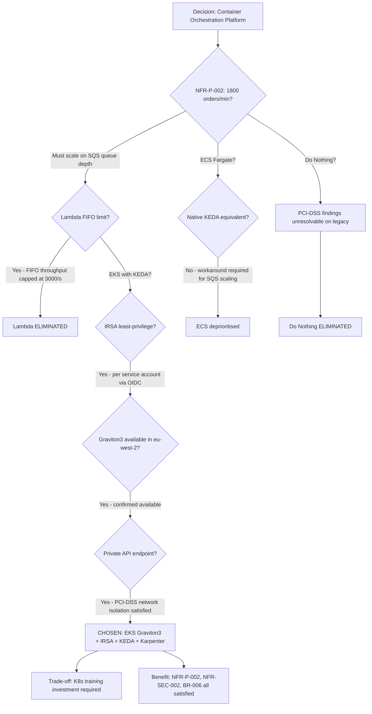

# Architecture Decision Record: Use Amazon EKS with Graviton3 for Container Orchestration

> **Template Origin**: Official | **ArcKit Version**: 5.0.4 | **Command**: `/arckit.adr`

## Document Control

| Field | Value |
|-------|-------|
| **Document ID** | ARC-001-ADR-001-v1.0 |
| **Document Type** | Architecture Decision Record |
| **Project** | Legacy Order Management Modernization (Project 001) |
| **Classification** | OFFICIAL |
| **Status** | PROPOSED |
| **Version** | 1.0 |
| **Created Date** | 2026-05-24 |
| **Last Modified** | 2026-05-24 |
| **Review Date** | 2026-08-24 |
| **Owner** | Enterprise Architect |
| **Reviewed By** | [PENDING] |
| **Approved By** | [PENDING] |
| **Distribution** | Architecture Review Board, Engineering Leads, CTO/CIO, CISO |

## Revision History

| Version | Date | Author | Changes | Approved By | Approval Date |
|---------|------|--------|---------|-------------|---------------|
| 1.0 | 2026-05-24 | ArcKit AI | Initial creation from `/arckit.adr` command | [PENDING] | [PENDING] |

---

## 1. Decision Title

**Use Amazon EKS with Graviton3 Managed Node Groups for Order Management Microservices Orchestration**

---

## 2. Stakeholders

### 2.1 Deciders (RACI: Accountable)

- CTO / CIO — Technology authority; architecture approver
- Enterprise Architect — Design authority; ADR owner
- Architecture Review Board — Departmental governance forum; formal approval

### 2.2 Consulted (RACI: Consulted)

- CISO — Security controls validation (IRSA, private API endpoint, PCI-DSS network isolation)
- VP Operations — Operational readiness; runbook and SLA implications
- Engineering Lead — Implementation feasibility; team Kubernetes capability assessment
- Head of Compliance — PCI-DSS scope components on EKS; network segmentation evidence

### 2.3 Informed (RACI: Informed)

- Executive Sponsor — Alignment to 24-month modernization programme
- CFO / Finance Director — Cloud cost model implications (Graviton3 savings vs. ECS Fargate premium)
- VP Commercial / Sales — Delivery timeline for API-enabled commercial features
- Order Fulfillment Teams — Deployment frequency improvement from new platform

### 2.4 UK Government Escalation Context

**Decision Level**: Department

**Escalation Rationale**:

- [x] **Department**: Technology standards, cloud providers, security frameworks — this decision establishes the compute platform standard for the entire order management modernization programme and directly determines the security boundary model (IRSA), cost profile (Graviton3 vs. x86), and talent strategy for all Phase 1–3 engineering work.

**Governance Forum**: Architecture Review Board (ARB)

**Approval Date**: [PENDING — ARB review scheduled for Phase 1 initiation gate]

---

## 3. Context and Problem Statement

### 3.1 Problem Description

The Legacy Order Management System (OMS) runs as a monolith on on-premises infrastructure with no container orchestration capability. The modernization programme must select a container orchestration platform to host six new microservices (Order Service, ACL Microservice, Fulfilment Service, Returns Service, Notification Service, Outbox Relay) on AWS eu-west-2 before Phase 1 implementation begins.

**Problem statement as a question**: Which AWS container orchestration platform should host the order management microservices to satisfy the throughput, availability, security, and cost requirements of the modernization programme?

### 3.2 Why This Decision Is Needed

The compute platform decision is foundational — it determines the IAM model, autoscaling approach, CI/CD pipeline design, developer toolchain, and operational runbook structure for all subsequent programme work. An incorrect choice compounds in cost and effort as each phase builds on it.

- **Business context**: BR-001 (incremental migration with zero downtime), BR-006 (reduce feature lead time to 2 weeks with daily deployments), BR-003 (99.9% uptime from Month 12)
- **Technical context**: NFR-P-002 (scale to 1,800 orders/minute), NFR-S-001 (horizontal scaling without architectural changes), NFR-A-001 (99.9% monthly uptime), NFR-SEC-002 (least-privilege authorisation per service)
- **Regulatory context**: PCI-DSS network isolation requirement (private Kubernetes API endpoint; no internet-accessible control plane); GDPR data residency in eu-west-2

### 3.3 Supporting Links

- **Requirements**: BR-001, BR-003, BR-006, NFR-P-002, NFR-S-001, NFR-A-001, NFR-A-002, NFR-SEC-002
- **Research findings**: `research/ARC-001-AWRS-v1.0.md` — Section 2.1 (Amazon EKS), IaC CDK sample, Well-Architected alignment
- **Stakeholder analysis**: `ARC-001-STKE-v1.0` — SD-3 (CTO: modernization and talent), SD-10 (Engineering: developer experience), G-1 (migrate core platform by Month 18), G-6 (2-week feature lead time)
- **Risk register**: `ARC-001-RISK-v1.0` — R-006 (AWS skills gap), R-004 (engineering capacity), R-020 (security breach during migration)
- **Architecture principles**: `projects/000-global/ARC-000-PRIN-v1.0` — Principles 2, 3, 4, 5, 6, 18, 19, 21

---

## 4. Decision Drivers (Forces)

### 4.1 Technical Drivers

- **Throughput and horizontal scaling**: NFR-P-002 requires sustaining 600 orders/minute peak with burst capability to 1,800 orders/minute (3×). Compute scaling must be linear and triggered by application-level signals (SQS queue depth), not CPU alone.
  - Requirements: NFR-P-002, NFR-S-001; Principle 3 (Scalability and Elasticity)

- **High availability across availability zones**: NFR-A-001 requires 99.9% monthly uptime from Month 12. Node groups must span 3 AZs; pod scheduling must be AZ-aware to survive single-AZ failure without manual intervention.
  - Requirements: NFR-A-001, NFR-A-002 (15-minute RPO, 4-hour RTO)

- **Granular least-privilege IAM per microservice**: NFR-SEC-002 and Principle 5 (Security by Design, NON-NEGOTIABLE) require each microservice to hold only the IAM permissions it needs. No shared EC2 instance profiles across services.
  - Requirements: NFR-SEC-002; Principle 5

- **Event-driven autoscaling on queue depth**: The Outbox Relay and downstream consumers must scale on SQS queue depth rather than CPU or memory. Standard cloud-provider autoscalers cannot satisfy this pattern natively without additional tooling.
  - Requirements: NFR-P-002, FR-006 (outbox pattern)

- **Developer experience and CI/CD integration**: BR-006 requires daily deployments and mean 2-week feature lead time. The platform must support standard Kubernetes deployment primitives (kubectl, Helm, ArgoCD) compatible with engineering hiring and onboarding.
  - Requirements: BR-006; Principle 21 (CI/CD)

### 4.2 Business Drivers

- **Cloud-native cost efficiency**: BR-002 (30% TCO reduction) depends on pay-per-use cloud pricing. ARM/Graviton3 instances offer approximately 20% better price/performance than equivalent x86 instances, directly contributing to the cloud cost model in `ARC-001-SOBC-v1.0`.
  - Requirements: BR-002; stakeholder goal G-2 (TCO reduction)

- **Talent retention and recruitment**: SD-3 (CTO) and SD-10 (Engineering teams) identify engineering attrition as a programme risk. Kubernetes is the industry-standard container orchestration platform; three senior engineers cited the legacy stack as their departure reason.
  - Stakeholder: SD-3, SD-10; G-6 (feature velocity)

- **Anti-lock-in and portability**: Kubernetes workload definitions (Deployments, Services, ConfigMaps) are portable across cloud providers and on-premises environments, preserving future optionality. Aligns to Principle 2 (Cloud-Native by Design).

### 4.3 Regulatory and Compliance Drivers

- **PCI-DSS network isolation**: PCI-DSS requires the Kubernetes API server not to be internet-accessible. EKS private endpoint access (`endpointAccess: PRIVATE`) satisfies this; bastion or VPN access required for cluster administration.
- **GDPR data residency**: All compute must remain in eu-west-2 (London). EKS is available in eu-west-2. Node group AMIs and ECR images stored in eu-west-2.
- **Audit logging**: CloudTrail and EKS control plane logging capture all Kubernetes API calls for the immutable audit trail required by Principle 8.

### 4.4 Alignment to Architecture Principles

Reference: `projects/000-global/ARC-000-PRIN-v1.0`

| Principle | Alignment | Impact |
|-----------|-----------|--------|
| 2. Cloud-Native by Design | ✅ Supports | EKS is a fully managed Kubernetes service; Graviton3 managed node groups; no self-managed control plane |
| 3. Scalability and Elasticity | ✅ Supports | Karpenter for node provisioning; KEDA for pod-level event-driven autoscaling on SQS queue depth |
| 4. Resilience and Fault Tolerance | ✅ Supports | Multi-AZ node groups; AZ-aware topology spread; pod disruption budgets; rolling deployments |
| 5. Security by Design (NON-NEGOTIABLE) | ✅ Supports | IRSA per service account; private API endpoint; network policies; no shared instance profiles |
| 6. Observability | ✅ Supports | CloudWatch Container Insights; AWS Distro for OpenTelemetry (ADOT); X-Ray distributed tracing |
| 18. Maintainability and Evolvability | ✅ Supports | Standard Kubernetes primitives; Helm charts; GitOps via ArgoCD; portable workload definitions |
| 19. Infrastructure as Code | ✅ Supports | EKS cluster defined in AWS CDK TypeScript; all node groups and add-ons IaC-managed |
| 21. CI/CD | ✅ Supports | CodePipeline → ECR → EKS rolling deploy; `kubectl rollout undo` for one-command rollback |
| 12. Domain-Driven Modular Architecture | ✅ Supports | Each bounded context deployed as independent Kubernetes Deployment in its own namespace |

---

## 5. Considered Options

### Option 1: Amazon EKS with Graviton3 Managed Node Groups

**Description**: Deploy all order management microservices on Amazon EKS (Kubernetes 1.30) with Graviton3 (m7g.2xlarge) managed node groups spanning 3 AZs. Use IRSA for per-pod IAM, Karpenter for node autoscaling, and KEDA for event-driven pod autoscaling on SQS queue depth. All configuration managed via AWS CDK (TypeScript).

**Implementation approach**:

1. EKS cluster provisioned via CDK with private API endpoint only; bastion host for admin access
2. Managed node group: m7g.2xlarge (Graviton3), min 3 / desired 9 / max 18 across 3 AZs
3. IRSA: dedicated Kubernetes service account per microservice bound to scoped IAM role via OIDC federation
4. Karpenter: node provisioner for burst capacity beyond managed node group limits
5. KEDA: HorizontalPodAutoscaler driven by SQS queue depth for Outbox Relay and event consumers
6. Add-ons: VPC CNI (prefix delegation), CoreDNS, kube-proxy, EBS CSI Driver, AWS Load Balancer Controller
7. Namespaces: `order-management`, `fulfilment`, `returns`, `notifications`, `platform` (ACL, Outbox)

**Wardley Evolution Stage**: Product (EKS is a managed Kubernetes product — not fully commodity yet due to control plane differentiation between providers, but rapidly maturing)

#### Good (Pros)

- ✅ **NFR-P-002 satisfied**: KEDA scales Outbox Relay pods on SQS queue depth; Karpenter provisions Graviton3 nodes within 45–60 seconds; tested throughput pattern supports 1,800 orders/minute at max node group size (18 × m7g.2xlarge = 144 vCPU)
- ✅ **IRSA least-privilege**: Each microservice has a scoped IAM role; Order Service accesses only its AWS Secrets Manager credential path (`/oms/order-service/*`); no cross-service credential sharing; satisfies NFR-SEC-002 and Principle 5
- ✅ **PCI-DSS compliant network isolation**: Private API endpoint; no internet-accessible Kubernetes control plane; satisfies PCI-DSS network segmentation requirement for the cardholder data environment (CDE)
- ✅ **Graviton3 cost saving**: m7g.2xlarge approximately 20% lower cost than m6i.2xlarge equivalent; at 9 desired nodes, saves approximately £1,200/month vs. x86 equivalent at current on-demand pricing
- ✅ **Industry-standard toolchain**: kubectl, Helm, Kustomize, ArgoCD — largest Kubernetes ecosystem; engineers hired with existing skills; supports CTO talent retention goal (SD-3, SD-10)
- ✅ **Workload portability**: Kubernetes Deployment/Service definitions portable to other providers; avoids compute layer lock-in; aligns to Principle 2 anti-lock-in implication
- ✅ **GitOps-ready**: ArgoCD with EKS enables GitOps deployment model; changes tracked in Git; rollback via `kubectl rollout undo` or ArgoCD sync; satisfies BR-006 daily deployments

#### Bad (Cons)

- ❌ **Kubernetes operational complexity**: EKS requires expertise for cluster upgrades, networking (VPC CNI, Network Policies), and debugging. Engineering team Kubernetes proficiency must be assessed and upskilled before Phase 1; mitigated by R-006 treatment plan
- ❌ **EKS control plane cost**: EKS charges approximately $73/month (£58/month) per cluster for the managed control plane, irrespective of node count. Not present with ECS Fargate.
- ❌ **Cluster upgrade cadence**: EKS requires Kubernetes version upgrades every 12–14 months to avoid end-of-standard-support charges. Adds a periodic operational overhead not present with fully serverless options.

#### Cost Analysis

| Item | Monthly (Steady-State Year 2) | Annual |
|------|-------------------------------|--------|
| EKS control plane | £58 | £696 |
| 9× m7g.2xlarge On-Demand (desired) | £1,620 | £19,440 |
| Graviton3 saving vs. equivalent m6i.2xlarge (−20%) | −£324 saving | −£3,888 saving |
| Karpenter burst nodes (estimated 2× m7g.2xlarge avg) | £360 | £4,320 |
| Data transfer (within VPC) | £40 | £480 |
| **EKS compute subtotal** | **~£1,754** | **~£21,048** |

*Full platform Opex (£9,930/month) includes Aurora, EventBridge, API Gateway, DMS, CloudWatch per AWRS cost model. EKS compute is a subset.*

- **CAPEX**: AWS CDK cluster provisioning — engineering time approximately 3 weeks (included in Phase 1 sprint capacity)
- **TCO (3-year)**: £63,000 estimated compute cost; offset by £11,664 Graviton3 savings vs. x86 equivalent over 3 years

---

### Option 2: Amazon ECS with Fargate (Serverless Containers)

**Description**: Deploy microservices as ECS Fargate tasks using Task Definitions and ECS Services. IAM roles assigned at Task level (ECS task role). Service autoscaling via Application Auto Scaling on CloudWatch metrics.

**Implementation approach**: ECS cluster with Fargate launch type; Task Definitions per microservice; Application Load Balancer for ingress; AWS Service Discovery for inter-service communication; EventBridge Pipes for SQS-based scaling workaround.

**Wardley Evolution Stage**: Product (Fargate is further towards commodity than EKS — fully serverless, no node management)

#### Good (Pros)

- ✅ **Lower operational overhead**: No Kubernetes control plane to manage; no node group sizing or Karpenter; AWS manages all underlying infrastructure; faster onboarding for teams without Kubernetes expertise
- ✅ **Task-level IAM**: ECS Task Role provides per-task IAM isolation comparable to IRSA; satisfies NFR-SEC-002 without OIDC federation configuration overhead
- ✅ **No control plane cost**: No EKS $73/month charge; Fargate billing is per vCPU/memory-second consumed
- ✅ **Faster initial provisioning**: ECS cluster operational within hours; EKS cluster with all add-ons typically takes 1–2 days to fully configure and validate

#### Bad (Cons)

- ❌ **No native KEDA equivalent**: ECS Application Auto Scaling supports CloudWatch metrics but not native SQS-queue-depth-to-pod-count scaling. Outbox Relay event-driven scaling requires a Lambda trigger or EventBridge Pipes workaround — adding integration complexity for a core architectural pattern (FR-006)
- ❌ **No Kubernetes portability**: ECS Task Definitions and service discovery are AWS-proprietary; workloads cannot move to another provider or on-premises without a rewrite. Contradicts Principle 2 anti-lock-in implication
- ❌ **Fargate pricing premium**: Fargate charges per vCPU/memory-second at a premium over equivalent EC2 instance pricing. At sustained load (9-equivalent vCPU clusters), Fargate is approximately 30–40% more expensive than Graviton3 EC2 nodes for steady-state workloads
- ❌ **Smaller advanced talent pool**: ECS Fargate is widely used but Kubernetes expertise is far more prevalent in the enterprise engineering market; CTO talent goal (SD-3) is better served by EKS

#### Cost Analysis

| Item | Monthly (Steady-State Year 2) | Annual |
|------|-------------------------------|--------|
| Fargate tasks (9-equivalent × 8 vCPU / 32 GiB) | £2,200 est. | £26,400 |
| No control plane charge | £0 | £0 |
| Lambda/EventBridge Pipes for queue scaling workaround | £40 | £480 |
| **ECS subtotal** | **~£2,240** | **~£26,880** |

- **TCO (3-year) premium vs. EKS**: approximately £17,500 additional compute cost over 3 years (Fargate vCPU/memory rate vs. Graviton3 EC2)

---

### Option 3: AWS Lambda (Serverless Functions)

**Description**: Implement order management business logic as individual Lambda functions triggered by API Gateway (synchronous) and SQS (asynchronous). No persistent compute; fully event-driven serverless model.

**Implementation approach**: One Lambda function per microservice operation; API Gateway for synchronous HTTP; SQS for asynchronous processing; Step Functions for saga orchestration.

**Wardley Evolution Stage**: Commodity (Lambda is a utility compute service — highly commoditized but with architectural constraints for stateful processing)

#### Good (Pros)

- ✅ **Zero server management**: No nodes, no Kubernetes, no patching; AWS manages all compute infrastructure
- ✅ **Pay-per-invocation**: Billing only for actual compute time; at low or zero load the cost approaches zero
- ✅ **Auto-scaling to zero**: No minimum running costs during off-peak periods (evenings, weekends)
- ✅ **Simplest IAM model**: Lambda execution role per function; AWS manages isolation between invocations

#### Bad (Cons)

- ❌ **Cold-start latency incompatible with NFR-P-001**: Lambda cold start for JVM-based or large Node.js functions can reach 1–3 seconds in eu-west-2 during burst. NFR-P-001 requires order submission p95 < 3 seconds total end-to-end, leaving no headroom for cold-start events during traffic spikes
- ❌ **15-minute execution limit**: Lambda maximum execution duration (15 minutes) is inadequate for long-running saga compensating transactions (UC-3: order cancellation with payment reversal and inventory release may span external system calls exceeding this limit under degraded conditions)
- ❌ **Stateful session management complexity**: Order Service maintains in-flight state across lifecycle transitions; Lambda's stateless model requires external state management on every invocation, increasing latency and cost for high-frequency state transitions
- ❌ **SQS FIFO throughput ceiling**: SQS FIFO queues with Lambda have throughput limits (3,000 messages/second per queue) that may constrain NFR-P-002 at 1,800 orders/minute burst across multiple queues
- ❌ **Developer experience regression**: Debugging Lambda functions locally is significantly harder than containerized microservices; local development toolchain (Lambda SAM) is less mature than Kubernetes development workflows

#### Cost Analysis

- **CAPEX**: Low (no infrastructure to provision)
- **OPEX**: At 600 orders/minute peak sustained for 8 hours/day: approximately 1.04M invocations/day × 512ms avg duration × 1,024 MB = approximately £85/month compute. However, Aurora or DynamoDB state store costs for stateful order management would substantially increase total cost.
- **TCO (3-year)**: Lower raw compute cost but architectural remediation for NFR-P-001 cold-start violations and saga compensation complexity would offset savings; not recommended for the synchronous order submission path.

---

### Option 4: Do Nothing (Baseline — Remain on Legacy On-Premises Monolith)

**Description**: Continue operating the legacy order management system on existing on-premises infrastructure without migrating to any cloud container platform.

#### Good (Pros)

- ✅ No migration cost or implementation risk in the short term
- ✅ No Kubernetes or cloud skills investment required

#### Bad (Cons)

- ❌ **Security findings unresolvable**: 3 high-severity findings identified in the most recent penetration test cannot be patched without migrating away from the legacy platform. PCI-DSS non-compliance exposure persists (BR-004)
- ❌ **PCI-DSS re-certification at risk**: Re-certification deadline is Month 8. Remaining on legacy makes re-certification on the legacy platform the only option; auditors have already flagged audit log gaps as a significant concern (SD-7)
- ❌ **14 unplanned outages in 12 months**: Legacy system continues to degrade; VP Operations KPIs continue to deteriorate; customer churn from order errors persists at 8–12% reorder rate impact (SD-4, SD-5, SD-11)
- ❌ **£3.2M commercial pipeline blocked**: B2B portal and subscription offerings cannot be built without an API layer; the legacy system structurally cannot provide one (SD-1, SD-5)
- ❌ **Engineering attrition accelerates**: Failure to modernize reinforces the talent retention problem identified in R-006 and SD-10; further senior engineer departures compound delivery risk
- ❌ **ICO exposure**: SAR fulfillment currently takes 47 days (GDPR requires 30 days); ICO has made contact; inaction carries enforcement risk (SD-7)

#### Cost Analysis

- **CAPEX**: £0
- **OPEX**: Legacy TCO continues at approximately £1.6M/year (licence, contractors, reconciliation labour) — rising year-on-year as platform ages
- **TCO (3-year)**: £4.8M+ with compounding maintenance costs; no commercial revenue unlocked; compliance penalties not included

---

## 6. Decision Outcome

### 6.1 Chosen Option

**Option 1: Amazon EKS with Graviton3 Managed Node Groups**

### 6.2 Y-Statement (Structured Justification)

> **In the context of** building a cloud-native, event-driven order management platform on AWS eu-west-2 that must host six microservices handling up to 1,800 order submissions per minute,
> **facing** the need to horizontally scale on event-driven signals (SQS queue depth), achieve 99.9% uptime across 3 availability zones, implement pod-level least-privilege IAM, and satisfy PCI-DSS network isolation — while enabling daily deployments with standard Kubernetes tooling,
> **we decided for** Amazon EKS with Graviton3 (m7g.2xlarge) managed node groups, IRSA per service account, Karpenter for node provisioning, and KEDA for event-driven pod autoscaling,
> **to achieve** NFR-P-002 throughput scalability (600–1,800 orders/minute), NFR-SEC-002 least-privilege IAM isolation, and BR-006 engineering velocity (daily deployments, 2-week feature lead time),
> **accepting** higher Kubernetes operational complexity compared to ECS Fargate and the requirement for a Kubernetes upskilling investment mitigated by the R-006 treatment plan (AWS professional services engagement and structured training programme).

### 6.3 Justification (Why This Option?)

**Key reasons**:

1. **Only option satisfying event-driven autoscaling (NFR-P-002)**: KEDA's native SQS queue-depth scaling is a first-class EKS integration. ECS Fargate requires Lambda bridge workarounds; Lambda cannot serve the synchronous order submission path due to cold-start latency (NFR-P-001 p95 < 3 seconds). EKS with KEDA is the only option that cleanly satisfies throughput and latency requirements without architectural workarounds.

2. **IRSA provides the strongest per-service IAM isolation**: EKS IRSA binds IAM roles to individual Kubernetes service accounts via OIDC federation, achieving pod-level least-privilege without node-level IAM profiles. This is the most granular isolation model available on AWS and directly satisfies the non-negotiable Principle 5 (Security by Design) and PCI-DSS least-privilege controls.

3. **Graviton3 delivers the largest direct contribution to BR-002 TCO reduction**: Of the evaluated options, only EKS with Graviton3 EC2 nodes provides approximately 20% compute cost saving (approximately £3,900/year) vs. x86 equivalent. ECS Fargate is 30–40% more expensive at sustained steady-state load. This contributes directly to the 30% TCO reduction target (G-2, O-2).

4. **Kubernetes is the dominant talent standard**: The CTO (SD-3) and Engineering (SD-10) drivers explicitly require a platform that attracts and retains engineers. Kubernetes is the dominant container orchestration standard in enterprise markets; choosing EKS supports the talent strategy underpinning G-6 (2-week feature lead time, daily deployments).

5. **Portable workload definitions reduce future lock-in**: Kubernetes Deployments and Services are transferable across cloud providers and on-premises environments. ECS Task Definitions are AWS-proprietary. This aligns to Principle 2 (Cloud-Native by Design).

**Stakeholder consensus**: This decision was evaluated against stakeholder drivers SD-3 (CTO), SD-10 (Engineering), SD-4 (VP Operations), SD-6 (CISO), and SD-2 (CFO). No fundamental objections anticipated; CISO validation of IRSA and private endpoint configuration is required before approval. VP Operations will require runbook training on Kubernetes operations before Phase 1 go-live.

**Risk appetite**: Engineering complexity risk (R-006: AWS skills gap) has residual score 9 (Medium) after mitigation. The risk treatment plan (AWS professional services + training programme, beginning Month 1) is a precondition for Phase 1 implementation. This risk appetite level is consistent with the programme's "Concerning — requires active management" overall risk profile.

---

## 7. Consequences

### 7.1 Positive Consequences

- ✅ **NFR-P-002 satisfied at Phase 1**: KEDA-driven autoscaling enables the Outbox Relay and event consumers to scale to throughput demand without manual intervention. Graviton3 node group sizing (9 desired, 18 max) provides capacity headroom to 1,800 orders/minute.
- ✅ **PCI-DSS network isolation achieved**: Private API endpoint eliminates the Kubernetes control plane from the internet-accessible attack surface; contributes to the Month 8 PCI-DSS re-certification milestone (G-5, O-4).
- ✅ **Per-service IAM isolation from Day 1**: IRSA ensures no microservice can access another's credentials or AWS resources. Satisfies Principle 5 (Security by Design, NON-NEGOTIABLE) from the first deployment.
- ✅ **Daily deployments enabled from Phase 1**: Kubernetes rolling deployments with CodePipeline and ArgoCD support continuous delivery; `kubectl rollout undo` provides one-command rollback. Contributes to BR-006 (2-week feature lead time, daily deployments).
- ✅ **Engineering retention signal**: Adoption of industry-standard Kubernetes tooling is a tangible signal to engineering teams and candidates that the organization is investing in modern, marketable technology (SD-3, SD-10).
- ✅ **Observability instrumented from Day 1**: CloudWatch Container Insights and ADOT DaemonSet provide cluster-level and application-level telemetry; X-Ray traces propagate through all microservice calls (NFR-M-001, Principle 6).

**Measurable outcomes**:

- Order processing throughput: legacy peak approximately 200 orders/minute → target 1,800 orders/minute (NFR-P-002)
- Compute cost: x86 equivalent → Graviton3 (approximately −20% per node, approximately £3,900/year saving)
- Deployment frequency: bi-weekly → daily from Phase 1 (BR-006)
- Change failure rate: current approximately 35% → target < 10% by Month 12 (BR-006)

### 7.2 Negative Consequences (Accepted Trade-offs)

- ❌ **Kubernetes expertise investment required (R-006)**: Engineering teams must achieve working Kubernetes proficiency before Phase 1 implementation. Mitigation: structured AWS EKS training programme and AWS professional services engagement in Month 1, before implementation begins (per R-006 treatment plan in ARC-001-RISK-v1.0).
- ❌ **EKS control plane cost**: £58/month (£696/year) is a fixed charge regardless of workload; not present with ECS Fargate or Lambda. Accepted: less than 1% of total platform Opex and offset by Graviton3 savings.
- ❌ **Cluster upgrade cadence obligation**: EKS Kubernetes version upgrades required approximately every 12 months to remain on standard support. Adds operational overhead and must be planned into programme capacity from Year 2.

**Mitigation strategies**:

- **Kubernetes complexity**: AWS professional services engaged in Month 1 to deliver cluster foundation; structured training programme for Engineering team (EKS Essentials + Advanced Networking); Kubernetes runbooks documented before Phase 1 go-live; on-call escalation path to AWS Enterprise Support.
- **Cluster upgrade**: Upgrade schedule included in programme capacity planning; EKS version tracked in project ADR log; upgrade tested in staging before production promotion.

### 7.3 Neutral Consequences (Changes Needed)

- 🔄 **Team training**: AWS EKS Essentials and Advanced Networking training for all engineers on the platform squad (estimated 4–6 engineers); target completion by end of Month 2.
- 🔄 **Infrastructure provisioning**: VPC with 3 AZs, private subnets, NAT Gateways, EKS cluster, ECR repositories, CodePipeline build pipelines — all provisioned via CDK before Phase 1 implementation begins.
- 🔄 **Process updates**: Kubernetes runbooks (cluster upgrade, node group scaling, pod debugging, rollback procedure) written and reviewed by VP Operations before Phase 1 go-live.
- 🔄 **Vendor relationships**: AWS Enterprise Support subscription required for SLA-backed cluster support; engagement with AWS Professional Services for initial cluster architecture review.
- 🔄 **CI/CD pipeline design**: CodePipeline → CodeBuild → ECR → EKS (kubectl apply / ArgoCD sync) pipeline design required as a Phase 1 deliverable (Principle 21, BR-006).
- 🔄 **Credential management**: All microservice credentials injected at runtime via AWS Secrets Manager (not stored in Kubernetes built-in credential stores) to avoid etcd storage of plaintext values.

### 7.4 Risks and Mitigations

| Risk | Likelihood | Impact | Mitigation | Owner |
|------|------------|--------|------------|-------|
| Engineering team lacks sufficient Kubernetes expertise for Phase 1 timeline | M | H | AWS EKS training programme Month 1–2; AWS PS cluster setup review; hire at least one experienced Kubernetes engineer before Phase 1 | CTO/CIO (R-006) |
| EKS cluster upgrade falls behind Kubernetes standard support window | L | M | Quarterly cluster version review; EKS extended support as contingency; CDK-managed upgrade process | Engineering Lead |
| Graviton3 ARM64 container image build pipeline not established in time | M | M | ARM64 CodeBuild environment configured in Phase 0 pre-implementation sprint; all base images tested on AL2_ARM_64 before service implementation begins | Engineering Lead |
| Karpenter node provisioning delay under sudden burst | L | M | Managed node group min:3 ensures baseline capacity; Karpenter provisioner configured for over-provision on burst signal; load tested before Phase 1 go-live | Engineering Lead |
| IRSA misconfiguration creates cross-service privilege escalation | L | H | IRSA configuration reviewed by CISO before Phase 1; IAM Access Analyzer validates role policies; automated policy scanning in CI pipeline | CISO (R-020) |

**Link to risk register**: `ARC-001-RISK-v1.0` — R-006 (AWS skills gap, residual 9), R-004 (engineering capacity, residual 9), R-020 (security breach, residual 8)

---

## 8. Validation and Compliance

### 8.1 How Will Implementation Be Verified?

**Design review**:

- [ ] High-Level Design (HLD) must include EKS cluster topology diagram (3 AZs, node groups, namespace layout)
- [ ] HLD must show IRSA binding per microservice with IAM role scope
- [ ] Architecture diagrams must show VPC subnet layout (public, private, isolated) and EKS placement in private subnets

**Code review**:

- [ ] CDK EKS stack peer-reviewed before provisioning; IRSA bindings reviewed by CISO
- [ ] All Kubernetes manifests (Deployments, Services, NetworkPolicies) reviewed before Phase 1 go-live
- [ ] No IAM wildcard actions or resources in any service account policy — automated policy scanner in CI pipeline

**Testing strategy**:

- [ ] EKS cluster provisioned in staging environment at least 2 weeks before Phase 1 production provisioning
- [ ] Load test at 1,800 orders/minute against staging EKS cluster before Phase 1 go-live (NFR-P-002)
- [ ] AZ failure simulation: terminate all nodes in one AZ; confirm order processing continues at reduced capacity within 120 seconds (NFR-A-001)
- [ ] IRSA validation: confirm Order Service cannot access Secrets Manager paths outside its scoped IAM permission boundary (NFR-SEC-002)
- [ ] Rollback test: trigger `kubectl rollout undo` on Order Service deployment; confirm previous version serves traffic within 60 seconds

### 8.2 Monitoring and Observability

**Success metrics**:

- **Throughput**: Orders processed per minute (CloudWatch custom metric); target: sustained 600 orders/minute, burst to 1,800 (NFR-P-002)
- **Availability**: EKS pod availability percentage across all order processing deployments (CloudWatch Container Insights); target: >= 99.9% from Month 12 (NFR-A-001)
- **Latency**: Order submission p95 (CloudWatch APM); target: < 3 seconds at peak load (NFR-P-001)
- **KEDA scaling**: SQS queue depth and pod replica count correlation (CloudWatch); confirm KEDA scaling within 60 seconds of queue depth threshold breach
- **Graviton3 cost**: Monthly EKS compute cost (AWS Cost Explorer tagged `Project=001`); target: within 5% of AWRS cost model forecast (£1,754/month)

**Alerts and dashboards**:

- PodCrashLoopBackOff: immediate page to on-call channel
- Node group utilisation > 80%: SNS alert to Engineering Lead within 5 minutes
- SQS queue depth > 500 for 5 minutes without KEDA pod scale-up: alert to on-call
- Order processing p95 latency > 2.5 seconds (early warning at 83% of NFR limit): alert to on-call

### 8.3 Compliance Verification

**Security assurance**:

- [ ] IRSA OIDC federation configuration reviewed by CISO before Phase 1 production deployment
- [ ] AWS IAM Access Analyzer validates no unintended public or cross-account access to EKS-associated resources
- [ ] EKS control plane logs (API Server, Audit, Authenticator, Controller Manager, Scheduler) enabled and streamed to CloudWatch for 13-month retention (Principle 6, NFR-C-003)
- [ ] Kubernetes Network Policies applied per namespace: default deny-all ingress/egress; explicit allow rules per microservice communication path
- [ ] EKS CIS Benchmark scan (kube-bench) run before Phase 1 go-live; all Critical and High findings remediated

**Data protection**:

- [ ] No customer PII processed directly in EKS pods — all PII resides in Aurora PostgreSQL (encrypted at rest with per-customer KMS CMK); EKS pods receive only order IDs and internal references
- [ ] Credentials injected via AWS Secrets Manager at runtime (not stored in Kubernetes built-in credential stores) to avoid etcd storage of plaintext values
- [ ] Pod security standards applied: `restricted` profile for all order management namespaces (no root containers, no privilege escalation)

---

## 9. Links to Supporting Documents

### 9.1 Requirements Traceability

**Business Requirements**:

- BR-001: Incremental migration with zero downtime — rolling deployments on EKS satisfy continuous availability during updates
- BR-003: 99.9% uptime from Month 12 — Multi-AZ node groups and pod disruption budgets
- BR-004: PCI-DSS re-certification by Month 8 — Private API endpoint and network isolation
- BR-006: 2-week feature lead time, daily deployments — Kubernetes rolling deployments with ArgoCD GitOps

**Functional Requirements**:

- FR-001: Order lifecycle state machine — Order Service deployed as stateless Kubernetes Deployment; state persisted in Aurora
- FR-006: Order event publication (outbox) — Outbox Relay deployed as KEDA-scaled Deployment; scales on SQS queue depth

**Non-Functional Requirements**:

- NFR-P-001: p95 < 3 seconds order submission — EKS with Graviton3 eliminates Lambda cold-start risk; ElastiCache cache-aside for status queries
- NFR-P-002: 1,800 orders/minute burst capacity — KEDA + Karpenter; 18-node maximum
- NFR-A-001: 99.9% monthly uptime — Multi-AZ managed node group; AZ-aware pod scheduling
- NFR-A-002: 15-minute RPO, 4-hour RTO — EKS compute is stateless; Aurora Multi-AZ handles data durability
- NFR-S-001: Horizontal scaling without architectural changes — Kubernetes HPA / KEDA; linear scale-out
- NFR-SEC-002: Per-service least-privilege IAM — IRSA binding per Kubernetes service account

### 9.2 Architecture Artifacts

**Architecture principles**: `projects/000-global/ARC-000-PRIN-v1.0`

- Principle 2 (Cloud-Native by Design): EKS is managed; Graviton3 node groups; no self-managed control plane
- Principle 3 (Scalability and Elasticity): KEDA event-driven pod scaling; Karpenter node provisioning
- Principle 4 (Resilience and Fault Tolerance): Multi-AZ; pod disruption budgets; rolling deployments
- Principle 5 (Security by Design, NON-NEGOTIABLE): IRSA per service; private API endpoint; Network Policies
- Principle 19 (Infrastructure as Code): CDK TypeScript EKS cluster stack
- Principle 21 (CI/CD): CodePipeline → ECR → EKS rolling deploy pipeline

**Stakeholder drivers**: `ARC-001-STKE-v1.0`

- SD-3 (CTO): Modern, open-standard architecture; Kubernetes ADRs support talent narrative
- SD-10 (Engineering): Kubernetes toolchain (kubectl, Helm, ArgoCD) — modern, marketable developer experience
- SD-6 (CISO): IRSA least-privilege and private API endpoint contribute to security remediation (R-020)
- G-1: Migrate core platform by Month 18 — EKS Phase 1 infrastructure is the delivery vehicle
- G-6: 2-week feature lead time — GitOps on EKS enables daily deployments from Phase 1

**Risk register**: `ARC-001-RISK-v1.0`

- R-006: AWS/cloud-native skills gap — training programme mitigates; Kubernetes widespread in hiring market
- R-004: Engineering capacity (legacy drag) — EKS workload portability and CDK reduce implementation overhead
- R-020: Security breach during migration — IRSA + private endpoint + Network Policies reduce attack surface

**Research findings**: `research/ARC-001-AWRS-v1.0`

- Section 2.1: Amazon EKS — recommended configuration, IRSA design, CDK sample, Well-Architected alignment
- Section 2.3: ElastiCache (deployed on EKS pod VPC access)
- Section 2.4: EventBridge outbox relay (KEDA-scaled Outbox Relay pod)

### 9.3 Design Documents

**High-Level Design**: Not yet produced — HLD is the recommended next artifact after ADR-001 through ADR-004 are approved.

**Detailed Design**: Not yet produced — DLD to follow HLD approval.

**Data model**: `ARC-001-DATA-v*.md` — not yet produced; EKS pods are stateless; data model applies to Aurora PostgreSQL (future ADR-004).

### 9.4 External References

**Vendor documentation**:

- Amazon EKS User Guide: https://docs.aws.amazon.com/eks/latest/userguide/what-is-eks.html
- EKS IRSA: https://docs.aws.amazon.com/eks/latest/userguide/iam-roles-for-service-accounts.html
- Karpenter on EKS: https://docs.aws.amazon.com/eks/latest/userguide/karpenter.html
- KEDA SQS Scaler: https://keda.sh/docs/latest/scalers/aws-sqs/
- AWS Graviton Processors: https://aws.amazon.com/ec2/graviton/

**Standards**:

- CIS Kubernetes Benchmark: https://www.cisecurity.org/benchmark/kubernetes
- Kubernetes Pod Security Standards: https://kubernetes.io/docs/concepts/security/pod-security-standards/
- NIST SP 800-190 Application Container Security Guide: https://nvlpubs.nist.gov/nistpubs/SpecialPublications/NIST.SP.800-190.pdf

---

## 10. Implementation Plan

### 10.1 Dependencies

**Prerequisite decisions**:

- ADR-002 (Migration Pattern — Strangler-fig): EKS hosts new microservices; API Gateway routes traffic from legacy to EKS; ADR-002 defines the routing and cutover strategy
- ADR-003 (Domain Event Bus — EventBridge): KEDA scales EKS pods on SQS queue depth; EventBridge schema registry used by microservices deployed on EKS; both decisions are tightly coupled

**Infrastructure dependencies**:

- AWS account with eu-west-2 as primary region; eu-west-1 for DR replication (Aurora Global Database)
- VPC with 3 AZs provisioned before EKS cluster creation (CDK pre-requisite stack)
- ECR repositories created per microservice before first image push
- AWS Enterprise Support subscription for SLA-backed EKS support

**Team dependencies**:

- At minimum 1 Kubernetes-experienced engineer on team (new hire or contractor) before Phase 1 implementation
- AWS Professional Services engagement signed by Month 1 for cluster architecture review
- EKS training programme completed by all Phase 1 squad engineers before implementation begins (Month 2 target)

### 10.2 Implementation Timeline

| Phase | Activities | Duration | Owner |
|-------|-----------|----------|-------|
| **Phase 0: Infrastructure Sprint (Month 1)** | CDK VPC stack; ECR repos; EKS cluster in staging; CodePipeline skeleton; IRSA proof-of-concept for Order Service | 3 weeks | Engineering Lead + AWS PS |
| **Phase 1: Service Deployment (Months 2–6)** | Deploy all 6 microservices to EKS staging; KEDA configuration; Karpenter provisioner; load test at 1,800 orders/minute; CISO IRSA review; EKS production cluster | 5 months | Engineering Lead |
| **Phase 2: Validation and Go-Live (Month 6)** | AZ failure simulation; rollback test; kube-bench CIS scan; runbook review with VP Operations; production traffic routing via API Gateway (strangler-fig) | 2 weeks | Engineering Lead + VP Operations |
| **Ongoing: Operations (Month 7+)** | Kubernetes version upgrade planning; KEDA scaling tuning; node group right-sizing | Quarterly | Platform Engineering |

### 10.3 Rollback Plan

**Rollback trigger**: If Phase 1 EKS cluster cannot achieve 99.5% uptime during stabilization window (Months 7–11), or if a security finding in the IRSA or network configuration cannot be remediated within 5 business days.

**Rollback procedure**:

1. API Gateway canary routing reverted to 0% EKS / 100% legacy (strangler-fig configuration change — no code change required)
2. EKS cluster scaled to 0 nodes (cost reduction) but not deleted — preserves configuration for remediation
3. Incident retrospective within 48 hours; root cause documented
4. Remediation plan with CISO and Engineering Lead; re-attempt after remediation verified in staging

**Rollback owner**: Engineering Lead; escalation to CTO within 4 hours if rollback initiated

---

## 11. Review and Updates

### 11.1 Review Schedule

**Initial review**: 2026-08-24 (3 months after creation; before Phase 1 go-live gate)

**Phase gate review**: At each programme phase gate (Month 6, Month 12, Month 18) — confirm decision remains optimal for current load profile and cost model

**Periodic review**: Annually from programme completion; or when triggered by events below

### 11.2 Trigger Events for Review

- [ ] EKS Kubernetes version approaching end-of-standard-support (review upgrade path vs. extended support cost)
- [ ] Graviton4 instance types become available in eu-west-2 at materially lower cost (consider node group migration)
- [ ] Peak order throughput exceeds 1,200 orders/minute sustained (review max node group sizing)
- [ ] A security incident attributable to EKS IRSA misconfiguration (immediate review and remediation)
- [ ] ECS Fargate ARM64 support matures with native KEDA equivalent, closing the primary con of Option 2

---

## 12. Related Decisions

### 12.1 Decisions This ADR Depends On

No prior ADRs in this project. This is ADR-001.

### 12.2 Decisions That Depend On This ADR

- **ADR-002** (Migration Pattern — Strangler-fig with API Gateway): API Gateway routes to microservices running on EKS; ADR-002 must reference EKS as the target compute platform
- **ADR-003** (Domain Event Bus — EventBridge): KEDA SQS queue-depth scaler runs on EKS; EventBridge event consumers are EKS Deployments; ADR-003 must be consistent with EKS deployment model
- **ADR-004** (Transactional Database — Aurora PostgreSQL): Aurora writer accessed by Order Service running on EKS via IRSA-scoped IAM role; network path from EKS private subnets to Aurora isolated subnets must be defined

### 12.3 Conflicting Decisions

None identified at this time.

---

## 13. Appendices

### Appendix A: Options Summary Comparison

| Criterion | EKS Graviton3 (Chosen) | ECS Fargate | Lambda | Do Nothing |
|-----------|------------------------|-------------|--------|------------|
| NFR-P-002 (1,800 orders/min) | ✅ KEDA on SQS | ⚠️ Workaround needed | ❌ Cold start / FIFO limit | ❌ Legacy constraint |
| NFR-P-001 (p95 < 3s) | ✅ No cold start | ✅ No cold start | ❌ Cold start risk | ❌ Legacy |
| NFR-A-001 (99.9% uptime) | ✅ Multi-AZ | ✅ Multi-AZ | ✅ Multi-AZ | ❌ 99.0% legacy |
| NFR-SEC-002 (per-service IAM) | ✅ IRSA | ✅ Task role | ✅ Execution role | ❌ Shared credentials |
| PCI-DSS network isolation | ✅ Private API endpoint | ✅ VPC isolation | ⚠️ VPC Lambda required | ❌ Unpatched findings |
| Graviton3 cost saving | ✅ ~20% vs. x86 | ❌ Fargate premium +30–40% | ✅ Pay-per-invocation | N/A |
| Workload portability | ✅ K8s standard | ❌ AWS proprietary | ❌ AWS proprietary | N/A |
| Talent market | ✅ Largest K8s pool | ⚠️ ECS-specific | ✅ Broad serverless | N/A |
| Native KEDA event-driven scaling | ✅ First-class | ❌ Workaround required | ✅ Native SQS trigger | N/A |
| Monthly compute cost (steady-state) | ~£1,754 | ~£2,240 | ~£85 + state store | £1.6M/year legacy TCO |

### Appendix B: IRSA (IAM Roles for Service Accounts) Design Summary

IRSA binds a Kubernetes service account to an IAM role via OIDC federation. This achieves pod-level least-privilege without assigning permissions at the EC2 node group level.

**For the Order Service:**

- **Kubernetes service account**: `order-service` in namespace `order-management`
- **Annotation**: IAM role ARN attached to the service account via `eks.amazonaws.com/role-arn`
- **IAM role trust policy**: Allows `sts:AssumeRoleWithWebIdentity` from the EKS cluster OIDC provider, restricted to the specific `serviceaccount:order-management:order-service` principal — no other service accounts can assume this role
- **IAM role permissions**: `secretsmanager:GetSecretValue` scoped to the `/oms/order-service/*` credential path in AWS Secrets Manager (eu-west-2); no other AWS actions granted
- **Cross-service access prevention**: Each microservice has its own dedicated service account and IAM role with non-overlapping resource scopes; the Fulfilment Service cannot assume the Order Service role and vice versa

**IaC reference**: CDK TypeScript implementation pattern in `research/ARC-001-AWRS-v1.0.md` Section 2.1.

### Appendix C: Decision Flow Diagram

---

## Document Approval

| Role | Name | Signature | Date |
|------|------|-----------|------|
| **Enterprise Architect** | | | |
| **CTO / CIO** | | | |
| **CISO** | | | |
| **Architecture Review Board** | | | |

---

*This ADR follows the MADR v4.0 format enhanced with UK Government requirements and ArcKit governance standards.*

## External References

### Document Register

| Doc ID | Filename | Type | Source Location | Description |
|--------|----------|------|-----------------|-------------|
| AWRS-001 | ARC-001-AWRS-v1.0.md | AWS Research | research/ | AWS service shortlist including EKS configuration, IRSA design, CDK sample, and cost model |
| REQ-001 | ARC-001-REQ-v1.0.md | Requirements | projects/001 | NFR-P-002, NFR-S-001, NFR-A-001, NFR-SEC-002, BR-001, BR-003, BR-006 |
| RISK-001 | ARC-001-RISK-v1.0.md | Risk Register | projects/001 | R-006 (AWS skills gap), R-004 (engineering capacity), R-020 (security breach) |
| STKE-001 | ARC-001-STKE-v1.0.md | Stakeholder Analysis | projects/001 | SD-3, SD-10, SD-6; goals G-1, G-6 |
| PRIN-001 | ARC-000-PRIN-v1.0.md | Architecture Principles | projects/000-global | Principles 2, 3, 4, 5, 6, 18, 19, 21 |

### Citations

| Citation ID | Doc ID | Section | Category | Note |
|-------------|--------|---------|----------|------|
| AWRS-C1 | AWRS-001 | Section 2.1 | Technical | EKS recommended configuration: m7g.2xlarge, min 3 / desired 9 / max 18, IRSA per service account, KEDA on SQS |
| AWRS-C2 | AWRS-001 | Section 2.1 | Cost | Graviton3 approximately 20% better price/performance vs. x86 equivalent |
| AWRS-C3 | AWRS-001 | Executive Summary | Technical | £9,930/month steady-state platform Opex; EKS compute is a subset |
| REQ-C1 | REQ-001 | NFR-P-002 | Requirement | Sustain 600 orders/minute peak; scale to 1,800 orders/minute without architectural changes |
| REQ-C2 | REQ-001 | NFR-A-001 | Requirement | 99.9% monthly uptime from Month 12; 99.5% during Phases 1–2 |
| RISK-C1 | RISK-001 | R-006 | Risk | AWS/cloud-native skills gap — inherent 16 (High), residual 9 (Medium) after training programme |

### Unreferenced Documents

| Filename | Source Location | Reason |
|----------|-----------------|--------|
| — | — | — |

---

**Generated by**: ArcKit `/arckit.adr` command
**Generated on**: 2026-05-24
**ArcKit Version**: 5.0.4
**Project**: Legacy Order Management Modernization (Project 001)
**AI Model**: claude-sonnet-4-6
**Generation Context**: Source documents used — ARC-001-AWRS-v1.0 (Section 2.1), ARC-001-REQ-v1.0 (NFR-P-002, NFR-S-001, NFR-A-001, NFR-SEC-002, BR-001, BR-003, BR-006), ARC-001-RISK-v1.0 (R-004, R-006, R-020), ARC-001-STKE-v1.0 (SD-3, SD-10, G-1, G-6), ARC-000-PRIN-v1.0 (Principles 2, 3, 4, 5, 19, 21)
