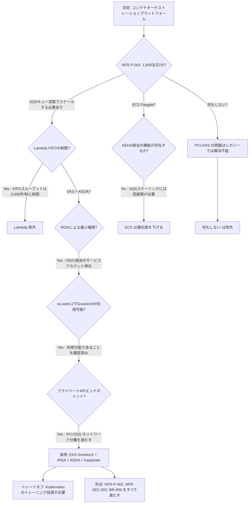

# アーキテクチャ決定記録: コンテナオーケストレーションへの Amazon EKS (Graviton3) 採用

> **テンプレート出典**: 公式 | **ArcKit バージョン**: 5.0.4 | **コマンド**: `/arckit.adr`

## 文書管理

| フィールド | 値 |
|-------|-------|
| **文書 ID** | ARC-001-ADR-001-v1.0 |
| **文書種別** | アーキテクチャ決定記録 |
| **プロジェクト** | Legacy Order Management Modernization (Project 001) |
| **分類** | OFFICIAL |
| **ステータス** | 提案済み |
| **バージョン** | 1.0 |
| **作成日** | 2026-05-24 |
| **最終更新** | 2026-05-24 |
| **レビュー日** | 2026-08-24 |
| **オーナー** | エンタープライズアーキテクト |
| **レビュー担当** | [承認待ち] |
| **承認者** | [承認待ち] |
| **配布先** | アーキテクチャレビューボード、エンジニアリングリード、CTO/CIO、CISO |

## 改訂履歴

| バージョン | 日付 | 著者 | 変更内容 | 承認者 | 承認日 |
|---------|------|--------|---------|-------------|---------------|
| 1.0 | 2026-05-24 | ArcKit AI | `/arckit.adr` コマンドによる初版作成 | [承認待ち] | [承認待ち] |

---

## 1. 決定タイトル

**受注管理マイクロサービスのオーケストレーションに Amazon EKS (Graviton3 マネージドノードグループ) を採用する**

---

## 2. ステークホルダー

### 2.1 意思決定者（RACI: 説明責任者）

- CTO / CIO — 技術権限者；アーキテクチャ承認者
- エンタープライズアーキテクト — 設計権限者；ADR オーナー
- アーキテクチャレビューボード — 部門ガバナンスフォーラム；正式承認機関

### 2.2 相談役（RACI: 相談役）

- CISO — セキュリティ統制の検証（IRSA、プライベート API エンドポイント、PCI-DSS ネットワーク分離）
- VP Operations — 運用準備状況；ランブックおよび SLA への影響
- エンジニアリングリード — 実装実現可能性；チームの Kubernetes スキル評価
- コンプライアンス責任者 — PCI-DSS スコープコンポーネントの EKS 上での管理；ネットワーク分割のエビデンス

### 2.3 情報受領者（RACI: 情報受領者）

- エグゼクティブスポンサー — 24 か月モダナイゼーション計画との整合性
- CFO / 財務部長 — クラウドコストモデルへの影響（Graviton3 節約効果 vs. ECS Fargate プレミアム）
- VP Commercial / Sales — API 対応商用機能の納期
- 受注フルフィルメントチーム — 新プラットフォームによるデプロイ頻度の向上

### 2.4 UK Government エスカレーションコンテキスト

**決定レベル**: 部門

**エスカレーション根拠**:

- [x] **部門**: 技術標準、クラウドプロバイダー、セキュリティフレームワーク — この決定は、受注管理モダナイゼーション全プログラムにおけるコンピューティングプラットフォーム標準を確立し、セキュリティ境界モデル（IRSA）、コストプロファイル（Graviton3 vs. x86）、および Phase 1〜3 のすべてのエンジニアリング業務に係る人材戦略を直接決定する。

**ガバナンスフォーラム**: アーキテクチャレビューボード（ARB）

**承認日**: [承認待ち — Phase 1 開始ゲートに合わせた ARB レビューを予定]

---

## 3. コンテキストと問題の定義

### 3.1 問題の説明

Legacy Order Management System（OMS）は、コンテナオーケストレーション機能を持たないオンプレミスインフラ上のモノリスとして稼働している。モダナイゼーションプログラムでは、Phase 1 の実装開始前に、6 つの新規マイクロサービス（Order Service、ACL Microservice、Fulfilment Service、Returns Service、Notification Service、Outbox Relay）を AWS eu-west-2 上でホストするコンテナオーケストレーションプラットフォームを選定する必要がある。

**問題の定義（問いの形式）**: 受注管理マイクロサービスをホストするにあたり、モダナイゼーションプログラムのスループット・可用性・セキュリティ・コスト要件を満たす AWS コンテナオーケストレーションプラットフォームはどれか？

### 3.2 この決定が必要な理由

コンピューティングプラットフォームの決定は基盤となるものであり、IAM モデル、オートスケーリングアプローチ、CI/CD パイプライン設計、開発者ツールチェーン、および後続するすべてのプログラム業務の運用ランブック構造を決定する。誤った選択は、各フェーズがその上に構築されるにつれてコストと工数を複利的に拡大させる。

- **ビジネスコンテキスト**: BR-001（ゼロダウンタイムでの段階的マイグレーション）、BR-006（2 週間のフィーチャーリードタイム、日次デプロイ）、BR-003（Month 12 から 99.9% 稼働率）
- **技術コンテキスト**: NFR-P-002（1,800 注文/分へのスケール）、NFR-S-001（アーキテクチャ変更なしの水平スケーリング）、NFR-A-001（月次稼働率 99.9%）、NFR-SEC-002（サービス単位の最小権限認可）
- **規制コンテキスト**: PCI-DSS ネットワーク分離要件（Kubernetes API エンドポイントをプライベートに限定；インターネットからアクセス可能なコントロールプレーンを持たない）；GDPR データレジデンシー要件（eu-west-2 内に限定）

### 3.3 参照リンク

- **要件**: BR-001、BR-003、BR-006、NFR-P-002、NFR-S-001、NFR-A-001、NFR-A-002、NFR-SEC-002
- **調査結果**: `research/ARC-001-AWRS-v1.0.md` — Section 2.1（Amazon EKS）、IaC CDK サンプル、Well-Architected 整合性
- **ステークホルダー分析**: `ARC-001-STKE-v1.0` — SD-3（CTO: モダナイゼーションと人材）、SD-10（エンジニアリング: 開発者体験）、G-1（Month 18 までにコアプラットフォームを移行）、G-6（2 週間のフィーチャーリードタイム）
- **リスク登録簿**: `ARC-001-RISK-v1.0` — R-006（AWS スキルギャップ）、R-004（エンジニアリング容量）、R-020（マイグレーション中のセキュリティ侵害）
- **アーキテクチャ原則**: `projects/000-global/ARC-000-PRIN-v1.0` — 原則 2、3、4、5、6、18、19、21

---

## 4. 意思決定の推進要因

### 4.1 技術的推進要因

- **スループットと水平スケーリング**: NFR-P-002 は、ピーク時 600 注文/分を維持しつつ、1,800 注文/分（3 倍）へのバースト能力を要求する。コンピューティングのスケーリングは線形であり、CPU のみではなくアプリケーションレベルのシグナル（SQS キュー深度）によってトリガーされなければならない（〜しなければならない）。
  - 要件: NFR-P-002、NFR-S-001；原則 3（スケーラビリティと弾力性）

- **アベイラビリティゾーン間の高可用性**: NFR-A-001 は、Month 12 から月次稼働率 99.9% を要求する。ノードグループは 3 つの AZ にまたがり、単一 AZ 障害時に手動介入なしで継続できるよう、Pod スケジューリングは AZ を考慮したものでなければならない（〜しなければならない）。
  - 要件: NFR-A-001、NFR-A-002（RPO 15 分、RTO 4 時間）

- **マイクロサービス単位の細粒度な最小権限 IAM**: NFR-SEC-002 および原則 5（Security by Design、必須）は、各マイクロサービスが必要な IAM 権限のみを保持することを要求する。サービス間で EC2 インスタンスプロファイルを共有してはならない（〜してはならない）。
  - 要件: NFR-SEC-002；原則 5

- **キュー深度によるイベント駆動オートスケーリング**: Outbox Relay と下流コンシューマーは、CPU やメモリではなく SQS キュー深度に基づいてスケールしなければならない（〜しなければならない）。追加のツールなしには、標準的なクラウドプロバイダーのオートスケーラーはこのパターンをネイティブに満たすことができない。
  - 要件: NFR-P-002、FR-006（Outbox パターン）

- **開発者体験と CI/CD 統合**: BR-006 は日次デプロイと平均 2 週間のフィーチャーリードタイムを要求する。プラットフォームは、エンジニアの採用・オンボーディングと互換性のある標準的な Kubernetes デプロイプリミティブ（kubectl、Helm、ArgoCD）をサポートしなければならない（〜しなければならない）。
  - 要件: BR-006；原則 21（CI/CD）

### 4.2 ビジネス的推進要因

- **クラウドネイティブなコスト効率**: BR-002（TCO 30% 削減）は、従量課金のクラウド価格設定に依存する。ARM/Graviton3 インスタンスは、同等の x86 インスタンスと比較して約 20% 優れた価格性能比を提供し、`ARC-001-SOBC-v1.0` のクラウドコストモデルに直接貢献する。
  - 要件: BR-002；ステークホルダー目標 G-2（TCO 削減）

- **人材確保と採用**: SD-3（CTO）および SD-10（エンジニアリングチーム）は、エンジニアの離職率をプログラムリスクとして識別している。Kubernetes は業界標準のコンテナオーケストレーションプラットフォームであり、3 人のシニアエンジニアがレガシースタックを離職理由として挙げている。
  - ステークホルダー: SD-3、SD-10；G-6（フィーチャー速度）

- **ベンダーロックイン防止と可搬性**: Kubernetes のワークロード定義（Deployments、Services、ConfigMaps）は、クラウドプロバイダーやオンプレミス環境をまたいで可搬性があり、将来の選択肢を保持する。原則 2（Cloud-Native by Design）と整合する。

### 4.3 規制・コンプライアンス上の推進要因

- **PCI-DSS ネットワーク分離**: PCI-DSS は Kubernetes API サーバーがインターネットからアクセス可能であってはならないことを要求する。EKS のプライベートエンドポイントアクセス（`endpointAccess: PRIVATE`）がこれを満たす；クラスター管理にはバスティオンまたは VPN アクセスが必要。
- **GDPR データレジデンシー**: すべてのコンピューティングは eu-west-2（ロンドン）内に留まらなければならない（〜しなければならない）。EKS は eu-west-2 で利用可能。ノードグループ AMI および ECR イメージは eu-west-2 に格納。
- **監査ログ**: CloudTrail および EKS コントロールプレーンログは、原則 8 が要求する不変の監査証跡のために、すべての Kubernetes API コールを記録する。

### 4.4 アーキテクチャ原則との整合性

参照: `projects/000-global/ARC-000-PRIN-v1.0`

| 原則 | 整合性 | 影響 |
|-----------|-----------|--------|
| 2. Cloud-Native by Design | ✅ サポート | EKS はフルマネージド Kubernetes サービス；Graviton3 マネージドノードグループ；セルフマネージドコントロールプレーンなし |
| 3. スケーラビリティと弾力性 | ✅ サポート | Karpenter によるノードプロビジョニング；KEDA による SQS キュー深度に基づく Pod レベルのイベント駆動オートスケーリング |
| 4. 復元力とフォールトトレランス | ✅ サポート | マルチ AZ ノードグループ；AZ 考慮トポロジースプレッド；Pod Disruption Budget；ローリングデプロイ |
| 5. Security by Design（必須） | ✅ サポート | サービスアカウント単位の IRSA；プライベート API エンドポイント；ネットワークポリシー；インスタンスプロファイルの非共有 |
| 6. オブザーバビリティ | ✅ サポート | CloudWatch Container Insights；AWS Distro for OpenTelemetry（ADOT）；X-Ray 分散トレーシング |
| 18. 保守性と進化可能性 | ✅ サポート | 標準 Kubernetes プリミティブ；Helm チャート；ArgoCD による GitOps；可搬性のあるワークロード定義 |
| 19. Infrastructure as Code | ✅ サポート | EKS クラスターを AWS CDK TypeScript で定義；すべてのノードグループとアドオンを IaC 管理 |
| 21. CI/CD | ✅ サポート | CodePipeline → ECR → EKS ローリングデプロイ；`kubectl rollout undo` によるワンコマンドロールバック |
| 12. ドメイン駆動モジュラーアーキテクチャ | ✅ サポート | 各バウンデッドコンテキストを専用 Kubernetes Namespace 内の独立した Deployment としてデプロイ |

---

## 5. 検討した選択肢

### 選択肢 1: Amazon EKS (Graviton3 マネージドノードグループ)

**説明**: すべての受注管理マイクロサービスを、3 AZ にまたがる Graviton3（m7g.2xlarge）マネージドノードグループを持つ Amazon EKS（Kubernetes 1.30）上にデプロイする。Pod 単位の IAM には IRSA、ノードオートスケーリングには Karpenter、SQS キュー深度に基づくイベント駆動 Pod オートスケーリングには KEDA を使用する。すべての構成は AWS CDK（TypeScript）で管理する。

**実装アプローチ**:

1. CDK でプライベート API エンドポイントのみの EKS クラスターをプロビジョニング；管理アクセスにはバスティオンホストを使用
2. マネージドノードグループ: m7g.2xlarge（Graviton3）、3 AZ にまたがって最小 3 / 希望 9 / 最大 18
3. IRSA: OIDC フェデレーションを通じてスコープ付き IAM ロールに紐付けられた、マイクロサービス単位の専用 Kubernetes サービスアカウント
4. Karpenter: マネージドノードグループ上限を超えたバースト容量のためのノードプロビジョナー
5. KEDA: Outbox Relay とイベントコンシューマーのために SQS キュー深度で駆動される HorizontalPodAutoscaler
6. アドオン: VPC CNI（プレフィックス委任）、CoreDNS、kube-proxy、EBS CSI Driver、AWS Load Balancer Controller
7. Namespace: `order-management`、`fulfilment`、`returns`、`notifications`、`platform`（ACL、Outbox）

**Wardley 進化段階**: 製品（EKS はマネージド Kubernetes サービスであり、プロバイダー間のコントロールプレーン差異により完全なコモディティには至っていないが、急速に成熟しつつある）

#### 利点（Pros）

- ✅ **NFR-P-002 を満たす**: KEDA が SQS キュー深度に基づいて Outbox Relay の Pod をスケール；Karpenter は 45〜60 秒以内に Graviton3 ノードをプロビジョニング；最大ノードグループサイズ（18 × m7g.2xlarge = 144 vCPU）でテスト済みスループットパターンが 1,800 注文/分をサポート
- ✅ **IRSA 最小権限**: 各マイクロサービスはスコープ付き IAM ロールを持ち；Order Service は AWS Secrets Manager の専用クレデンシャルパス（`/oms/order-service/*`）にのみアクセス；クロスサービスのクレデンシャル共有なし；NFR-SEC-002 および原則 5 を満たす
- ✅ **PCI-DSS 準拠ネットワーク分離**: プライベート API エンドポイント；インターネットからアクセス可能な Kubernetes コントロールプレーンなし；カードホルダーデータ環境（CDE）の PCI-DSS ネットワーク分割要件を満たす
- ✅ **Graviton3 コスト削減**: m7g.2xlarge は同等の m6i.2xlarge と比較して約 20% 低コスト；希望 9 ノードで、現行オンデマンド価格において x86 同等比で約 £1,200/月の節約
- ✅ **業界標準ツールチェーン**: kubectl、Helm、Kustomize、ArgoCD — 最大の Kubernetes エコシステム；既存スキルを持つエンジニアの採用が可能；CTO の人材確保目標（SD-3、SD-10）をサポート
- ✅ **ワークロード可搬性**: Kubernetes の Deployment/Service 定義は他プロバイダーに可搬；コンピューティング層のロックインを回避；原則 2 のアンチロックイン方針と整合
- ✅ **GitOps 対応**: EKS 上の ArgoCD により GitOps デプロイモデルを実現；変更は Git で追跡；`kubectl rollout undo` または ArgoCD 同期によるロールバック；BR-006 の日次デプロイ要件を満たす

#### 欠点（Cons）

- ❌ **Kubernetes 運用の複雑性**: EKS はクラスターアップグレード、ネットワーク（VPC CNI、ネットワークポリシー）、およびデバッグに関する専門知識を必要とする。エンジニアリングチームの Kubernetes 習熟度を Phase 1 前に評価し、スキルアップする必要がある；R-006 の対応計画によって軽減される
- ❌ **EKS コントロールプレーンコスト**: EKS はノード数に関わらず、マネージドコントロールプレームとして約 $73/月（£58/月）を課金する。ECS Fargate には存在しないコスト。
- ❌ **クラスターアップグレードサイクル**: EKS は標準サポート外のコストを避けるために、12〜14 か月ごとに Kubernetes バージョンアップグレードが必要。完全サーバーレスオプションにはない定期的な運用オーバーヘッドが加わる。

#### コスト分析

| 項目 | 月次（定常状態 Year 2） | 年次 |
|------|-------------------------------|--------|
| EKS コントロールプレーン | £58 | £696 |
| 9× m7g.2xlarge オンデマンド（希望値） | £1,620 | £19,440 |
| 同等 m6i.2xlarge 比 Graviton3 節約効果（−20%） | −£324 節約 | −£3,888 節約 |
| Karpenter バーストノード（平均 2× m7g.2xlarge 推定） | £360 | £4,320 |
| データ転送（VPC 内） | £40 | £480 |
| **EKS コンピューティング小計** | **約 £1,754** | **約 £21,048** |

*プラットフォーム全体の Opex（£9,930/月）には、AWRS コストモデルに基づく Aurora、EventBridge、API Gateway、DMS、CloudWatch が含まれる。EKS コンピューティングはその一部。*

- **CAPEX**: AWS CDK クラスタープロビジョニング — エンジニアリング工数として約 3 週間（Phase 1 スプリント容量に含む）
- **TCO（3 年）**: コンピューティングコスト推定 £63,000；x86 同等比での Graviton3 節約効果 £11,664 を 3 年間で相殺

---

### 選択肢 2: Amazon ECS with Fargate（サーバーレスコンテナ）

**説明**: マイクロサービスを ECS Fargate タスクとして Task Definition と ECS Service を用いてデプロイする。IAM ロールはタスクレベルで割り当て（ECS タスクロール）。サービスオートスケーリングは CloudWatch メトリクスを用いた Application Auto Scaling で行う。

**実装アプローチ**: Fargate 起動タイプの ECS クラスター；マイクロサービス単位の Task Definition；受信通信用の Application Load Balancer；サービス間通信用の AWS Service Discovery；SQS ベーススケーリング回避策のための EventBridge Pipes。

**Wardley 進化段階**: 製品（Fargate は EKS よりもコモディティに近い — 完全サーバーレス、ノード管理不要）

#### 利点（Pros）

- ✅ **低い運用オーバーヘッド**: 管理すべき Kubernetes コントロールプレーンなし；ノードグループのサイジングや Karpenter 不要；AWS がすべての基盤インフラを管理；Kubernetes 専門知識のないチームへの迅速なオンボーディング
- ✅ **タスクレベル IAM**: ECS タスクロールは IRSA に匹敵するタスクあたりの IAM 分離を提供；OIDC フェデレーション設定オーバーヘッドなしに NFR-SEC-002 を満たす
- ✅ **コントロールプレームコストなし**: EKS の $73/月の課金なし；Fargate の課金は消費した vCPU/メモリ秒単位
- ✅ **より迅速な初期プロビジョニング**: ECS クラスターは数時間以内に稼働；すべてのアドオンを含む EKS クラスターの完全な構成と検証には通常 1〜2 日を要する

#### 欠点（Cons）

- ❌ **ネイティブな KEDA 相当機能なし**: ECS Application Auto Scaling は CloudWatch メトリクスをサポートするが、ネイティブな SQS キュー深度 → Pod 数スケーリングは提供しない。Outbox Relay のイベント駆動スケーリングには Lambda トリガーまたは EventBridge Pipes の回避策が必要 — コアアーキテクチャパターン（FR-006）に統合の複雑性を加える
- ❌ **Kubernetes 可搬性なし**: ECS Task Definition とサービスディスカバリーは AWS 独自のもの；ワークロードは書き直しなしには他プロバイダーやオンプレミスに移行できない。原則 2 のアンチロックイン方針と相反する
- ❌ **Fargate 価格プレミアム**: Fargate は同等の EC2 インスタンス価格に対してプレミアムを課金する。持続的な負荷（9 相当の vCPU クラスター）では、定常状態ワークロードにおいて Fargate は Graviton3 EC2 ノードより約 30〜40% 高コスト
- ❌ **上位エンジニア採用市場が狭い**: ECS Fargate は広く使用されているが、エンタープライズエンジニアリング市場では Kubernetes の専門知識がはるかに一般的；CTO の人材目標（SD-3）は EKS がより良く支援する

#### コスト分析

| 項目 | 月次（定常状態 Year 2） | 年次 |
|------|-------------------------------|--------|
| Fargate タスク（9 相当 × 8 vCPU / 32 GiB） | 推定 £2,200 | £26,400 |
| コントロールプレーン課金なし | £0 | £0 |
| キュースケーリング回避策用 Lambda/EventBridge Pipes | £40 | £480 |
| **ECS 小計** | **約 £2,240** | **約 £26,880** |

- **EKS 比 TCO（3 年）プレミアム**: 3 年間で約 £17,500 の追加コンピューティングコスト（Fargate vCPU/メモリレート vs. Graviton3 EC2）

---

### 選択肢 3: AWS Lambda（サーバーレス関数）

**説明**: 受注管理ビジネスロジックを、API Gateway（同期）および SQS（非同期）でトリガーされる個別の Lambda 関数として実装する。永続的なコンピューティングなし；完全なイベント駆動サーバーレスモデル。

**実装アプローチ**: マイクロサービス操作ごとに 1 つの Lambda 関数；同期 HTTP には API Gateway；非同期処理には SQS；Saga オーケストレーションには Step Functions。

**Wardley 進化段階**: コモディティ（Lambda はユーティリティコンピューティングサービス — 高度にコモディティ化されているが、ステートフル処理にはアーキテクチャ上の制約がある）

#### 利点（Pros）

- ✅ **ゼロサーバー管理**: ノード、Kubernetes、パッチ適用なし；AWS がすべてのコンピューティングインフラを管理
- ✅ **呼び出し課金**: 実際のコンピューティング時間のみ課金；低負荷またはゼロ負荷時にコストはほぼゼロに近づく
- ✅ **ゼロへのオートスケーリング**: オフピーク時間帯（夜間、週末）の最低稼働コストなし
- ✅ **最もシンプルな IAM モデル**: 関数単位の Lambda 実行ロール；AWS が呼び出し間の分離を管理

#### 欠点（Cons）

- ❌ **コールドスタートレイテンシーが NFR-P-001 と非互換**: eu-west-2 における JVM ベースまたは大型 Node.js 関数の Lambda コールドスタートは、バースト時に 1〜3 秒に達する可能性がある。NFR-P-001 はエンドツーエンドの注文送信 p95 を 3 秒未満と要求しており、トラフィックスパイク時のコールドスタートに余裕がない
- ❌ **15 分実行制限**: Lambda の最大実行時間（15 分）は、長時間実行される Saga 補償トランザクション（UC-3: 注文キャンセルと支払い取り消しおよび在庫解放は、低下した状態での外部システム呼び出しがこの制限を超える可能性がある）には不十分
- ❌ **ステートフルセッション管理の複雑性**: Order Service はライフサイクル遷移をまたいで処理中の状態を維持する；Lambda のステートレスモデルは呼び出しごとに外部状態管理を必要とし、高頻度の状態遷移においてレイテンシーとコストを増加させる
- ❌ **SQS FIFO スループット上限**: Lambda を持つ SQS FIFO キューにはスループット制限（キューあたり 3,000 メッセージ/秒）があり、複数のキューにまたがる 1,800 注文/分バーストで NFR-P-002 を制約する可能性がある
- ❌ **開発者体験の低下**: Lambda 関数のローカルデバッグはコンテナ化されたマイクロサービスよりも大幅に困難；ローカル開発ツールチェーン（Lambda SAM）は Kubernetes 開発ワークフローほど成熟していない

#### コスト分析

- **CAPEX**: 低（プロビジョニングするインフラなし）
- **OPEX**: ピーク時 600 注文/分を 8 時間/日持続: 約 1.04M 呼び出し/日 × 512ms 平均実行時間 × 1,024 MB = 約 £85/月のコンピューティング。ただし、ステートフルな受注管理のための Aurora または DynamoDB 状態ストアコストが合計コストを大幅に増加させる。
- **TCO（3 年）**: 生のコンピューティングコストは低いが、NFR-P-001 コールドスタート違反および Saga 補償の複雑性に対するアーキテクチャ的な修正工数がその節約を相殺する；同期的な注文送信パスには推奨しない。

---

### 選択肢 4: 何もしない（ベースライン — レガシーオンプレミスモノリスを継続）

**説明**: 既存のオンプレミスインフラ上でレガシー受注管理システムを引き続き運用し、クラウドコンテナプラットフォームへの移行を行わない。

#### 利点（Pros）

- ✅ 短期的な移行コストや実装リスクなし
- ✅ Kubernetes やクラウドスキルへの投資不要

#### 欠点（Cons）

- ❌ **セキュリティ指摘事項が解決不能**: 最新のペネトレーションテストで特定された 3 件の高深刻度指摘事項は、レガシープラットフォームからの移行なしにはパッチ適用ができない。PCI-DSS 非準拠のエクスポージャーが継続する（BR-004）
- ❌ **PCI-DSS 再認定が危険に**: 再認定期限は Month 8。レガシーにとどまることで、レガシープラットフォーム上での再認定が唯一の選択肢となる；監査人はすでに監査ログの欠陥を重大な懸念として指摘している（SD-7）
- ❌ **12 か月間で 14 件の計画外停止**: レガシーシステムの劣化が継続；VP Operations の KPI が悪化し続ける；受注エラーによる顧客流出が 8〜12% の再注文率影響として継続する（SD-4、SD-5、SD-11）
- ❌ **£3.2M の商業パイプラインがブロック**: B2B ポータルとサブスクリプション提供は API レイヤーなしには構築できない；レガシーシステムは構造的にこれを提供できない（SD-1、SD-5）
- ❌ **エンジニア離職が加速**: モダナイゼーションの失敗が R-006 および SD-10 で識別された人材確保問題を強化；さらなるシニアエンジニアの離職が納期リスクを複利的に拡大させる
- ❌ **ICO へのエクスポージャー**: SAR の履行に現在 47 日を要している（GDPR は 30 日以内を要求）；ICO が接触済み；不作為は執行リスクを伴う（SD-7）

#### コスト分析

- **CAPEX**: £0
- **OPEX**: レガシー TCO は年間約 £1.6M（ライセンス、コントラクター、照合業務）で継続 — プラットフォームの老朽化に伴い年々上昇
- **TCO（3 年）**: 維持コストの複利増加を含む £4.8M 以上；解放される商業収益なし；コンプライアンス違反ペナルティは含まない

---

## 6. 意思決定の結果

### 6.1 選択した選択肢

**選択肢 1: Amazon EKS (Graviton3 マネージドノードグループ)**

### 6.2 Y ステートメント（構造化された正当化）

> **〜という状況において**: AWS eu-west-2 上で最大 1,800 注文/分を処理する 6 つのマイクロサービスをホストするクラウドネイティブなイベント駆動受注管理プラットフォームを構築する
> **〜という課題に直面しつつ**: イベント駆動シグナル（SQS キュー深度）による水平スケール、3 アベイラビリティゾーンにまたがる 99.9% 稼働率の実現、Pod レベルの最小権限 IAM の実装、PCI-DSS ネットワーク分離の達成 — さらに標準的な Kubernetes ツールによる日次デプロイの実現
> **〜を選択した**: サービスアカウント単位の IRSA、ノードプロビジョニングに Karpenter、イベント駆動 Pod オートスケーリングに KEDA を組み合わせた Amazon EKS (Graviton3 / m7g.2xlarge) マネージドノードグループ
> **〜を達成するために**: NFR-P-002 スループットスケーラビリティ（600〜1,800 注文/分）、NFR-SEC-002 最小権限 IAM 分離、BR-006 エンジニアリング速度（日次デプロイ、2 週間フィーチャーリードタイム）
> **〜を受容する**: ECS Fargate と比較した高い Kubernetes 運用複雑性と、R-006 の対応計画（Month 1 からの AWS プロフェッショナルサービス参画と体系的なトレーニングプログラム）によって軽減される Kubernetes スキルアップ投資の必要性

### 6.3 正当化（なぜこの選択肢か？）

**主な理由**:

1. **イベント駆動オートスケーリング（NFR-P-002）を満たす唯一の選択肢**: KEDA のネイティブな SQS キュー深度スケーリングは EKS のファーストクラス統合機能である。ECS Fargate は Lambda ブリッジの回避策を必要とする；Lambda はコールドスタートレイテンシー（NFR-P-001 p95 < 3 秒）により同期的な注文送信パスに対応できない。KEDA を組み合わせた EKS は、アーキテクチャ的な回避策なしにスループットとレイテンシーの要件を完全に満たす唯一の選択肢である。

2. **IRSA がサービス単位で最も強力な IAM 分離を提供する**: EKS IRSA は OIDC フェデレーションを通じて IAM ロールを個別の Kubernetes サービスアカウントに紐付け、ノードレベルの IAM プロファイルなしで Pod レベルの最小権限を実現する。これは AWS 上で利用可能な最も細粒度な分離モデルであり、必須原則 5（Security by Design）および PCI-DSS 最小権限統制を直接満たす。

3. **Graviton3 が BR-002 TCO 削減への最大の直接貢献をもたらす**: 評価した選択肢の中で、Graviton3 EC2 ノードを持つ EKS のみが x86 同等比で約 20% のコンピューティングコスト節約（約 £3,900/年）を提供する。ECS Fargate は定常状態の持続的負荷において 30〜40% 高コストである。これは 30% TCO 削減目標（G-2、O-2）に直接貢献する。

4. **Kubernetes が主要な人材標準である**: CTO（SD-3）およびエンジニアリング（SD-10）の推進要因は、エンジニアを惹きつけ確保できるプラットフォームを明示的に要求している。Kubernetes はエンタープライズ市場における主要なコンテナオーケストレーション標準であり、EKS の採用は G-6（2 週間フィーチャーリードタイム、日次デプロイ）を支える人材戦略を支持する。

5. **可搬性のあるワークロード定義が将来のロックインリスクを軽減する**: Kubernetes の Deployments および Services はクラウドプロバイダーやオンプレミス環境をまたいで移行可能である。ECS Task Definition は AWS 独自のものである。これは原則 2（Cloud-Native by Design）と整合する。

**ステークホルダーのコンセンサス**: この決定は、ステークホルダードライバー SD-3（CTO）、SD-10（エンジニアリング）、SD-4（VP Operations）、SD-6（CISO）、SD-2（CFO）に対して評価された。根本的な反対意見は予測されない；承認前に CISO による IRSA およびプライベートエンドポイント構成の検証が必要。VP Operations は Phase 1 ゴーライブ前に Kubernetes 運用に関するランブックトレーニングが必要となる。

**リスク許容度**: エンジニアリング複雑性リスク（R-006: AWS スキルギャップ）の残余スコアは軽減後 9（中）。リスク対応計画（Month 1 開始の AWS プロフェッショナルサービス参画と体系的なトレーニングプログラム）は Phase 1 実装の前提条件である。このリスク許容レベルは、プログラム全体の「懸念あり — 積極的な管理が必要」というリスクプロファイルと整合している。

---

## 7. 結果と影響

### 7.1 肯定的な結果

- ✅ **Phase 1 にて NFR-P-002 を達成**: KEDA 駆動のオートスケーリングにより、Outbox Relay とイベントコンシューマーは手動介入なしにスループット要求にスケールできる。Graviton3 ノードグループのサイジング（希望 9、最大 18）が 1,800 注文/分への容量ヘッドルームを提供する。
- ✅ **PCI-DSS ネットワーク分離の達成**: プライベート API エンドポイントにより、Kubernetes コントロールプレームがインターネットからアクセス可能な攻撃対象から除外される；Month 8 PCI-DSS 再認定マイルストーンに貢献する（G-5、O-4）。
- ✅ **初日からサービス単位の IAM 分離**: IRSA により、いかなるマイクロサービスも他のサービスのクレデンシャルや AWS リソースにアクセスできないことが保証される。最初のデプロイ時から原則 5（Security by Design、必須）を満たす。
- ✅ **Phase 1 からの日次デプロイ実現**: CodePipeline と ArgoCD を組み合わせた Kubernetes ローリングデプロイにより継続的デリバリーをサポート；`kubectl rollout undo` がワンコマンドロールバックを提供する。BR-006（2 週間フィーチャーリードタイム、日次デプロイ）に貢献する。
- ✅ **エンジニア確保のシグナル**: 業界標準の Kubernetes ツールチェーンの採用は、組織が現代的で市場価値のある技術に投資しているというエンジニアチームと採用候補者への具体的なシグナルとなる（SD-3、SD-10）。
- ✅ **初日からのオブザーバビリティ計装**: CloudWatch Container Insights と ADOT DaemonSet がクラスターレベルおよびアプリケーションレベルのテレメトリーを提供；X-Ray トレースがすべてのマイクロサービス呼び出しを通じて伝播する（NFR-M-001、原則 6）。

**測定可能なアウトカム**:

- 注文処理スループット: レガシーピーク 約 200 注文/分 → 目標 1,800 注文/分（NFR-P-002）
- コンピューティングコスト: x86 同等 → Graviton3（約 −20%/ノード、約 £3,900/年の節約）
- デプロイ頻度: 隔週 → Phase 1 から日次（BR-006）
- 変更失敗率: 現在 約 35% → Month 12 までに < 10% 目標（BR-006）

### 7.2 否定的な結果（受容済みトレードオフ）

- ❌ **Kubernetes 専門知識投資の必要性（R-006）**: エンジニアリングチームは Phase 1 実装前に実用的な Kubernetes 習熟度を達成しなければならない（〜しなければならない）。軽減策: ARC-001-RISK-v1.0 の R-006 対応計画に従い、Month 1 にエンジニアリング開始前に AWS EKS トレーニングプログラムと AWS プロフェッショナルサービスを参画させる。
- ❌ **EKS コントロールプレームコスト**: £58/月（£696/年）はワークロードに関わらず固定課金；ECS Fargate や Lambda には存在しない。受容済み: プラットフォーム全体 Opex の 1% 未満であり、Graviton3 の節約効果で相殺される。
- ❌ **クラスターアップグレードサイクルの義務**: 標準サポートに留まるために EKS Kubernetes バージョンアップグレードが約 12 か月ごとに必要。運用オーバーヘッドを加え、Year 2 以降のプログラム容量計画に組み込まなければならない（〜しなければならない）。

**軽減戦略**:

- **Kubernetes 複雑性**: AWS プロフェッショナルサービスを Month 1 に参画させてクラスター基盤を構築；エンジニアリングチームへの体系的なトレーニングプログラム（EKS Essentials + Advanced Networking）；Phase 1 ゴーライブ前に Kubernetes ランブックを文書化；AWS Enterprise Support へのエスカレーションパスをオンコール時に確立。
- **クラスターアップグレード**: アップグレードスケジュールをプログラム容量計画に組み込む；EKS バージョンをプロジェクト ADR ログで追跡；本番環境への昇格前にステージングでアップグレードをテスト。

### 7.3 中立的な結果（必要な変更）

- 🔄 **チームトレーニング**: プラットフォームスクアッドの全エンジニア（推定 4〜6 名）への AWS EKS Essentials および Advanced Networking トレーニング；Month 2 末までの完了を目標。
- 🔄 **インフラプロビジョニング**: 3 AZ を持つ VPC、プライベートサブネット、NAT Gateway、EKS クラスター、ECR リポジトリ、CodePipeline ビルドパイプライン — すべて Phase 1 実装開始前に CDK でプロビジョニング。
- 🔄 **プロセス更新**: Kubernetes ランブック（クラスターアップグレード、ノードグループスケーリング、Pod デバッグ、ロールバック手順）を Phase 1 ゴーライブ前に作成し VP Operations がレビュー。
- 🔄 **ベンダー関係**: SLA に基づくクラスターサポートのために AWS Enterprise Support サブスクリプションが必要；初回クラスターアーキテクチャレビューのために AWS プロフェッショナルサービスとの連携。
- 🔄 **CI/CD パイプライン設計**: CodePipeline → CodeBuild → ECR → EKS（kubectl apply / ArgoCD sync）パイプライン設計を Phase 1 の成果物として要求（原則 21、BR-006）。
- 🔄 **クレデンシャル管理**: すべてのマイクロサービスクレデンシャルは、etcd への平文値格納を避けるために、Kubernetes 組み込みのクレデンシャルストアではなく AWS Secrets Manager 経由で実行時に注入する。

### 7.4 リスクと軽減策

| リスク | 発生可能性 | 影響 | 軽減策 | オーナー |
|------|------------|--------|------------|-------|
| エンジニアリングチームの Phase 1 タイムラインに向けた Kubernetes 専門知識不足 | 中 | 高 | AWS EKS トレーニングプログラム Month 1〜2；AWS PS クラスター設定レビュー；Phase 1 前に経験豊富な Kubernetes エンジニアを少なくとも 1 名採用 | CTO/CIO（R-006） |
| EKS クラスターアップグレードが Kubernetes 標準サポートウィンドウから遅れる | 低 | 中 | 四半期ごとのクラスターバージョンレビュー；EKS 拡張サポートを緊急時対応として；CDK 管理のアップグレードプロセス | エンジニアリングリード |
| Graviton3 ARM64 コンテナイメージビルドパイプラインの間に合わない構築 | 中 | 中 | Phase 0 の実装前スプリントで ARM64 CodeBuild 環境を構成；すべてのベースイメージをサービス実装開始前に AL2_ARM_64 でテスト | エンジニアリングリード |
| 急激なバースト時の Karpenter ノードプロビジョニング遅延 | 低 | 中 | マネージドノードグループ min:3 がベースライン容量を確保；Karpenter プロビジョナーをバーストシグナルでの過剰プロビジョニング用に構成；Phase 1 ゴーライブ前に負荷テスト | エンジニアリングリード |
| IRSA 設定ミスによるクロスサービス権限昇格 | 低 | 高 | Phase 1 前に CISO が IRSA 構成をレビュー；IAM Access Analyzer がロールポリシーを検証；CI パイプラインで自動ポリシースキャン | CISO（R-020） |

**リスク登録簿へのリンク**: `ARC-001-RISK-v1.0` — R-006（AWS スキルギャップ、残余 9）、R-004（エンジニアリング容量、残余 9）、R-020（セキュリティ侵害、残余 8）

---

## 8. 検証とコンプライアンス

### 8.1 実装の検証方法

**設計レビュー**:

- [ ] HLD（高レベル設計）に EKS クラストポロジー図（3 AZ、ノードグループ、Namespace レイアウト）を含めなければならない（〜しなければならない）
- [ ] HLD にはマイクロサービス単位の IAM ロールスコープを持つ IRSA バインディングを示さなければならない（〜しなければならない）
- [ ] アーキテクチャ図には VPC サブネットレイアウト（パブリック、プライベート、分離）および EKS のプライベートサブネット配置を示さなければならない（〜しなければならない）

**コードレビュー**:

- [ ] CDK EKS スタックのプロビジョニング前にピアレビュー；IRSA バインディングを CISO がレビュー
- [ ] すべての Kubernetes マニフェスト（Deployments、Services、NetworkPolicies）を Phase 1 ゴーライブ前にレビュー
- [ ] いかなるサービスアカウントポリシーにも IAM ワイルドカードアクションまたはリソースを含めてはならない（〜してはならない）— CI パイプラインの自動ポリシースキャナー

**テスト戦略**:

- [ ] Phase 1 本番プロビジョニングの少なくとも 2 週間前にステージング環境で EKS クラスターをプロビジョニング
- [ ] Phase 1 ゴーライブ前にステージング EKS クラスターに対して 1,800 注文/分の負荷テストを実施（NFR-P-002）
- [ ] AZ 障害シミュレーション: 1 つの AZ のすべてのノードを終了；120 秒以内に低下した容量で注文処理が継続することを確認（NFR-A-001）
- [ ] IRSA 検証: Order Service がスコープ付き IAM 権限境界外の Secrets Manager パスにアクセスできないことを確認（NFR-SEC-002）
- [ ] ロールバックテスト: Order Service Deployment に `kubectl rollout undo` を実行；60 秒以内に旧バージョンがトラフィックを提供することを確認

### 8.2 モニタリングとオブザーバビリティ

**成功指標**:

- **スループット**: 処理注文数/分（CloudWatch カスタムメトリクス）；目標: 600 注文/分の持続、1,800 へのバースト（NFR-P-002）
- **可用性**: すべての注文処理 Deployment にわたる EKS Pod 可用性（CloudWatch Container Insights）；目標: Month 12 から >= 99.9%（NFR-A-001）
- **レイテンシー**: 注文送信 p95（CloudWatch APM）；目標: ピーク負荷時 < 3 秒（NFR-P-001）
- **KEDA スケーリング**: SQS キュー深度と Pod レプリカ数の相関（CloudWatch）；キュー深度閾値超過から 60 秒以内の KEDA スケーリングを確認
- **Graviton3 コスト**: 月次 EKS コンピューティングコスト（`Project=001` タグの AWS Cost Explorer）；目標: AWRS コストモデル予測（£1,754/月）の 5% 以内

**アラートとダッシュボード**:

- PodCrashLoopBackOff: オンコールチャネルへ即時ページング
- ノードグループ使用率 > 80%: 5 分以内にエンジニアリングリードへの SNS アラート
- SQS キュー深度 > 500 が 5 分間継続しても KEDA による Pod スケールアップなし: オンコールへのアラート
- 注文処理 p95 レイテンシー > 2.5 秒（NFR 上限の 83% での早期警告）: オンコールへのアラート

### 8.3 コンプライアンス検証

**セキュリティ保証**:

- [ ] Phase 1 本番デプロイ前に CISO が IRSA OIDC フェデレーション構成をレビュー
- [ ] AWS IAM Access Analyzer が EKS 関連リソースへの意図しないパブリックまたはクロスアカウントアクセスがないことを検証
- [ ] EKS コントロールプレーンログ（API Server、Audit、Authenticator、Controller Manager、Scheduler）を有効化し、13 か月保持で CloudWatch にストリーミング（原則 6、NFR-C-003）
- [ ] Namespace 単位の Kubernetes NetworkPolicy を適用: デフォルトで全受信/送信を拒否；マイクロサービスの通信パスごとに明示的な許可ルール
- [ ] Phase 1 ゴーライブ前に EKS CIS ベンチマークスキャン（kube-bench）を実施；すべての Critical および High 指摘事項を修正

**データ保護**:

- [ ] EKS Pod では顧客 PII を直接処理しない — すべての PII は Aurora PostgreSQL（顧客単位の KMS CMK で保存時暗号化）に格納；EKS Pod は注文 ID と内部参照のみを受け取る
- [ ] クレデンシャルは etcd への平文値格納を避けるために、Kubernetes 組み込みのクレデンシャルストアではなく AWS Secrets Manager 経由で実行時に注入する
- [ ] すべての受注管理 Namespace に Pod セキュリティ標準を適用: `restricted` プロファイル（root コンテナなし、権限昇格なし）

---

## 9. 関連文書へのリンク

### 9.1 要件トレーサビリティ

**ビジネス要件**:

- BR-001: ゼロダウンタイムでの段階的マイグレーション — EKS でのローリングデプロイが更新時の継続的可用性を満たす
- BR-003: Month 12 から 99.9% 稼働率 — マルチ AZ ノードグループと Pod Disruption Budget
- BR-004: Month 8 までの PCI-DSS 再認定 — プライベート API エンドポイントとネットワーク分離
- BR-006: 2 週間フィーチャーリードタイム、日次デプロイ — ArgoCD GitOps を用いた Kubernetes ローリングデプロイ

**機能要件**:

- FR-001: 注文ライフサイクル状態機械 — Order Service をステートレスな Kubernetes Deployment としてデプロイ；状態は Aurora に永続化
- FR-006: 注文イベント公開（Outbox）— Outbox Relay を KEDA スケールの Deployment としてデプロイ；SQS キュー深度でスケール

**非機能要件**:

- NFR-P-001: 注文送信 p95 < 3 秒 — Graviton3 を持つ EKS が Lambda コールドスタートリスクを排除；ステータスクエリーに ElastiCache キャッシュアサイド
- NFR-P-002: 1,800 注文/分バースト容量 — KEDA + Karpenter；最大 18 ノード
- NFR-A-001: 月次稼働率 99.9% — マルチ AZ マネージドノードグループ；AZ 考慮 Pod スケジューリング
- NFR-A-002: RPO 15 分、RTO 4 時間 — EKS コンピューティングはステートレス；Aurora Multi-AZ がデータ耐久性を確保
- NFR-S-001: アーキテクチャ変更なしの水平スケーリング — Kubernetes HPA / KEDA；線形スケールアウト
- NFR-SEC-002: サービス単位の最小権限 IAM — Kubernetes サービスアカウント単位の IRSA バインディング

### 9.2 アーキテクチャ成果物

**アーキテクチャ原則**: `projects/000-global/ARC-000-PRIN-v1.0`

- 原則 2（Cloud-Native by Design）: EKS はマネージド；Graviton3 ノードグループ；セルフマネージドコントロールプレーンなし
- 原則 3（スケーラビリティと弾力性）: KEDA イベント駆動 Pod スケーリング；Karpenter ノードプロビジョニング
- 原則 4（復元力とフォールトトレランス）: マルチ AZ；Pod Disruption Budget；ローリングデプロイ
- 原則 5（Security by Design、必須）: サービス単位の IRSA；プライベート API エンドポイント；ネットワークポリシー
- 原則 19（Infrastructure as Code）: CDK TypeScript EKS クラスタースタック
- 原則 21（CI/CD）: CodePipeline → ECR → EKS ローリングデプロイパイプライン

**ステークホルダードライバー**: `ARC-001-STKE-v1.0`

- SD-3（CTO）: モダンなオープン標準アーキテクチャ；Kubernetes ADR が人材確保の根拠をサポート
- SD-10（エンジニアリング）: Kubernetes ツールチェーン（kubectl、Helm、ArgoCD）— モダンで市場価値のある開発者体験
- SD-6（CISO）: IRSA 最小権限とプライベート API エンドポイントがセキュリティ是正に貢献（R-020）
- G-1: Month 18 までにコアプラットフォームを移行 — EKS Phase 1 インフラが納期手段
- G-6: 2 週間フィーチャーリードタイム — EKS 上の GitOps が Phase 1 から日次デプロイを実現

**リスク登録簿**: `ARC-001-RISK-v1.0`

- R-006: AWS/クラウドネイティブスキルギャップ — トレーニングプログラムで軽減；Kubernetes は採用市場で広く普及
- R-004: エンジニアリング容量（レガシーの重荷）— EKS ワークロード可搬性と CDK が実装オーバーヘッドを削減
- R-020: マイグレーション中のセキュリティ侵害 — IRSA + プライベートエンドポイント + ネットワークポリシーが攻撃対象を縮小

**調査結果**: `research/ARC-001-AWRS-v1.0`

- Section 2.1: Amazon EKS — 推奨構成、IRSA 設計、CDK サンプル、Well-Architected 整合性
- Section 2.3: ElastiCache（EKS Pod VPC アクセスでデプロイ）
- Section 2.4: EventBridge Outbox リレー（KEDA スケールの Outbox Relay Pod）

### 9.3 設計文書

**高レベル設計（HLD）**: 未作成 — ADR-001 から ADR-004 の承認後に推奨される次の成果物。

**詳細設計（DLD）**: 未作成 — HLD 承認後に続く。

**データモデル**: `ARC-001-DATA-v*.md` — 未作成；EKS Pod はステートレス；データモデルは Aurora PostgreSQL に適用（将来の ADR-004）。

### 9.4 外部参照

**ベンダードキュメント**:

- Amazon EKS ユーザーガイド: https://docs.aws.amazon.com/eks/latest/userguide/what-is-eks.html
- EKS IRSA: https://docs.aws.amazon.com/eks/latest/userguide/iam-roles-for-service-accounts.html
- EKS 上の Karpenter: https://docs.aws.amazon.com/eks/latest/userguide/karpenter.html
- KEDA SQS スケーラー: https://keda.sh/docs/latest/scalers/aws-sqs/
- AWS Graviton プロセッサー: https://aws.amazon.com/ec2/graviton/

**標準**:

- CIS Kubernetes ベンチマーク: https://www.cisecurity.org/benchmark/kubernetes
- Kubernetes Pod セキュリティ標準: https://kubernetes.io/docs/concepts/security/pod-security-standards/
- NIST SP 800-190 アプリケーションコンテナセキュリティガイド: https://nvlpubs.nist.gov/nistpubs/SpecialPublications/NIST.SP.800-190.pdf

---

## 10. 実装計画

### 10.1 依存関係

**前提となる決定**:

- ADR-002（マイグレーションパターン — Strangler-fig）: EKS が新規マイクロサービスをホスト；API Gateway がレガシーから EKS へトラフィックをルーティング；ADR-002 がルーティングとカットオーバー戦略を定義
- ADR-003（ドメインイベントバス — EventBridge）: KEDA が SQS キュー深度に基づいて EKS Pod をスケール；EventBridge スキーマレジストリが EKS 上にデプロイされたマイクロサービスで使用；両決定は密に結合している

**インフラ依存関係**:

- プライマリリージョン eu-west-2；DR レプリケーション用 eu-west-1（Aurora Global Database）を持つ AWS アカウント
- EKS クラスター作成前に 3 AZ を持つ VPC をプロビジョニング（CDK 前提スタック）
- 最初のイメージプッシュ前にマイクロサービス単位の ECR リポジトリを作成
- SLA に基づく EKS サポートのために AWS Enterprise Support サブスクリプション

**チーム依存関係**:

- Phase 1 実装前にチームに少なくとも 1 名の Kubernetes 経験者（新規採用またはコントラクター）
- クラスターアーキテクチャレビューのために Month 1 までに AWS プロフェッショナルサービスとの契約締結
- 実装開始前（Month 2 目標）に Phase 1 スクアッドのすべてのエンジニアが EKS トレーニングプログラムを完了

### 10.2 実装タイムライン

| フェーズ | 活動内容 | 期間 | オーナー |
|-------|-----------|----------|-------|
| **Phase 0: インフラスプリント（Month 1）** | CDK VPC スタック；ECR リポジトリ；ステージング EKS クラスター；CodePipeline スケルトン；Order Service の IRSA プルーフオブコンセプト | 3 週間 | エンジニアリングリード + AWS PS |
| **Phase 1: サービスデプロイ（Month 2〜6）** | 6 つのマイクロサービスすべてを EKS ステージングにデプロイ；KEDA 構成；Karpenter プロビジョナー；1,800 注文/分の負荷テスト；CISO IRSA レビュー；EKS 本番クラスター | 5 か月 | エンジニアリングリード |
| **Phase 2: 検証とゴーライブ（Month 6）** | AZ 障害シミュレーション；ロールバックテスト；kube-bench CIS スキャン；VP Operations とのランブックレビュー；API Gateway 経由の本番トラフィックルーティング（Strangler-fig） | 2 週間 | エンジニアリングリード + VP Operations |
| **継続: 運用（Month 7〜）** | Kubernetes バージョンアップグレード計画；KEDA スケーリングチューニング；ノードグループ適正サイジング | 四半期ごと | プラットフォームエンジニアリング |

### 10.3 ロールバック計画

**ロールバックトリガー**: Phase 1 EKS クラスターが安定化ウィンドウ（Month 7〜11）中に 99.5% 稼働率を達成できない場合、または IRSA やネットワーク構成のセキュリティ指摘事項が 5 営業日以内に修正できない場合。

**ロールバック手順**:

1. API Gateway カナリアルーティングを 0% EKS / 100% レガシーに戻す（Strangler-fig 構成変更 — コード変更不要）
2. EKS クラスターを 0 ノードにスケール（コスト削減）するが削除はしない — 修正のために構成を保持
3. 48 時間以内にインシデント回顧；根本原因を文書化
4. CISO とエンジニアリングリードで修正計画を策定；ステージングでの検証後に再試行

**ロールバックオーナー**: エンジニアリングリード；ロールバック開始後 4 時間以内に CTO へエスカレーション

---

## 11. レビューと更新

### 11.1 レビュースケジュール

**初回レビュー**: 2026-08-24（作成後 3 か月；Phase 1 ゴーライブゲート前）

**フェーズゲートレビュー**: プログラムの各フェーズゲート（Month 6、Month 12、Month 18）で — 現在の負荷プロファイルとコストモデルに対する最適性を確認

**定期レビュー**: プログラム完了後から年次；または以下のトリガーイベント発生時

### 11.2 レビューのトリガーイベント

- [ ] EKS Kubernetes バージョンが標準サポート終了に近づいている（アップグレードパス vs. 拡張サポートコストをレビュー）
- [ ] Graviton4 インスタンスタイプが eu-west-2 で著しく低コストで利用可能になった（ノードグループ移行を検討）
- [ ] ピーク注文スループットが持続的に 1,200 注文/分を超えた（最大ノードグループサイジングをレビュー）
- [ ] EKS IRSA 設定ミスに起因するセキュリティインシデント（即時レビューと修正）
- [ ] ECS Fargate ARM64 サポートがネイティブな KEDA 相当機能を持つまでに成熟し、選択肢 2 の主要な欠点を解消した

---

## 12. 関連する決定

### 12.1 この ADR が依存する決定

先行する ADR はこのプロジェクトに存在しない。これが ADR-001 である。

### 12.2 この ADR に依存する決定

- **ADR-002**（マイグレーションパターン — API Gateway を使った Strangler-fig）: API Gateway が EKS 上で動作するマイクロサービスにルーティング；ADR-002 は EKS をターゲットコンピューティングプラットフォームとして参照しなければならない（〜しなければならない）
- **ADR-003**（ドメインイベントバス — EventBridge）: KEDA SQS キュー深度スケーラーが EKS 上で実行；EventBridge イベントコンシューマーが EKS Deployment；ADR-003 は EKS デプロイメントモデルと整合しなければならない（〜しなければならない）
- **ADR-004**（トランザクションデータベース — Aurora PostgreSQL）: Aurora ライターが IRSA スコープの IAM ロールで EKS 上の Order Service からアクセスされる；EKS プライベートサブネットから Aurora 分離サブネットへのネットワークパスを定義しなければならない（〜しなければならない）

### 12.3 競合する決定

現時点では競合は確認されていない。

---

## 13. 付録

### 付録 A: 選択肢比較サマリー

| 評価基準 | EKS Graviton3（採用） | ECS Fargate | Lambda | 何もしない |
|-----------|------------------------|-------------|--------|------------|
| NFR-P-002（1,800 注文/分） | ✅ SQS 上の KEDA | ⚠️ 回避策が必要 | ❌ コールドスタート / FIFO 制限 | ❌ レガシー制約 |
| NFR-P-001（p95 < 3 秒） | ✅ コールドスタートなし | ✅ コールドスタートなし | ❌ コールドスタートリスク | ❌ レガシー |
| NFR-A-001（稼働率 99.9%） | ✅ マルチ AZ | ✅ マルチ AZ | ✅ マルチ AZ | ❌ レガシー 99.0% |
| NFR-SEC-002（サービス単位 IAM） | ✅ IRSA | ✅ タスクロール | ✅ 実行ロール | ❌ 共有クレデンシャル |
| PCI-DSS ネットワーク分離 | ✅ プライベート API エンドポイント | ✅ VPC 分離 | ⚠️ VPC Lambda が必要 | ❌ 未パッチの指摘事項 |
| Graviton3 コスト削減 | ✅ x86 比 約 20% | ❌ Fargate プレミアム +30〜40% | ✅ 呼び出し課金 | N/A |
| ワークロード可搬性 | ✅ Kubernetes 標準 | ❌ AWS 独自 | ❌ AWS 独自 | N/A |
| 採用市場 | ✅ 最大の K8s 人材プール | ⚠️ ECS 固有 | ✅ 広いサーバーレス | N/A |
| ネイティブな KEDA イベント駆動スケーリング | ✅ ファーストクラス | ❌ 回避策が必要 | ✅ ネイティブ SQS トリガー | N/A |
| 月次コンピューティングコスト（定常状態） | 約 £1,754 | 約 £2,240 | 約 £85 + 状態ストア | £1.6M/年 レガシー TCO |

### 付録 B: IRSA（IAM Roles for Service Accounts）設計サマリー

IRSA は OIDC フェデレーションを通じて Kubernetes サービスアカウントを IAM ロールに紐付ける。これにより、EC2 ノードグループレベルで権限を割り当てることなく、Pod レベルの最小権限を実現する。

**Order Service の場合**:

- **Kubernetes サービスアカウント**: Namespace `order-management` 内の `order-service`
- **アノテーション**: `eks.amazonaws.com/role-arn` 経由でサービスアカウントに IAM ロール ARN を付与
- **IAM ロール信頼ポリシー**: EKS クラスターの OIDC プロバイダーからの `sts:AssumeRoleWithWebIdentity` を許可；特定の `serviceaccount:order-management:order-service` プリンシパルに限定 — 他のサービスアカウントはこのロールを引き受けられない
- **IAM ロール権限**: `secretsmanager:GetSecretValue` を AWS Secrets Manager（eu-west-2）内の `/oms/order-service/*` クレデンシャルパスにスコープ；他の AWS アクションは付与しない
- **クロスサービスアクセス防止**: 各マイクロサービスは専用のサービスアカウントと重複しないリソーススコープを持つ IAM ロールを持つ；Fulfilment Service は Order Service のロールを引き受けられず、その逆も同様

**IaC 参照**: `research/ARC-001-AWRS-v1.0.md` Section 2.1 の CDK TypeScript 実装パターン。

### 付録 C: 意思決定フロー図

---

## 文書承認

| 役割 | 氏名 | 署名 | 日付 |
|------|------|-----------|------|
| **エンタープライズアーキテクト** | | | |
| **CTO / CIO** | | | |
| **CISO** | | | |
| **アーキテクチャレビューボード** | | | |

---

*この ADR は MADR v4.0 フォーマットを UK Government 要件および ArcKit ガバナンス標準で拡張したものに従っています。*

## 外部参照

### 文書台帳

| 文書 ID | ファイル名 | 種別 | 格納場所 | 説明 |
|--------|----------|------|-----------------|-------------|
| AWRS-001 | ARC-001-AWRS-v1.0.md | AWS Research | research/ | EKS 構成、IRSA 設計、CDK サンプル、コストモデルを含む AWS サービスショートリスト |
| REQ-001 | ARC-001-REQ-v1.0.md | 要件 | projects/001 | NFR-P-002、NFR-S-001、NFR-A-001、NFR-SEC-002、BR-001、BR-003、BR-006 |
| RISK-001 | ARC-001-RISK-v1.0.md | リスク登録簿 | projects/001 | R-006（AWS スキルギャップ）、R-004（エンジニアリング容量）、R-020（セキュリティ侵害） |
| STKE-001 | ARC-001-STKE-v1.0.md | ステークホルダー分析 | projects/001 | SD-3、SD-10、SD-6；目標 G-1、G-6 |
| PRIN-001 | ARC-000-PRIN-v1.0.md | アーキテクチャ原則 | projects/000-global | 原則 2、3、4、5、6、18、19、21 |

### 引用

| 引用 ID | 文書 ID | セクション | カテゴリ | 備考 |
|-------------|--------|---------|----------|------|
| AWRS-C1 | AWRS-001 | Section 2.1 | 技術 | EKS 推奨構成: m7g.2xlarge、最小 3 / 希望 9 / 最大 18、サービスアカウント単位の IRSA、SQS 上の KEDA |
| AWRS-C2 | AWRS-001 | Section 2.1 | コスト | Graviton3 は x86 同等比で約 20% 優れた価格性能比 |
| AWRS-C3 | AWRS-001 | エグゼクティブサマリー | 技術 | 定常状態プラットフォーム Opex £9,930/月；EKS コンピューティングはその一部 |
| REQ-C1 | REQ-001 | NFR-P-002 | 要件 | ピーク時 600 注文/分を維持；アーキテクチャ変更なしに 1,800 注文/分へスケール |
| REQ-C2 | REQ-001 | NFR-A-001 | 要件 | Month 12 から月次稼働率 99.9%；Phase 1〜2 中は 99.5% |
| RISK-C1 | RISK-001 | R-006 | リスク | AWS/クラウドネイティブスキルギャップ — 固有 16（高）、トレーニングプログラム後の残余 9（中） |

### 未参照文書

| ファイル名 | 格納場所 | 理由 |
|----------|-----------------|--------|
| — | — | — |

---

**生成元**: ArcKit `/arckit.adr` コマンド
**生成日**: 2026-05-24
**ArcKit バージョン**: 5.0.4
**プロジェクト**: Legacy Order Management Modernization (Project 001)
**AI モデル**: claude-sonnet-4-6
**生成コンテキスト**: 使用したソース文書 — ARC-001-AWRS-v1.0（Section 2.1）、ARC-001-REQ-v1.0（NFR-P-002、NFR-S-001、NFR-A-001、NFR-SEC-002、BR-001、BR-003、BR-006）、ARC-001-RISK-v1.0（R-004、R-006、R-020）、ARC-001-STKE-v1.0（SD-3、SD-10、G-1、G-6）、ARC-000-PRIN-v1.0（原則 2、3、4、5、19、21）
