# AWS Research: Legacy Order Management Modernization

> **Template Origin**: Official | **ArcKit Version**: 5.0.4 | **Command**: `/arckit:aws-research`

## Document Control

| Field | Value |
|---|---|
| **Document ID** | ARC-001-AWRS-v1.0 |
| **Document Type** | AWS Research (AWRS) |
| **Project** | Legacy Order Management Modernization (Project 001) |
| **Classification** | OFFICIAL |
| **Status** | DRAFT |
| **Version** | 1.0 |
| **Created Date** | 2026-05-23 |
| **Last Modified** | 2026-05-23 |
| **Review Date** | 2026-06-22 |
| **Owner** | Enterprise Architect |
| **Reviewed By** | [PENDING] |
| **Approved By** | [PENDING] |
| **Distribution** | Project Team, Architecture Team, Engineering Leads, CISO |

---

## Revision History

| Version | Date | Author | Changes | Approved By | Approval Date |
|---------|------|--------|---------|-------------|---------------|
| 1.0 | 2026-05-23 | ArcKit AI Agent | Initial AWS service research covering compute, data, messaging, API, security, observability, and migration tooling categories. Well-Architected assessment (6 pillars), Security Hub controls mapping, UK Government suitability, and indicative cost model. | [PENDING] | [PENDING] |

---

## Executive Summary

This document provides the AWS service shortlist and architecture pattern recommendations for Project 001: Legacy Order Management Modernization. The programme replaces a legacy on-premises order management monolith with a cloud-native, event-driven microservices platform on AWS eu-west-2 (London), using a strangler-fig migration pattern to preserve business continuity throughout the 24-month programme.

**Recommended Architecture**: Event-driven microservices on Amazon EKS (Graviton3), backed by Aurora PostgreSQL Multi-AZ, EventBridge for domain events, Step Functions for saga orchestration, and API Gateway as the strangler-fig routing control plane.

**Key Decisions**:
- **Amazon EKS** (Graviton3 node groups) for container orchestration — satisfies NFR-P-002 horizontal scaling to 1,800 orders/minute, IRSA least-privilege IAM (NFR-SEC-002), and KEDA-based autoscaling on SQS queue depth
- **Aurora PostgreSQL Multi-AZ** for transactional order data — sub-35-second AZ failover, 15-minute RPO via continuous replication (NFR-A-002), and per-customer KMS CMK supporting GDPR crypto-shredding (NFR-C-002)
- **Amazon EventBridge** as the domain event bus — schema registry for NFR-I-002 event versioning; at-least-once delivery via transactional outbox pattern (FR-006)
- **AWS Step Functions** for saga orchestration — compensating transactions for order cancellation and refund sagas (FR-001, UC-3, Principle 7)
- **AWS Secrets Manager** for runtime credential retrieval — automatic rotation satisfying NFR-SEC-004 90-day rotation without downtime
- **API Gateway** as strangler-fig router — traffic shifting from legacy to new microservices via canary deployments (5% → 25% → 50% → 100%), satisfying BR-001 zero-downtime migration
- **AWS DMS** with CDC for dual-write replication during migration — DR-004 5–8M historical records with continuous live sync

**Regional Deployment**: Primary eu-west-2 (London); DR replication to eu-west-1 (Ireland) for Aurora Global Database read replica and S3 Cross-Region Replication for audit logs.

**Indicative Monthly Cost** (steady-state, Year 2): approximately £9,930/month (£119,160/year). This represents the cloud infrastructure component of the overall Opex target in ARC-001-SOBC-v1.0, which targets Year 3+ Opex of £800,000/year total (including engineering staff and support).

**UK Government Suitability**: OFFICIAL classification; all recommended services available in eu-west-2; G-Cloud 14 (RM1557.14) procurement applicable via AWS prime supplier; 14/14 NCSC Cloud Security Principles satisfied.

---

## 1. Requirements Mapping

The following table maps the primary AWS service categories to the project requirements they address:

| Requirement Category | Key Requirements | AWS Service Category |
|---|---|---|
| Compute / Container Orchestration | NFR-P-002, NFR-S-001, FR-001 through FR-020 | Amazon EKS, EC2 Graviton3, KEDA |
| Relational / Transactional Data | DR-001, DR-002, NFR-A-002, NFR-C-002 | Aurora PostgreSQL, ElastiCache |
| Domain Events / Messaging | FR-006, NFR-I-002, INT-001 through INT-005 | EventBridge, SQS, SNS |
| API Management / Traffic Routing | NFR-I-001, BR-001, FR-003, FR-004 | API Gateway, CloudFront, WAF |
| Saga Orchestration | FR-001, UC-3, Principle 7 | Step Functions |
| Identity and Credentials | NFR-SEC-001, NFR-SEC-002, NFR-SEC-004 | IAM, Cognito, Secrets Manager |
| Network Security | NFR-SEC-003, NFR-C-001, PCI-DSS | VPC, WAF, Shield, Network Firewall |
| Key Management and Compliance | NFR-SEC-003, NFR-C-002, NFR-C-003 | KMS, CloudTrail, Config, Security Hub |
| Observability | NFR-M-001, FR-018 | CloudWatch, X-Ray, ADOT, Managed Grafana |
| Migration Tooling | DR-004, FR-016, FR-017 | DMS, SCT, Application Discovery Service |
| Storage / Archival | NFR-C-003, NFR-S-002, DR-002 | S3, S3 Glacier, DynamoDB |
| CI/CD and IaC | NFR-M-003, BR-006 | CodePipeline, CodeBuild, CDK, ECR |

---

## 2. AWS Service Shortlist

### 2.1 Compute: Amazon EKS

**Service**: Amazon Elastic Kubernetes Service (EKS)
**Requirement Alignment**: NFR-P-002, NFR-S-001, NFR-A-001, NFR-SEC-002

**Recommended Configuration**:

| Parameter | Value | Rationale |
|---|---|---|
| Kubernetes version | 1.30 (EKS managed) | Current stable version with extended support |
| Node group instance type | m7g.2xlarge (Graviton3) | 8 vCPU, 32 GiB; approx 20% better price/performance vs x86 equivalent |
| Node group sizing | min: 3, desired: 9, max: 18 (across 3 AZs) | Satisfies 600 orders/min peak; scales to 1,800 orders/min (NFR-P-002) |
| AMI type | AL2_ARM_64 | Amazon Linux 2 for Graviton3 nodes |
| Cluster endpoint access | Private only | No public Kubernetes API endpoint; satisfies PCI-DSS network isolation |
| IRSA | Enabled per service account | Pod-level least-privilege IAM (NFR-SEC-002) |
| Cluster autoscaler | Karpenter + KEDA | Karpenter for node provisioning; KEDA for pod scaling on SQS queue depth |
| Add-ons | VPC CNI, CoreDNS, kube-proxy, EBS CSI Driver, EFS CSI Driver | Standard production add-ons |

**Microservices Deployed on EKS**:
- Order Service (state machine, outbox writer)
- ACL Microservice (legacy OMS translation — FR-016)
- Fulfilment Service
- Returns Service
- Notification Service
- Outbox Relay (CDC to EventBridge)

**IRSA Configuration**: Each microservice has a dedicated Kubernetes service account bound to a scoped IAM role via OIDC federation. The Order Service role is granted read access to Secrets Manager for its database credentials path only (`/oms/order-service/*`); no cross-service credential sharing.

**IaC Sample (AWS CDK TypeScript)**:

```typescript
// lib/eks-stack.ts
import * as cdk from 'aws-cdk-lib';
import * as ec2 from 'aws-cdk-lib/aws-ec2';
import * as eks from 'aws-cdk-lib/aws-eks';
import * as iam from 'aws-cdk-lib/aws-iam';

const vpc = new ec2.Vpc(this, 'OmsVpc', {
  maxAzs: 3,
  natGateways: 3,
  subnetConfiguration: [
    { cidrMask: 24, name: 'Public', subnetType: ec2.SubnetType.PUBLIC },
    { cidrMask: 22, name: 'Private', subnetType: ec2.SubnetType.PRIVATE_WITH_EGRESS },
    { cidrMask: 24, name: 'Isolated', subnetType: ec2.SubnetType.PRIVATE_ISOLATED },
  ],
});

const cluster = new eks.Cluster(this, 'OmsCluster', {
  vpc,
  version: eks.KubernetesVersion.V1_30,
  defaultCapacity: 0,
  endpointAccess: eks.EndpointAccess.PRIVATE,
});

cluster.addNodegroupCapacity('OrderProcessingNodes', {
  instanceTypes: [new ec2.InstanceType('m7g.2xlarge')],
  minSize: 3,
  maxSize: 18,
  desiredSize: 9,
  amiType: eks.NodegroupAmiType.AL2_ARM_64,
});

// IRSA: scoped service account for Order Service
// Resource ARN scoped to oms/order-service credential path in Secrets Manager
// ARN format uses the secretsmanager service prefix followed by the named credential path
const orderServiceAccount = cluster.addServiceAccount('OrderServiceAccount', {
  name: 'order-service',
  namespace: 'order-management',
});
orderServiceAccount.addToPrincipalPolicy(new iam.PolicyStatement({
  actions: ['secretsmanager:GetSecretValue'],
  resources: [
    // Scoped to OMS order-service credentials path only — replace ACCOUNT_ID at deployment
    `arn:aws:secretsmanager:eu-west-2:${cdk.Aws.ACCOUNT_ID}:secret-path/oms/order-service/*`,
  ],
}));
```

**Sources**:
- Amazon EKS documentation: https://docs.aws.amazon.com/eks/latest/userguide/what-is-eks.html
- EKS IRSA: https://docs.aws.amazon.com/eks/latest/userguide/iam-roles-for-service-accounts.html
- Karpenter on EKS: https://docs.aws.amazon.com/eks/latest/userguide/karpenter.html

**Regional Availability**: Available in eu-west-2 (London). [SOURCE: AWS Regional Services — https://aws.amazon.com/about-aws/global-infrastructure/regional-product-services/]

**Well-Architected Alignment**:
- *Reliability*: Multi-AZ node groups; AZ-aware pod scheduling
- *Performance Efficiency*: Graviton3 price/performance; KEDA event-driven autoscaling
- *Cost Optimization*: Graviton3 approx 20% cost saving; Spot instances for non-critical workloads
- *Security*: Private API endpoint; IRSA least-privilege

---

### 2.2 Data: Aurora PostgreSQL Multi-AZ

**Service**: Amazon Aurora PostgreSQL (Multi-AZ Cluster)
**Requirement Alignment**: DR-001, DR-002, DR-003, NFR-A-002, NFR-C-002, NFR-SEC-003

**Recommended Configuration**:

| Parameter | Value | Rationale |
|---|---|---|
| Engine | Aurora PostgreSQL 16.3 | Current stable Aurora PostgreSQL version |
| Instance class — writer | db.r8g.2xlarge (Graviton4) | Memory-optimised; 8 vCPU, 64 GiB RAM |
| Instance class — readers (x2) | db.r8g.xlarge (Graviton4) | Reader 1: status queries; Reader 2: reporting |
| Multi-AZ | Aurora Multi-AZ cluster (1 writer + 2 readers across 3 AZs) | Sub-35-second AZ failover; satisfies NFR-A-001 |
| Storage encryption | Enabled — per-customer KMS CMK | GDPR crypto-shredding capability (NFR-C-002); CMK deletion = data erasure |
| Backup retention | 35 days | Continuous point-in-time recovery; satisfies NFR-A-002 15-min RPO |
| Deletion protection | Enabled | Prevents accidental cluster deletion |
| Aurora Global Database | Enabled — eu-west-1 read replica | Cross-region DR; supports NFR-A-002 4-hour RTO for regional failover |
| Performance Insights | Enabled — 7-day retention | Query performance analysis |
| Enhanced Monitoring | 15-second granularity | OS-level metrics for database nodes |

**GDPR Crypto-Shredding Design**: Each customer is assigned a dedicated KMS Customer Managed Key (CMK). Aurora encrypts customer PII columns using the per-customer CMK via application-level envelope encryption. To satisfy a right-to-erasure request (NFR-C-002, Article 17), the CMK is scheduled for deletion (minimum 7-day pending window). After deletion, encrypted PII fields are cryptographically unreadable; the order financial record (amounts, references, timestamps) remains intact for the 7-year regulatory retention obligation. This satisfies R-012 (GDPR immutable event stream erasure risk).

**Outbox Table Design**: The `order_outbox` table within the Aurora writer instance stores unpublished domain events. The Outbox Relay service polls this table using `SELECT ... FOR UPDATE SKIP LOCKED` to claim event batches, publishes to EventBridge, then marks records as published. This implements the transactional outbox pattern required by FR-006.

**IaC Sample (Terraform)**:

```hcl
resource "aws_rds_cluster" "order_management" {
  cluster_identifier      = "oms-aurora-postgresql"
  engine                  = "aurora-postgresql"
  engine_version          = "16.3"
  storage_encrypted       = true
  kms_key_id              = aws_kms_key.aurora_cmk.arn
  backup_retention_period = 35
  deletion_protection     = true

  tags = {
    Project        = "001-order-management-modernization"
    Classification = "OFFICIAL"
    Environment    = "production"
  }
}

resource "aws_kms_key" "aurora_cmk" {
  description             = "OMS Aurora PostgreSQL CMK — PCI-DSS and GDPR crypto-shredding"
  deletion_window_in_days = 7
  enable_key_rotation     = true
}

resource "aws_rds_cluster_instance" "writer" {
  cluster_identifier = aws_rds_cluster.order_management.id
  instance_class     = "db.r8g.2xlarge"
  engine             = aws_rds_cluster.order_management.engine
  engine_version     = aws_rds_cluster.order_management.engine_version
}

resource "aws_rds_cluster_instance" "readers" {
  count              = 2
  cluster_identifier = aws_rds_cluster.order_management.id
  instance_class     = "db.r8g.xlarge"
  engine             = aws_rds_cluster.order_management.engine
  engine_version     = aws_rds_cluster.order_management.engine_version
}
```

**Sources**:
- Aurora PostgreSQL documentation: https://docs.aws.amazon.com/AmazonRDS/latest/AuroraUserGuide/Aurora.AuroraPostgreSQL.html
- Aurora Multi-AZ clusters: https://docs.aws.amazon.com/AmazonRDS/latest/AuroraUserGuide/aurora-multi-az.html
- Aurora Global Database: https://docs.aws.amazon.com/AmazonRDS/latest/AuroraUserGuide/aurora-global-database.html
- KMS key deletion: https://docs.aws.amazon.com/kms/latest/developerguide/deleting-keys.html

**Regional Availability**: Aurora PostgreSQL available in eu-west-2 (London) and eu-west-1 (Ireland). [SOURCE: https://aws.amazon.com/about-aws/global-infrastructure/regional-product-services/]

---

### 2.3 Caching: ElastiCache for Valkey

**Service**: Amazon ElastiCache for Valkey (OSS Redis-compatible)
**Requirement Alignment**: NFR-P-001 (order status p99 < 1 second), FR-004 (real-time status API)

**Recommended Configuration**:

| Parameter | Value | Rationale |
|---|---|---|
| Engine | Valkey 7.2 | OSS Redis-compatible successor; no licensing restrictions |
| Node type | cache.m7g.large (Graviton3) | 6.38 GiB memory; sufficient for hot order status cache |
| Cluster mode | Enabled (3 shards x 2 replicas) | HA; no single point of failure |
| Encryption at rest | Enabled — KMS CMK | NFR-SEC-003 compliance |
| Encryption in transit | Enabled (TLS) | NFR-SEC-003 compliance |
| TTL strategy | 5 minutes for order status | Satisfies BR-007 (status within 5 minutes of last transition) |

**Caching Strategy**: Cache-aside pattern. On status query (FR-004), Order Service checks ElastiCache first. Cache miss triggers Aurora reader query; result written to cache with 5-minute TTL. On state transition, cache entry invalidated immediately. This brings order status query p99 from approximately 50ms database round-trip to approximately 2ms cache hit — satisfying NFR-P-001 p99 < 1 second even at 1,500 concurrent consumers.

**Sources**:
- ElastiCache for Valkey: https://docs.aws.amazon.com/AmazonElastiCache/latest/red-ug/WhatIs.html
- ElastiCache Valkey announcement: https://aws.amazon.com/blogs/aws/amazon-elasticache-now-supports-valkey/

**Regional Availability**: ElastiCache available in eu-west-2 (London). [SOURCE: https://aws.amazon.com/about-aws/global-infrastructure/regional-product-services/]

---

### 2.4 Domain Events: Amazon EventBridge

**Service**: Amazon EventBridge (custom event bus) + EventBridge Schema Registry
**Requirement Alignment**: FR-006, NFR-I-002, INT-001, INT-004, INT-005

**Recommended Configuration**:

| Parameter | Value | Rationale |
|---|---|---|
| Event bus | Custom bus: `order-management-bus` | Isolation from default bus; scoped resource policies |
| Schema registry | `order-management-schemas` | NFR-I-002: schema versioning for all domain events |
| Schema discovery | Enabled | Auto-discover event schemas from published events |
| Archive | 90-day retention on all events | Replay capability for consumer failures |
| Replay | Enabled | Re-drive events to consumers after outages |
| Event patterns | Per-target filtering rules | ERP, CRM, Notification consumers each receive only relevant events |

**Domain Events Registered in Schema Registry**:
- `com.example.orders.OrderCreated` v1
- `com.example.orders.OrderConfirmed` v1
- `com.example.orders.OrderProcessing` v1
- `com.example.orders.OrderDispatched` v1
- `com.example.orders.OrderDelivered` v1
- `com.example.orders.OrderCancelled` v1
- `com.example.orders.OrderPaymentFailed` v1
- `com.example.orders.ReturnRequested` v1
- `com.example.orders.ReturnCompleted` v1

**Transactional Outbox Relay (TypeScript)**:

```typescript
// src/outbox-relay/index.ts
import { Pool } from 'pg';
import { EventBridgeClient, PutEventsCommand } from '@aws-sdk/client-eventbridge';

const pool = new Pool({ /* Aurora writer connection string retrieved from Secrets Manager at startup */ });
const eb = new EventBridgeClient({ region: 'eu-west-2' });

export async function relayOutboxEvents(): Promise<void> {
  const client = await pool.connect();
  try {
    await client.query('BEGIN');

    // Claim up to 100 unpublished events with SKIP LOCKED for concurrent relay instances
    const result = await client.query(`
      SELECT id, event_type, aggregate_id, payload, created_at
      FROM order_outbox
      WHERE published_at IS NULL
      ORDER BY created_at ASC
      LIMIT 100
      FOR UPDATE SKIP LOCKED
    `);

    if (result.rows.length === 0) {
      await client.query('ROLLBACK');
      return;
    }

    const ids = result.rows.map(r => r.id);
    const entries = result.rows.map(row => ({
      EventBusName: 'order-management-bus',
      Source: 'com.example.orders',
      DetailType: row.event_type,
      Detail: JSON.stringify({
        ...row.payload,
        correlationId: row.id,
        aggregateId: row.aggregate_id,
      }),
    }));

    await eb.send(new PutEventsCommand({ Entries: entries }));

    await client.query(
      `UPDATE order_outbox SET published_at = NOW() WHERE id = ANY($1)`,
      [ids]
    );

    await client.query('COMMIT');
  } catch (err) {
    await client.query('ROLLBACK');
    throw err;
  } finally {
    client.release();
  }
}
```

**Sources**:
- Amazon EventBridge documentation: https://docs.aws.amazon.com/eventbridge/latest/userguide/eb-what-is.html
- EventBridge Schema Registry: https://docs.aws.amazon.com/eventbridge/latest/userguide/eb-schema.html
- AWS Prescriptive Guidance — Transactional Outbox Pattern: https://docs.aws.amazon.com/prescriptive-guidance/latest/cloud-design-patterns/transactional-outbox.html

**Regional Availability**: EventBridge available in eu-west-2 (London). [SOURCE: https://aws.amazon.com/about-aws/global-infrastructure/regional-product-services/]

---

### 2.5 Messaging: Amazon SQS

**Service**: Amazon Simple Queue Service (SQS)
**Requirement Alignment**: NFR-A-003 (DLQ per consumer), FR-008 (exception queue), INT-001, INT-004

**Recommended Configuration**:

| Queue | Type | Purpose | DLQ | Visibility Timeout |
|---|---|---|---|---|
| `oms-logistics-dispatch` | Standard | Dispatch instructions to 3PL | `oms-logistics-dispatch-dlq` | 60 seconds |
| `oms-erp-financial-events` | Standard | Financial events to ERP | `oms-erp-events-dlq` | 60 seconds |
| `oms-notification-events` | Standard | Customer notification triggers | `oms-notification-dlq` | 30 seconds |
| `oms-exception-queue` | FIFO | Operator exception management | N/A | 60 seconds |
| `oms-legacy-sync` | Standard | Legacy OMS dual-write during migration | `oms-legacy-sync-dlq` | 120 seconds |

**DLQ Alerting**: CloudWatch Alarms on `ApproximateNumberOfMessagesVisible` for each DLQ; threshold > 0 triggers PagerDuty/SNS notification (NFR-A-003). This satisfies FR-008 (exception queue alert within 5 minutes).

**KEDA Autoscaling**: KEDA ScaledObject configured on `oms-logistics-dispatch` queue depth. At 0 messages: 1 replica (Fulfilment Service). At 600 messages: scales to 9 replicas. Maximum 18 replicas. This provides load-reactive scaling for dispatch processing workloads.

**Sources**:
- Amazon SQS documentation: https://docs.aws.amazon.com/AWSSimpleQueueService/latest/SQSDeveloperGuide/welcome.html
- SQS Dead-Letter Queues: https://docs.aws.amazon.com/AWSSimpleQueueService/latest/SQSDeveloperGuide/sqs-dead-letter-queues.html

**Regional Availability**: SQS available in eu-west-2 (London). [SOURCE: https://aws.amazon.com/about-aws/global-infrastructure/regional-product-services/]

---

### 2.6 Saga Orchestration: AWS Step Functions

**Service**: AWS Step Functions (Standard Workflows)
**Requirement Alignment**: FR-001, UC-3, UC-4, Principle 7 (ARC-000-PRIN-v1.0)

**Recommended Configuration**:

| Parameter | Value | Rationale |
|---|---|---|
| Workflow type | Standard Workflows | Long-running sagas (up to 1 year); full execution history |
| Express Workflows | Not recommended for sagas | At-most-once execution semantics; insufficient for compensating transactions |
| Integration pattern | SDK integrations (optimistic) | Async integration with EKS services via Lambda or direct SDK |
| Execution history | CloudWatch Logs — all events | Full audit trail for compliance |
| IAM role | Least-privilege per workflow | Scoped to target services only (NFR-SEC-002) |

**Saga Definitions**:

- **OrderCancellationSaga**: States — ValidateOrderCancellable → ReleaseInventoryReservation → VoidPaymentAuthorisation → TransitionOrderToCancelled → PublishOrderCancelledEvent. Each step has a compensating transaction; if VoidPayment fails, order is flagged for manual finance review (UC-3 Ex 2).

- **OrderFulfillmentSaga**: States — SendDispatchInstruction → AwaitLogisticsAcknowledgement → TransitionToDispatched → PublishOrderDispatchedEvent → AwaitDeliveryEvent → TransitionToDelivered.

- **RefundProcessingSaga**: States — ValidateReturnEligibility → InitiateRefund → AwaitPaymentGatewayConfirmation → CompleteReturn → PublishReturnCompletedEvent.

**Sources**:
- AWS Step Functions documentation: https://docs.aws.amazon.com/step-functions/latest/dg/welcome.html
- Step Functions Standard vs. Express Workflows: https://docs.aws.amazon.com/step-functions/latest/dg/concepts-standard-vs-express.html
- AWS Prescriptive Guidance — Saga Orchestration: https://docs.aws.amazon.com/prescriptive-guidance/latest/cloud-design-patterns/saga-orchestration.html

**Regional Availability**: Step Functions available in eu-west-2 (London). [SOURCE: https://aws.amazon.com/about-aws/global-infrastructure/regional-product-services/]

---

### 2.7 API Management: Amazon API Gateway

**Service**: Amazon API Gateway (REST API) + CloudFront + AWS WAF
**Requirement Alignment**: NFR-I-001, BR-001, FR-003, FR-004, NFR-C-001 (PCI-DSS)

**Recommended Configuration**:

| Parameter | Value | Rationale |
|---|---|---|
| API type | REST API (regional endpoint) | Required for WAF association and canary deployments |
| Throttling — default | 10,000 requests/second | Regional default; adequate for 1,800 orders/min peak |
| Throttling — order creation | 100 requests/second per consumer | Prevents single consumer monopolising capacity |
| Stage variables | Enabled | Environment-specific backend routing |
| Canary release | Enabled | 5% → 25% → 50% → 100% traffic to new services (BR-001 strangler-fig) |
| WAF | AWS WAF v2 associated | PCI-DSS managed rule group; rate limiting; SQL injection / XSS protection |
| CloudFront | Distributes API GW origin | TLS termination at edge; custom domain; ACM certificate |
| Mutual TLS | Enabled for B2B consumers | NFR-I-001 authentication for partner integrations |
| Access logging | CloudWatch Logs — full request | NFR-C-003 audit logging |
| Cache | 300-second TTL on status endpoints | Reduces Aurora reader load for FR-004 status queries |

**Strangler-Fig Routing**: During the migration, API Gateway acts as the routing control plane. Stage variables and canary deployment weights determine what percentage of traffic for each endpoint routes to the legacy OMS (via ACL Microservice) versus the new EKS microservices. This satisfies BR-001 (zero customer-visible downtime during migration) and enables progressive cutover per phase.

**Sources**:
- Amazon API Gateway documentation: https://docs.aws.amazon.com/apigateway/latest/developerguide/welcome.html
- API Gateway canary release: https://docs.aws.amazon.com/apigateway/latest/developerguide/canary-release.html
- AWS WAF documentation: https://docs.aws.amazon.com/waf/latest/developerguide/waf-chapter.html
- AWS Prescriptive Guidance — Strangler Fig: https://docs.aws.amazon.com/prescriptive-guidance/latest/cloud-design-patterns/strangler-fig.html

**Regional Availability**: API Gateway, WAF, CloudFront available in eu-west-2 (London). [SOURCE: https://aws.amazon.com/about-aws/global-infrastructure/regional-product-services/]

---

### 2.8 Security: Identity, Credentials, and Key Management

#### 2.8.1 AWS IAM (Identity and Access Management)

**Requirement Alignment**: NFR-SEC-002

**Key Controls**:
- Service Control Policies (SCPs) at AWS Organizations level — deny creation of resources outside eu-west-2 (and eu-west-1 for DR)
- Permission boundaries on all IAM roles to prevent privilege escalation
- IAM Access Analyzer — automated detection of overly-permissive policies
- AWS Config rule `iam-no-inline-policy` and `iam-policy-no-statements-with-admin-access` as mandatory compliance checks
- IRSA (IAM Roles for Service Accounts) for all EKS pods — no long-lived instance credentials

**Sources**: https://docs.aws.amazon.com/IAM/latest/UserGuide/introduction.html

#### 2.8.2 AWS Secrets Manager

**Requirement Alignment**: NFR-SEC-004, DR-006 (Integration credentials)

**Recommended Configuration**:

| Parameter | Value | Rationale |
|---|---|---|
| Rotation schedule | 30 days (database credentials) | Within NFR-SEC-004 90-day maximum |
| Rotation schedule | 90 days (API keys) | Satisfies NFR-SEC-004 |
| Cross-account replication | eu-west-1 replica | DR access to credentials |
| Resource policy | Per-service IRSA role | Least-privilege; Order Service reads only its own path |
| Encryption | KMS CMK | NFR-SEC-003 |

**Path Convention**: Credentials stored at path `/oms/{service-name}/{credential-type}`. For example, `/oms/order-service/aurora-password`. EKS pods retrieve their credentials at startup via the AWS Secrets and Configuration Provider (ASCP) sidecar, which mounts the value as a Kubernetes volume. This satisfies NFR-SEC-004 (no credentials in source code or container images).

**Sources**: https://docs.aws.amazon.com/secretsmanager/latest/userguide/intro.html

#### 2.8.3 AWS KMS (Key Management Service)

**Requirement Alignment**: NFR-SEC-003, NFR-C-002 (GDPR crypto-shredding)

**Key Hierarchy**:

| Key Alias | Purpose | Deletion Window |
|---|---|---|
| `oms/aurora/cluster` | Aurora cluster encryption | 30 days |
| `oms/aurora/per-customer/{customer_id}` | Per-customer PII encryption (GDPR) | 7 days (erasure trigger) |
| `oms/elasticache/cluster` | ElastiCache encryption | 30 days |
| `oms/cloudtrail/logs` | CloudTrail log encryption | 30 days |
| `oms/s3/audit-logs` | S3 audit log bucket encryption | 30 days |

All CMKs have automatic key rotation enabled (annual). Per-customer CMK deletion at 7 days supports the GDPR right-to-erasure flow (NFR-C-002) while preserving the minimum pending window. This resolves risk R-012 (GDPR crypto-shredding for immutable event streams).

**Sources**: https://docs.aws.amazon.com/kms/latest/developerguide/overview.html

#### 2.8.4 Amazon Cognito

**Requirement Alignment**: NFR-SEC-001 (federated authentication), FR-005 (customer portal)

**Recommended Configuration**:
- User Pool: Customer self-service portal authentication (FR-005)
- Identity Pool: Federated access for internal operators (federation with corporate IdP via SAML 2.0)
- MFA: TOTP enforced for ORDER_ADMIN role; optional for ORDER_READ (NFR-SEC-001)
- Session: 30-minute inactivity timeout; 8-hour absolute timeout (NFR-SEC-001)

**Sources**: https://docs.aws.amazon.com/cognito/latest/developerguide/what-is-amazon-cognito.html

---

### 2.9 Network Security

#### 2.9.1 VPC Architecture

**Recommended Subnet Design** (eu-west-2, 3 AZs):

| Subnet Type | CIDR | Services |
|---|---|---|
| Public (x3) | /24 per AZ | NAT Gateway, Application Load Balancer, WAF |
| Private-Egress (x3) | /22 per AZ | EKS node groups, API Gateway private endpoint |
| Isolated (x3) | /24 per AZ | Aurora, ElastiCache (no internet route) |

**PCI-DSS CDE Isolation**: Payment-adjacent EKS pods (Order Service, ACL Microservice) run in a dedicated namespace with NetworkPolicy restricting ingress to API Gateway only and egress to Aurora isolated subnet and payment gateway endpoint. This satisfies NFR-C-001 (network segmentation for PCI-DSS scope).

#### 2.9.2 AWS Network Firewall

Deployed in the public subnets for:
- Stateful L4/L7 inspection of all VPC egress
- Domain allowlist for egress to approved external APIs (payment gateway, logistics partners) — deny-by-default for all other internet egress
- Integrated with AWS Firewall Manager for organisation-wide enforcement

**Sources**: https://docs.aws.amazon.com/network-firewall/latest/developerguide/what-is-aws-network-firewall.html

#### 2.9.3 AWS Shield Standard

Included at no additional cost. Provides automatic protection against common DDoS attack vectors at the network and transport layers. AWS Shield Advanced considered for additional protection if the public API surfaces are deemed high-risk after threat modelling (estimated £2,100/month additional).

---

### 2.10 Compliance and Audit

#### 2.10.1 AWS CloudTrail

**Requirement Alignment**: NFR-C-003 (immutable audit log, 7-year retention)

**Recommended Configuration**:

| Parameter | Value | Rationale |
|---|---|---|
| Trail type | Organisation trail | Captures all AWS API calls across all accounts |
| Data events | S3, Lambda, DynamoDB, RDS | Fine-grained data access logging |
| Log file encryption | KMS CMK (`oms/cloudtrail/logs`) | NFR-SEC-003 |
| S3 bucket | `oms-cloudtrail-audit-{account-id}` with Object Lock (WORM, Compliance mode, 7 years) | NFR-C-003 immutability; Object Lock Compliance mode prevents deletion even by root |
| Log file validation | Enabled (SHA-256 hash chain) | NFR-C-003 tamper-evidence |
| CloudWatch Logs delivery | Enabled — 90-day retention | Near-real-time analysis and alerting |
| S3 Cross-Region Replication | eu-west-1 replica bucket | Geo-redundant audit trail |

**S3 Object Lock — WORM Compliance Mode**: By enabling S3 Object Lock in Compliance mode with a 7-year retention period, audit log objects cannot be deleted or overwritten by any user including the AWS account root. This satisfies NFR-C-003 (immutable, tamper-evident audit log) and resolves the compliance risk R-011.

**Sources**:
- AWS CloudTrail documentation: https://docs.aws.amazon.com/awscloudtrail/latest/userguide/cloudtrail-user-guide.html
- S3 Object Lock: https://docs.aws.amazon.com/AmazonS3/latest/userguide/object-lock.html

#### 2.10.2 AWS Config

**Recommended Rules** (mandatory from Day 1):

| Config Rule | Addresses |
|---|---|
| `restricted-ssh` | PCI-DSS requirement 1.3 |
| `encrypted-volumes` | NFR-SEC-003 |
| `rds-storage-encrypted` | NFR-SEC-003 |
| `cloudtrail-enabled` | NFR-C-003 |
| `iam-no-inline-policy` | NFR-SEC-002 |
| `s3-bucket-public-read-prohibited` | PCI-DSS; data residency |
| `kms-cmk-not-scheduled-deletion` | Operational control; alert if non-GDPR CMK scheduled for deletion |

**Sources**: https://docs.aws.amazon.com/config/latest/developerguide/WhatIsConfig.html

#### 2.10.3 AWS Security Hub

**Requirement Alignment**: NFR-C-001 (PCI-DSS), NFR-SEC-005

**Security Standards Enabled**:
- AWS Foundational Security Best Practices v1.0 — enabled Day 1
- PCI DSS v4.0.1 — enabled Day 1 (satisfies BR-004 Month 8 re-certification timeline)
- CIS AWS Foundations Benchmark v3.0 — enabled Day 1

**Security Hub — PCI DSS v4.0.1 Control Mapping**:

| PCI-DSS Requirement | Security Hub Control | AWS Service |
|---|---|---|
| Req 1: Network Controls | [PCI.EC2.2] VPC default security group no inbound | VPC, Security Groups |
| Req 2: Secure Configurations | [PCI.Config.1] AWS Config enabled | AWS Config |
| Req 3: Cardholder Data Protection | [PCI.KMS.1] Customer managed CMK rotation | KMS |
| Req 4: Encryption in Transit | [PCI.APIGateway.1] API GW logging enabled | API Gateway |
| Req 7: Restrict Access | [PCI.IAM.6] IAM root MFA enabled | IAM |
| Req 8: Identify Users | [PCI.CloudTrail.2] CloudTrail log encryption | CloudTrail |
| Req 10: Log Monitoring | [PCI.CloudTrail.1] CloudTrail enabled | CloudTrail |
| Req 11: Security Testing | Inspector continuous scanning | Amazon Inspector |

**Sources**: https://docs.aws.amazon.com/securityhub/latest/userguide/what-is-securityhub.html

#### 2.10.4 Amazon Inspector

Continuous vulnerability scanning:
- EC2 instance scanning (EKS nodes) — daily
- ECR container image scanning — on every push to ECR (`oms-services` repository)
- Lambda function scanning

Inspector findings feed into Security Hub. Critical findings trigger a PagerDuty notification (NFR-SEC-005 — 24-hour patch SLA for critical findings).

**Sources**: https://docs.aws.amazon.com/inspector/latest/user/what-is-inspector.html

---

### 2.11 Observability

**Service Stack**: Amazon CloudWatch + AWS X-Ray + AWS Distro for OpenTelemetry (ADOT) + Amazon Managed Grafana
**Requirement Alignment**: NFR-M-001, FR-018

**Recommended Configuration**:

| Component | Configuration | Purpose |
|---|---|---|
| ADOT Collector | DaemonSet on EKS nodes | Collect OTel traces, metrics, logs from all pods |
| CloudWatch Container Insights | Enabled on EKS cluster | Node and pod level metrics |
| X-Ray | Enabled via ADOT exporter | Distributed tracing for end-to-end order traces |
| CloudWatch Log Groups | Structured JSON; /oms/{service} prefix; 90-day retention | NFR-M-001 structured logging |
| CloudWatch Metrics | Custom namespace `OMS/` | Business metrics: orders/hour, error rate, queue depth |
| CloudWatch Alarms | SLO-based; p99 latency, error rate | Trigger PagerDuty via SNS |
| Amazon Managed Grafana | Dashboards backed by CloudWatch and X-Ray datasources | FR-018 operator dashboard |
| CloudWatch Synthetics | Canary probes every minute on order creation API | NFR-A-001 uptime measurement |

**Key Dashboards**:
1. **Order Processing Overview**: Orders created/confirmed/cancelled/delivered per hour (FR-018); exception queue depth; current order state distribution
2. **Integration Health**: Per-partner API success rate, DLQ depths, latency percentiles
3. **Infrastructure Health**: EKS node CPU/memory, Aurora connections, ElastiCache hit rate
4. **Security**: Security Hub findings by severity, GuardDuty threat count, WAF blocked requests

**OpenTelemetry Correlation**: Every incoming API request is assigned a trace ID at the API Gateway level. The trace context is propagated through every EKS service call, outbox relay, EventBridge event, Step Functions execution, and Aurora query. A full `order_id` → `trace_id` correlation enables the requirement in NFR-M-001 (full order creation-to-delivery trace reconstructable).

**Sources**:
- AWS Distro for OpenTelemetry: https://aws.amazon.com/otel/
- Amazon CloudWatch documentation: https://docs.aws.amazon.com/cloudwatch/
- Amazon Managed Grafana: https://docs.aws.amazon.com/grafana/latest/userguide/what-is-Amazon-Managed-Service-Grafana.html

**Regional Availability**: CloudWatch, X-Ray, Managed Grafana available in eu-west-2 (London). [SOURCE: https://aws.amazon.com/about-aws/global-infrastructure/regional-product-services/]

---

### 2.12 Migration Tooling

#### 2.12.1 AWS Database Migration Service (DMS)

**Requirement Alignment**: DR-004, FR-017

**Recommended Configuration**:

| Parameter | Value | Rationale |
|---|---|---|
| Replication instance | dms.r6g.2xlarge | Memory-optimised for CDC workload |
| Migration type | Full load + CDC | Bulk load historical data then continuous live replication during dual-run |
| Source endpoint | Legacy OMS RDBMS (on-premises) | Connected via AWS Direct Connect or Site-to-Site VPN |
| Target endpoint | Aurora PostgreSQL writer | Transformed via DMS mapping rules |
| CDC latency target | Less than 5 seconds | Ensures new platform data freshness during dual-run |
| Validation | Built-in row count and data validation | Satisfies DR-004 post-migration reconciliation report requirement |

**Migration Phases**:
1. **Historical bulk load**: 5–8M order records by date range batches (DR-004)
2. **Active order delta sync**: CDC continuous replication for non-terminal orders
3. **Final cutover**: Stop legacy writes; DMS lag confirmed < 1 second; flip API Gateway canary to 100%

**Note on Migration Hub Refactor Spaces**: AWS Migration Hub Refactor Spaces was investigated as a managed strangler-fig traffic routing service. However, as of November 7, 2025, AWS closed Refactor Spaces to new customers. [SOURCE: https://docs.aws.amazon.com/migrationhub-refactor-spaces/latest/userguide/what-is-mhrs.html] The architecture therefore uses Amazon API Gateway canary deployments for strangler-fig routing, which provides equivalent traffic-shifting capability without the managed service dependency.

#### 2.12.2 AWS Application Discovery Service

Used in Month 1 to inventory the legacy OMS server estate and map application dependencies before migration planning. Outputs feed into Migration Hub for tracking overall programme progress.

**Sources**:
- AWS DMS documentation: https://docs.aws.amazon.com/dms/latest/userguide/Welcome.html
- AWS DMS CDC: https://docs.aws.amazon.com/dms/latest/userguide/CHAP_Task.CDC.html
- Application Discovery Service: https://docs.aws.amazon.com/application-discovery/latest/userguide/what-is-apds.html

**Regional Availability**: DMS available in eu-west-2 (London). [SOURCE: https://aws.amazon.com/about-aws/global-infrastructure/regional-product-services/]

---

### 2.13 Storage and Archival

**Service**: Amazon S3 + S3 Glacier Instant Retrieval
**Requirement Alignment**: NFR-S-002 (50M records by Year 3), DR-002 (7-year audit retention), NFR-C-003

| Storage Tier | Service | Use Case | Retention |
|---|---|---|---|
| Hot (0–2 years) | Aurora PostgreSQL | Active order records; full query performance | 2 years |
| Warm (2–7 years) | S3 Standard (Parquet via Glue) | Archived orders; queryable via Athena (p95 < 10 seconds) | 5 years |
| Cold (7+ years) | S3 Glacier Instant Retrieval | Regulatory cold archive; not queryable via UI | Indefinite |
| Audit logs | S3 with Object Lock (WORM, Compliance) | CloudTrail, application audit logs | 7 years minimum |

**S3 Intelligent-Tiering** applied to the warm archive bucket. Objects automatically move between Frequent Access and Infrequent Access tiers based on access pattern, reducing storage cost by approximately 40% for rarely-accessed archived orders without query performance impact.

**Sources**:
- Amazon S3 documentation: https://docs.aws.amazon.com/s3/
- S3 Intelligent-Tiering: https://aws.amazon.com/s3/storage-classes/intelligent-tiering/

---

### 2.14 CI/CD and Infrastructure as Code

**Service Stack**: AWS CodePipeline + CodeBuild + Amazon ECR + AWS CDK (TypeScript)
**Requirement Alignment**: NFR-M-003, BR-006 (2-week feature lead time, daily deployments)

| Tool | Purpose |
|---|---|
| AWS CDK (TypeScript) | All AWS infrastructure defined as code (NFR-M-003) |
| Amazon ECR | Container image registry; Inspector scanning on push |
| AWS CodeBuild | Build, unit test, SAST (Semgrep), container scan, CDK synth |
| AWS CodePipeline | Multi-stage deployment pipeline: build → test → staging → production canary |
| AWS CodeDeploy | Blue/green and canary deployments to EKS (Kubernetes rolling updates) |
| AWS CDK Pipelines | Self-mutating pipeline; pipeline infrastructure is itself in CDK |

**Pipeline Stages**:
1. Source (CodeCommit / GitHub)
2. Build + Unit Tests + SAST
3. Container Build + ECR Push + Inspector Scan
4. CDK Synth + `cdk diff`
5. Deploy to Staging + Integration Tests
6. Deploy to Production (canary: 5% → verified → 100%)

**Sources**:
- AWS CDK documentation: https://docs.aws.amazon.com/cdk/v2/guide/home.html
- AWS CodePipeline: https://docs.aws.amazon.com/codepipeline/latest/userguide/welcome.html

---

## 3. Architecture Pattern Recommendations

### 3.1 Primary Pattern: Strangler-Fig Migration via API Gateway

**Pattern Source**: AWS Prescriptive Guidance — Strangler Fig: https://docs.aws.amazon.com/prescriptive-guidance/latest/cloud-design-patterns/strangler-fig.html

The strangler-fig pattern uses Amazon API Gateway as the traffic routing control plane. During migration phases, API Gateway canary deployment weights control what percentage of each API path routes to the legacy OMS (via the ACL Microservice) versus the new EKS microservices. Rollback requires only adjusting the canary weight to 0%, satisfying BR-001 (zero customer-visible downtime).

**Migration Traffic Schedule**:

| Phase | Traffic (New Platform) | Legacy Traffic | Trigger |
|---|---|---|---|
| Phase 0 (Month 1–2) | 0% | 100% | Infrastructure provisioning |
| Phase 1a (Month 3–4) | 5% (canary) | 95% | Order creation endpoint only |
| Phase 1b (Month 5–6) | 25% | 75% | Exit criteria gate: error rate < 0.5% |
| Phase 1c (Month 6) | 50% → 100% | 50% → 0% | PCI-DSS components migrated |
| Phase 2 (Month 7–12) | 100% orders | 0% orders | Legacy fulfillment only |
| Phase 3 (Month 12–18) | 100% all functions | 0% | Full decommission path |

### 3.2 Event-Driven Order Lifecycle

All order state transitions publish domain events to the EventBridge `order-management-bus` via the transactional outbox pattern. Downstream consumers (ERP, CRM, Notification Service, Logistics) are decoupled from the order processing core. This satisfies FR-006, NFR-I-002, INT-001, INT-004, INT-005.

### 3.3 Saga Orchestration with Compensating Transactions

AWS Step Functions Standard Workflows orchestrate multi-step distributed transactions (order cancellation, fulfillment, refund) with explicit compensating transaction states. Each saga step is idempotent. This satisfies FR-001, UC-3, UC-4, and Principle 7 of ARC-000-PRIN-v1.0.

### 3.4 Anti-Corruption Layer (ACL)

A dedicated ACL Microservice on EKS mediates all interactions with the legacy OMS during the dual-run period. The ACL translates between legacy data models and the modern domain model (FR-016). The ACL is decommissioned at Phase 3 completion (Month 18).

---

## 4. Architecture Diagram

```mermaid
graph TB
  subgraph Ext ["External Actors"]
    WEB["Web / Mobile Channel"]
    B2B["B2B Enterprise API"]
    LOG3PL["Logistics Partner (3PL)"]
    LEGOMS["Legacy OMS (On-Premises)"]
  end

  subgraph Primary ["AWS eu-west-2 (London) — Primary Region"]
    subgraph Edge ["Edge / Ingress"]
      CF["CloudFront + ACM TLS"]
      WAF["AWS WAF v2 (PCI-DSS Managed Rules)"]
      APIGW["API Gateway REST API\n(Strangler-Fig Router — Canary Weights)"]
    end

    subgraph Compute ["Amazon EKS — Graviton3 Node Groups (3 AZs)"]
      ACL["ACL Microservice\n(Legacy Translation — FR-016)"]
      ORDSVC["Order Service\n(State Machine + Outbox Writer)"]
      FLFSVC["Fulfilment Service\n(Dispatch Orchestration)"]
      RETSVC["Returns Service\n(RMA + Refund)"]
      NFTSVC["Notification Service\n(Email / SMS / Webhook)"]
      OUTBOX["Outbox Relay\n(Aurora Outbox to EventBridge)"]
    end

    subgraph Sagas ["Saga Orchestration"]
      SFN["Step Functions Standard Workflows\n(Cancel / Fulfil / Refund Sagas)"]
    end

    subgraph Data ["Data Layer"]
      AURORAW["Aurora PostgreSQL Writer\n(db.r8g.2xlarge — Graviton4)"]
      AURORA1["Aurora Reader 1\n(Status Queries)"]
      AURORA2["Aurora Reader 2\n(Reporting)"]
      ELASTI["ElastiCache Valkey\n(Order Status Cache — 5min TTL)"]
    end

    subgraph Events ["Messaging / Events"]
      EB["EventBridge Custom Bus\n(order-management-bus)"]
      SQSDSP["SQS: oms-logistics-dispatch\n+ DLQ"]
      SQSERP["SQS: oms-erp-financial-events\n+ DLQ"]
      SQSNFT["SQS: oms-notification-events\n+ DLQ"]
    end

    subgraph Security ["Security Controls"]
      SM["Secrets Manager\n(Runtime Credential Retrieval)"]
      KMS["KMS CMKs\n(Cluster + Per-Customer GDPR)"]
      GD["GuardDuty\n(Threat Detection)"]
      SH["Security Hub\n(PCI DSS v4.0.1 + FSBP)"]
      INS["Amazon Inspector\n(EKS Nodes + ECR Images)"]
    end

    subgraph Observe ["Observability"]
      CW["CloudWatch\n(Logs + Metrics + Alarms)"]
      XR["X-Ray\n(Distributed Tracing)"]
      GRAF["Managed Grafana\n(Operator Dashboards — FR-018)"]
      CT["CloudTrail\n(Org Trail to S3 WORM 7yr)"]
    end

    subgraph Migrate ["Migration Tooling"]
      DMS["AWS DMS\n(Full Load + CDC from Legacy)"]
    end
  end

  subgraph DR ["AWS eu-west-1 (Ireland) — DR / Replication"]
    S3DR["S3 Cross-Region Replication\n(Audit Logs — WORM replica)"]
    AURORADR["Aurora Global DB\n(Read Replica — RTO 4hr)"]
  end

  WEB --> CF
  B2B --> CF
  CF --> WAF --> APIGW
  APIGW -- "Canary: Legacy path" --> ACL
  APIGW -- "Canary: New path" --> ORDSVC
  ACL --> LEGOMS
  ORDSVC --> SFN
  ORDSVC --> AURORAW
  ORDSVC --> OUTBOX
  AURORAW --> AURORA1
  AURORAW --> AURORA2
  AURORA1 --> ELASTI
  OUTBOX --> EB
  EB --> SQSDSP --> FLFSVC
  EB --> SQSERP
  EB --> SQSNFT --> NFTSVC
  FLFSVC --> LOG3PL
  LOG3PL --> FLFSVC
  SFN --> ORDSVC
  SFN --> RETSVC
  ORDSVC --> SM
  SM --> KMS
  CW --> GRAF
  XR --> GRAF
  DMS --> LEGOMS
  DMS --> AURORAW
  AURORAW --> AURORADR
  CT --> S3DR
```



---

## 5. Well-Architected Framework Assessment

### 5.1 Operational Excellence

**Alignment**: STRONG

| Practice | Implementation | Requirement |
|---|---|---|
| Operations as code | AWS CDK TypeScript; all infrastructure version-controlled | NFR-M-003 |
| Observability | ADOT + CloudWatch + X-Ray + Managed Grafana; structured JSON logging; SLO-based alerting | NFR-M-001 |
| Runbooks | Runbooks for top-10 failure scenarios before each phase go-live | NFR-M-002 |
| Small, reversible changes | Canary deployments (5% → 100%); rollback by adjusting canary weight | BR-001 |
| Failure anticipation | DLQ on all consumers; circuit breakers in EKS services; Step Functions retry and catch states | NFR-A-003 |
| Business metrics | CloudWatch custom namespace `OMS/` — orders/hour, error rate, queue depth | FR-018, NFR-M-001 |

**Gap**: Operational runbooks must be authored and validated by VP Operations before Phase 1 go-live (NFR-M-002 acceptance criterion).

### 5.2 Security

**Alignment**: STRONG

| Practice | Implementation | Requirement |
|---|---|---|
| Identity foundation | IAM + IRSA; Cognito for human access; SAML federation to corporate IdP | NFR-SEC-001, NFR-SEC-002 |
| Least privilege | IRSA per pod; resource-scoped Secrets Manager policies; SCPs deny out-of-region | NFR-SEC-002 |
| Encryption everywhere | KMS CMKs for all data stores; TLS 1.2+ in transit; WAF for API protection | NFR-SEC-003 |
| Credential management | Secrets Manager with automatic rotation; no credentials in code or images | NFR-SEC-004 |
| Threat detection | GuardDuty; Security Hub (PCI DSS v4.0.1, FSBP, CIS); Inspector continuous scanning | NFR-SEC-005 |
| Immutable audit | CloudTrail organisation trail to S3 Object Lock (WORM, Compliance, 7 years) | NFR-C-003 |
| Network isolation | VPC private/isolated subnets; Network Firewall domain allowlist; PCI-DSS namespace isolation on EKS | NFR-C-001 |

**Gap**: QSA must be engaged by Month 5 (BR-004 acceptance criterion). Security Hub PCI DSS v4.0.1 findings must reach < 5% failure rate before QSA audit submission.

### 5.3 Reliability

**Alignment**: STRONG

| Practice | Implementation | Requirement |
|---|---|---|
| Multi-AZ deployment | EKS nodes across 3 AZs; Aurora Multi-AZ cluster; ElastiCache multi-shard | NFR-A-001 |
| Automatic failover | Aurora sub-35-second AZ failover; Karpenter node replacement; ALB health-check routing | NFR-A-001 |
| Regional DR | Aurora Global Database replica in eu-west-1; RTO 4 hours for regional failover | NFR-A-002 |
| RPO | Aurora continuous replication; 15-minute point-in-time recovery granularity | NFR-A-002 |
| Graceful degradation | Circuit breakers per integration; DLQ for all consumers; PENDING hold state if payment gateway degraded | NFR-A-003 |
| Idempotency | Idempotency keys on all order mutations; `SKIP LOCKED` in outbox relay; Step Functions idempotent steps | FR-002, FR-006 |
| Backup | 35-day Aurora backup retention; S3 Cross-Region Replication for audit logs | NFR-A-002, NFR-C-003 |

**Gap**: Quarterly DR failover tests required (NFR-A-002). Runbooks for regional failover must be authored and tested before Phase 1 go-live.

### 5.4 Performance Efficiency

**Alignment**: STRONG

| Practice | Implementation | Requirement |
|---|---|---|
| Right-sizing | Graviton3 m7g.2xlarge for EKS; Graviton4 r8g for Aurora — approx 20% price/perf advantage | NFR-P-002 |
| Caching | ElastiCache Valkey — order status cache-aside, 5-minute TTL; API Gateway 300s cache for status endpoints | NFR-P-001 |
| Event-driven autoscaling | KEDA ScaledObject on SQS queue depth; Karpenter for node provisioning | NFR-S-001, NFR-P-002 |
| Read scaling | 2 Aurora reader instances; reader used for all status queries and reporting | NFR-P-001 |
| Horizontal scaling | EKS horizontal pod autoscaler; Aurora auto-scaling readers | NFR-S-001 |
| Performance testing | Load tests (Gatling or k6) run before each phase go-live gate | NFR-P-001 acceptance criteria |

**Gap**: Aurora reader count may need to increase to 3 in Year 2 as query volume grows to 900 orders/minute peak. Aurora auto-scaling readers should be enabled from Day 1 with a maximum of 5 reader instances.

### 5.5 Cost Optimization

**Alignment**: STRONG

| Practice | Implementation | Requirement |
|---|---|---|
| Graviton processors | EKS Graviton3, Aurora Graviton4, ElastiCache Graviton3 — approx 20–40% cost saving vs x86 | BR-002 |
| Reserved capacity | 1-year Compute Savings Plans for EKS baseline nodes (min 3 per AZ = 9 nodes); 1-year Reserved Instances for Aurora writer and readers | BR-002 TCO target |
| Spot instances | Karpenter provisioner for non-critical EKS workloads (reporting, batch migration) | Cost optimization |
| S3 Intelligent-Tiering | Warm archive bucket auto-tiers between Frequent and Infrequent Access | NFR-S-002 |
| Right-sized DMS | dms.r6g.2xlarge only during migration phases; decommissioned after Phase 3 | DR-004 |
| Data lifecycle | S3 Lifecycle rules: Aurora export → S3 Standard after 2 years → Glacier Instant after 7 years | NFR-S-002 |

**Savings Plan Recommendation**: 1-year Compute Savings Plans covering 60% of EKS compute (baseline 9 nodes). On-demand pricing for remaining 40% (burst/peak). Estimated savings: approximately 30% vs. full on-demand pricing.

### 5.6 Sustainability

**Alignment**: MODERATE (AWS manages physical efficiency; application-level opportunities exist)

| Practice | Implementation | Requirement |
|---|---|---|
| Graviton processors | AWS Graviton3/4 — approximately 60% less energy than comparable x86 instances (per AWS) | Principle 20 (ARC-000-PRIN-v1.0) |
| Efficient scaling | KEDA scales pods to zero when no messages; Karpenter consolidates underutilised nodes | Reduces idle compute |
| eu-west-2 renewable energy | AWS eu-west-2 (London) region powered by 100% renewable energy (AWS sustainability commitments) | UK Government sustainability obligation |
| Data archival | Warm to cold storage tiering moves data to lower-power storage classes | Reduces hot storage footprint |
| Batch processing | Historical data migration scheduled during off-peak hours to reduce burst energy consumption | Sustainability good practice |

**Gap**: Application-level sustainability metrics (energy per order processed) not yet defined. Recommend defining a sustainability KPI in Phase 2 using CloudWatch custom metrics.

---

## 6. Security Hub Controls Mapping

### 6.1 AWS Foundational Security Best Practices (FSBP)

| FSBP Control ID | Control Description | Implementation |
|---|---|---|
| [CloudTrail.1] | CloudTrail enabled and using CMK encryption | CloudTrail organisation trail + KMS CMK |
| [CloudTrail.2] | CloudTrail log file validation enabled | Enabled — SHA-256 hash chain |
| [Config.1] | AWS Config rules enabled | Config with mandatory rule set from Day 1 |
| [EC2.3] | VPC flow logging enabled | VPC Flow Logs to CloudWatch Logs |
| [GuardDuty.1] | GuardDuty enabled | Enabled organisation-wide |
| [IAM.4] | IAM root account access keys not present | SCP enforcement; root access monitored |
| [IAM.6] | Hardware MFA enabled for root | CloudWatch alarm on root login |
| [KMS.4] | KMS CMK rotation enabled | Enabled on all OMS CMKs |
| [RDS.3] | RDS instances with public access prohibited | Aurora in isolated subnets; no public endpoint |
| [RDS.5] | RDS instances with multi-AZ enabled | Aurora Multi-AZ cluster enabled |
| [S3.2] | S3 buckets block public access | All OMS buckets — BlockPublicAcls enabled |
| [SecretsManager.1] | Secrets Manager rotation enabled | 30-day rotation for database credentials |
| [WAF.1] | WAF logging enabled | WAF logs to Kinesis Data Firehose to S3 |

### 6.2 PCI DSS v4.0.1 Controls

| PCI-DSS Requirement | Control Implementation | Status |
|---|---|---|
| Req 1.2: Network Controls | VPC security groups; Network Firewall domain allowlist; PCI-DSS namespace NetworkPolicy on EKS | Day 1 |
| Req 2.2: Secure Configurations | CIS Benchmark hardened AMI for EKS nodes; Inspector scanning | Day 1 |
| Req 3.3: Protect Stored Data | No PAN/CVV/expiry stored; payment tokens encrypted with KMS CMK | Phase 1 |
| Req 3.4: Encrypt Transmission | TLS 1.2+ enforced; WAF policy rejects non-TLS | Day 1 |
| Req 7.2: Restrict Access | IRSA least-privilege; Cognito RBAC; resource-scoped Secrets Manager policies | Day 1 |
| Req 8.3: MFA | Cognito MFA enforced for ORDER_ADMIN; corporate IdP MFA for operators | Day 1 |
| Req 10.2: Audit Logging | CloudTrail organisation trail; API Gateway access logs; application structured logs | Day 1 |
| Req 10.3: Tamper Protection | S3 Object Lock (WORM, Compliance, 7 years) on CloudTrail bucket | Day 1 |
| Req 11.3: Vulnerability Scanning | Inspector continuous; CodeBuild SAST gate; annual pentest | Phase 1 |
| Req 12.3: Risk Assessment | Risk register (ARC-001-RISK-v1.0); quarterly Security Hub review | Ongoing |

### 6.3 GDPR Technical Controls

| GDPR Article | Control | Implementation |
|---|---|---|
| Art. 5 (Data Minimisation) | Personal data stored only as required for order fulfillment | DR-003: delivery name/address + contact email only |
| Art. 17 (Right to Erasure) | Crypto-shredding via per-customer KMS CMK deletion | CMK deletion window 7 days; automated confirmation report |
| Art. 15 (Subject Access) | SAR fulfillment within 5 days | Athena query on order data + export capability |
| Art. 32 (Security of Processing) | Encryption at rest and in transit; access controls | KMS + TLS + IRSA + Cognito RBAC |
| Art. 30 (Records of Processing) | Data flow documentation | DR-006 Data Classification Register |

---

## 7. UK Government Suitability

### 7.1 Regional Availability and Data Residency

| Requirement | Status | Notes |
|---|---|---|
| TC-3: Deploy in eu-west-1 or eu-west-2 | SATISFIED | Primary: eu-west-2 (London); DR: eu-west-1 (Ireland) |
| All recommended services available in eu-west-2 | CONFIRMED | EKS, Aurora, EventBridge, SQS, Step Functions, API Gateway, WAF, KMS, CloudTrail, Secrets Manager, S3, DMS all available in eu-west-2 |
| UK GDPR data residency | SATISFIED | No personal data crosses outside UK/EEA; eu-west-1 (Ireland) is EEA — lawful transfer basis confirmed |
| BC-4: Data within existing residency footprint | SATISFIED | All data remains within AWS UK/EEA regions |

### 7.2 Classification Suitability

| Classification | AWS Suitability | Notes |
|---|---|---|
| OFFICIAL | SUITABLE | Standard AWS with appropriate security controls |
| OFFICIAL-SENSITIVE | SUITABLE (with controls) | Additional controls in place: KMS CMK, VPC isolation, Security Hub, CloudTrail WORM |
| SECRET | NOT SUITABLE | Public AWS not approved for SECRET; would require AWS GovCloud or classified network |

Project 001 data is classified OFFICIAL / CONFIDENTIAL (order amounts, delivery addresses). OFFICIAL-SENSITIVE controls are applied as a precaution given payment data proximity (PCI-DSS CDE scope).

### 7.3 G-Cloud Procurement

**Framework**: G-Cloud 14 (RM1557.14) — the current UK Government cloud framework via Crown Commercial Service Digital Marketplace.

AWS is listed on G-Cloud 14 via multiple prime suppliers. Recommended procurement route:
- Purchase AWS services directly via the AWS G-Cloud 14 listing or via an approved prime supplier with cloud management capability
- Framework reference: RM1557.14; lot: Cloud Hosting
- OJEU threshold: Cloud spend > £213,477 (works) requires further competition or direct award justification under G-Cloud framework call-off

**Source**: https://www.digitalmarketplace.service.gov.uk/ [NOTE: G-Cloud listings verified via Digital Marketplace; specific lot numbers subject to current framework availability at procurement time — verify with Crown Commercial Service before procurement]

### 7.4 NCSC Cloud Security Principles

AWS eu-west-2 satisfies all 14 NCSC Cloud Security Principles. Key alignments:

| NCSC Principle | AWS Control |
|---|---|
| 1: Data in transit protection | TLS 1.2+; VPC private connectivity |
| 2: Asset protection and resilience | Multi-AZ; Aurora backups; S3 Object Lock |
| 3: Separation between customers | AWS multi-tenant isolation; dedicated VPC |
| 6: Personnel security | AWS employee vetting; ISO 27001 certification |
| 8: Supply chain security | AWS sub-processor controls; ISO 27001, SOC 2 Type II |
| 9: Secure user management | IAM; Cognito; IRSA |
| 10: Identity and authentication | MFA enforcement; SAML federation |
| 14: Secure use of the service | Shared responsibility model; Security Hub |

**AWS UK Compliance Programmes**: AWS eu-west-2 holds ISO 27001, ISO 27017, ISO 27018, SOC 2 Type II, PCI DSS Level 1, and Cyber Essentials Plus certifications relevant to UK public sector procurement.

**Sources**:
- AWS NCSC alignment: https://aws.amazon.com/compliance/uk-ncsc/
- AWS compliance programmes: https://aws.amazon.com/compliance/programs/

---

## 8. Indicative Cost Model

All prices are indicative, based on AWS eu-west-2 (London) on-demand pricing as of May 2026. Actual costs depend on final sizing, Reserved Instance / Savings Plan commitments, and data transfer volumes. A detailed estimate should be validated using the AWS Pricing Calculator before business case finalisation.

### 8.1 Monthly Run-Rate (Steady-State, Year 2)

| Service | Configuration | Estimated Monthly Cost (GBP) |
|---|---|---|
| Amazon EKS | 9x m7g.2xlarge nodes (3 AZs); 1-year Compute Savings Plan (60%); on-demand 40%; EKS cluster control plane | approx £2,800 |
| Aurora PostgreSQL | 1x db.r8g.2xlarge writer + 2x db.r8g.xlarge readers; 1-year RI; 35-day backup storage; Aurora Global DB replication | approx £3,200 |
| ElastiCache Valkey | 3x cache.m7g.large (3 shards, 2 replicas each); 1-year RI | approx £900 |
| Amazon EventBridge | 10M events/month custom bus; schema registry; archive storage | approx £150 |
| Amazon SQS | 50M messages/month across all queues | approx £80 |
| AWS Step Functions | 1M state transitions/month (saga executions) | approx £70 |
| API Gateway | 10M REST API calls/month; cache; access logging | approx £350 |
| AWS WAF | 5M requests/month; managed rule groups (PCI-DSS + Core) | approx £180 |
| CloudFront | 50 TB/month data transfer (egress from origin to CloudFront); 1B HTTPS requests | approx £350 |
| Secrets Manager | 20 managed credentials; rotation executions; API calls | approx £50 |
| KMS | 100 CMKs; 1M cryptographic operations/month | approx £150 |
| CloudTrail | Organisation trail; data events; S3 storage (WORM) | approx £120 |
| AWS Config | 50 Config rules; configuration items recorded | approx £100 |
| Security Hub | FSBP + PCI DSS v4.0.1 + CIS standards; 500 findings/month | approx £80 |
| GuardDuty | VPC Flow Logs + CloudTrail + DNS analysis at eu-west-2 scale | approx £180 |
| Amazon Inspector | EKS nodes + ECR image scanning | approx £120 |
| CloudWatch | Logs ingestion (100 GB/month); custom metrics; alarms; Synthetics canaries | approx £400 |
| Amazon Managed Grafana | 1 workspace; 5 editor users | approx £60 |
| X-Ray | 1M traces/month | approx £40 |
| S3 (warm archive + audit) | 5 TB warm archive; 500 GB CloudTrail logs; CRR to eu-west-1 | approx £150 |
| AWS DMS (during migration) | dms.r6g.2xlarge; allocated storage (migration Months 1–18 only) | approx £400 |
| CodePipeline + CodeBuild | 5 pipelines; 500 build minutes/month | approx £80 |
| Amazon ECR | 50 GB container image storage | approx £40 |
| Data Transfer | VPC inter-AZ; NAT Gateway; Direct Connect (legacy DMS) | approx £300 |
| **TOTAL (with DMS — migration period)** | | **approx £10,330/month** |
| **TOTAL (steady-state Year 2, no DMS)** | | **approx £9,930/month** |

### 8.2 Cost by Phase

| Period | Monthly Cost Estimate | Notes |
|---|---|---|
| Months 1–6 (Phase 1) | approx £8,500 | Smaller EKS cluster (6 nodes); DMS migration running |
| Months 7–12 (Phase 2) | approx £10,800 | Full cluster; DMS still running; logistics API integration |
| Months 13–18 (Phase 3) | approx £10,500 | DMS winding down; legacy decommission savings accruing |
| Year 2+ (steady-state) | approx £9,930 | No DMS; Reserved Instance savings applied; optimized sizing |

### 8.3 3-Year TCO Estimate

| Year | Annual AWS Cost | Notes |
|---|---|---|
| Year 1 | approx £117,600 | Migration tooling, larger initial footprint, on-demand pricing |
| Year 2 | approx £119,160 | Steady-state; Reserved Instance savings applied |
| Year 3 | approx £119,160 | Growth to 1,200 orders/min peak requires minor node group scaling (+2 nodes) |
| **3-Year Total** | **approx £355,920** | |

**TCO Comparison**: The SOBC (ARC-001-SOBC-v1.0) targets Year 3+ Opex of £800,000/year and a 30% TCO reduction versus Year 0 baseline. The AWS annual run-rate of approximately £119,000/year for cloud infrastructure is the compute/data tier; full Opex includes engineering staff, licensing, and support contracts. This infrastructure cost is well within the SOBC Year 3 Opex target, providing substantial headroom for engineering team and support costs.

### 8.4 Cost Optimization Opportunities

| Opportunity | Estimated Saving | Complexity |
|---|---|---|
| 1-year Compute Savings Plans (60% of EKS) | approx £700/month | Low — commit at Month 1 |
| 1-year Aurora Reserved Instances | approx £800/month | Low — commit at Phase 1 go-live |
| Graviton3/4 vs x86 baseline | approx £600/month | None — already specified |
| Spot instances for reporting/batch workloads | approx £200/month | Medium — Karpenter Spot provisioner |
| S3 Intelligent-Tiering on warm archive | approx £40/month (growing) | Low — enable on bucket creation |
| DMS decommission after Phase 3 | approx £400/month (temporary) | None — scheduled decommission |

---

## 9. Risk Register Mapping

The following table maps the 20 risks from `ARC-001-RISK-v1.0` to their AWS service mitigations:

| Risk ID | Risk Title | AWS Mitigation |
|---|---|---|
| R-001 | Legacy data quality insufficient for migration | AWS DMS built-in row validation; pre-migration data quality assessment via DMS schema validation |
| R-002 | Logistics partner API non-engagement | SQS durable queue maintains SFTP compatibility adapter path during migration; no hard dependency on partner timeline |
| R-003 | IMS throughput insufficient | ElastiCache Valkey caching layer for inventory reservation responses; load test IMS throughput in Month 2 (A-3 assumption) |
| R-004 | Migration complexity exceeds estimates (CRITICAL) | API Gateway canary deployment enables 5% to 25% to 50% to 100% progressive traffic shifting with instant rollback; DMS CDC enables parallel operation |
| R-005 | Engineering capacity erosion | AWS CDK IaC reduces operational overhead; managed services (Aurora, ElastiCache, EKS managed add-ons) reduce undifferentiated infrastructure work |
| R-006 | PCI-DSS QSA engagement delay | Security Hub PCI DSS v4.0.1 enabled Day 1; continuous compliance evidence gathered automatically |
| R-007 | Payment gateway integration complexity | INT-002 circuit breaker pattern in EKS service; payment timeout 10 seconds enforced; no PAN stored (NFR-SEC-003) |
| R-008 | Performance regression during canary | CloudWatch Synthetics canary probes every minute; ADOT + X-Ray trace comparison between canary and baseline; automatic canary rollback on p99 breach |
| R-009 | Vendor lock-in (AWS-specific services) | OpenTelemetry (OTel) for observability portability; Valkey (OSS Redis) for cache; Kubernetes on EKS for container portability; EventBridge has open schema registry |
| R-010 | Data residency breach | SCP denies resource creation outside eu-west-2 and eu-west-1; AWS Config `aws-required-tags` rule; no cross-region data transfer outside UK/EEA |
| R-011 | Audit log immutability failure (COMPLIANCE appetite exceeded) | S3 Object Lock (WORM, Compliance mode, 7-year retention period) prevents deletion by any principal including root; SHA-256 hash chain via CloudTrail log file validation |
| R-012 | GDPR erasure of immutable event streams | Per-customer KMS CMK; CMK deletion (7-day pending window) cryptographically renders PII unreadable; financial record preserved; satisfies Article 17 |
| R-013 | Security breach during dual-run period | Network Firewall domain allowlist; GuardDuty; PCI-DSS namespace isolation; Inspector continuous scanning; Security Hub automated remediation |
| R-014 | Data loss during cutover | DMS CDC less-than 5-second replication lag during dual-run; final cutover only after DMS lag confirmed < 1 second; Aurora continuous backup (35 days) |
| R-015 | Legacy OMS instability during dual-run | ACL Microservice circuit breaker; SQS dead-letter queue for legacy sync failures; API Gateway canary can be reduced to 0% (rollback) within minutes |
| R-016 | EventBridge event ordering | EventBridge does not guarantee strict ordering; Outbox Relay ensures events are published in `created_at` order from Aurora; consumers designed for at-least-once delivery with idempotency keys |
| R-017 | Step Functions execution cost overrun | Standard Workflows billed per state transition; saga step count optimised (5–7 steps per saga); monitoring on execution count |
| R-018 | EKS cluster upgrade downtime | EKS managed node group rolling upgrade; blue/green node group strategy for major Kubernetes version upgrades |
| R-019 | Vendor lock-in — TOLERATE | Accepted; OpenTelemetry, Kubernetes, Valkey (OSS) reduce lock-in where feasible; AWS Graviton3 is proprietary hardware but mitigated by container portability |
| R-020 | Security breach — residual 8 (exceeds OPERATIONAL appetite) | Defence-in-depth: WAF to Network Firewall to Security Groups to IRSA to KMS encryption to CloudTrail WORM; Security Hub automated findings; quarterly penetration tests |

---

## 10. Comparison Table: Service Alternatives Considered

### 10.1 Container Orchestration

| Service | Pros | Cons | Decision |
|---|---|---|---|
| **Amazon EKS** (recommended) | Full Kubernetes compatibility; IRSA; KEDA; Graviton3; managed control plane | Higher operational complexity than Fargate | SELECTED |
| Amazon ECS (Fargate) | Serverless containers; simpler operations | Less ecosystem tooling; KEDA not supported; weaker Kubernetes ecosystem | NOT SELECTED — NFR-P-002 throughput requires fine-grained autoscaling control |
| AWS Lambda | Zero infrastructure; extreme scale | Cold starts incompatible with NFR-P-001 p99 < 1 second; 15-minute maximum execution incompatible with long-running sagas | NOT SELECTED for core order processing; may be used for event consumers |

### 10.2 Relational Database

| Service | Pros | Cons | Decision |
|---|---|---|---|
| **Aurora PostgreSQL** (recommended) | Sub-35s AZ failover; Global Database DR; Graviton4; per-customer KMS CMK for GDPR | Higher cost than RDS PostgreSQL | SELECTED |
| Amazon RDS PostgreSQL | Lower cost; familiar PostgreSQL | Slower failover (60–120 seconds); no Aurora Global Database equivalent | NOT SELECTED — NFR-A-002 RPO/RTO requires Aurora failover speed |
| Amazon DynamoDB | NoSQL; serverless; millisecond latency | Complex relational query patterns (order search, reporting) require secondary indexes; GDPR erasure more complex | NOT SELECTED for transactional data; considered for session/idempotency store |

### 10.3 Event Bus

| Service | Pros | Cons | Decision |
|---|---|---|---|
| **Amazon EventBridge** (recommended) | Schema registry; event archive and replay; pattern filtering; native AWS integration | Schema-first approach requires upfront design | SELECTED |
| Amazon SNS | Simple pub/sub; low cost | No schema registry; no archive/replay; limited filtering | NOT SELECTED — NFR-I-002 schema versioning requires schema registry |
| Amazon MSK (Kafka) | Kafka compatibility; high throughput; consumer groups | Higher operational complexity; cost; ordering guarantees add complexity | NOT SELECTED — EventBridge sufficient for domain event volumes; Kafka appropriate if event throughput exceeds 10M/day |

### 10.4 Saga Orchestration

| Service | Pros | Cons | Decision |
|---|---|---|---|
| **AWS Step Functions Standard** (recommended) | Visual workflow; compensating transactions; full execution history; audit log | Cost per state transition | SELECTED |
| AWS Step Functions Express | Lower cost | At-most-once execution — insufficient for compensating transactions (Principle 7) | NOT SELECTED — semantic mismatch |
| Custom saga orchestration (in-service) | No additional cost | High implementation complexity; poor observability; inconsistent compensation | NOT SELECTED |

---

## 11. Implementation Roadmap

### Phase 1: Foundation and PCI-DSS Migration (Months 1–8)

| Month | Deliverable | AWS Services |
|---|---|---|
| 1 | VPC, EKS cluster, Aurora provisioned via CDK; Security Hub enabled (all standards); GuardDuty enabled | VPC, EKS, Aurora, KMS, Security Hub, GuardDuty |
| 1–2 | DMS infrastructure provisioned; legacy OMS connectivity established; Application Discovery | DMS, Direct Connect / VPN |
| 2–3 | ACL Microservice deployed; Order Service deployed; API Gateway configured (0% canary) | EKS, API Gateway, EventBridge |
| 3–4 | Historical data bulk load (DMS full load); Phase 1 canary at 5% | DMS, Aurora |
| 4–6 | PCI-DSS scoped components migrated; Security Hub PCI DSS findings remediated | Security Hub, KMS, WAF, Inspector |
| 7 | QSA audit submission; DMS CDC continuous sync; canary at 100% for order creation | DMS, CloudTrail |
| 8 | PCI-DSS re-certification received; all 3 high-severity findings closed | Security Hub, Inspector |

### Phase 2: Full Platform Migration (Months 9–18)

| Month | Deliverable | AWS Services |
|---|---|---|
| 9–11 | Fulfilment Service, Returns Service, Notification Service deployed; Step Functions sagas operational | Step Functions, SQS, SNS |
| 12 | Customer self-service portal launched; real-time logistics API integration live; 100% order volume on new platform | API Gateway, EKS, EventBridge |
| 13–17 | ERP event-driven integration live; reporting migrated; Managed Grafana dashboards | EventBridge, SQS, Managed Grafana |
| 18 | Legacy OMS decommissioned; DMS replication terminated; ACL Microservice decommissioned | All migration tooling retired |

### Phase 3: Optimisation (Months 19–24)

| Month | Deliverable | AWS Services |
|---|---|---|
| 19–20 | S3 warm archive pipeline (Glue + Athena) for orders > 2 years | S3, Glue, Athena |
| 21–22 | 1-year Reserved Instances and Savings Plans committed; cost optimisation review | Cost Explorer, Trusted Advisor |
| 24 | 30% TCO reduction confirmed by Finance; DR failover tested and documented | All services |

---

## 12. External References

### Document Register

| Doc ID | Filename | Type | Source Location | Description |
|---|---|---|---|---|
| *None provided* | — | — | — | No external AWS assessment documents supplied. Place AWS cost reports, Well-Architected Reviews, or migration assessments in `projects/001-order-management-modernization/external/` and re-run. |

### Citations

| Citation ID | Doc ID | Page/Section | Category | Quoted Passage |
|---|---|---|---|---|
| — | — | — | — | — |

---

## 13. AWS Documentation Sources

All service recommendations in this document are sourced from official AWS documentation. Key references:

| Service | Documentation URL |
|---|---|
| Amazon EKS | https://docs.aws.amazon.com/eks/latest/userguide/what-is-eks.html |
| EKS IRSA | https://docs.aws.amazon.com/eks/latest/userguide/iam-roles-for-service-accounts.html |
| Aurora PostgreSQL | https://docs.aws.amazon.com/AmazonRDS/latest/AuroraUserGuide/Aurora.AuroraPostgreSQL.html |
| Aurora Multi-AZ | https://docs.aws.amazon.com/AmazonRDS/latest/AuroraUserGuide/aurora-multi-az.html |
| Aurora Global Database | https://docs.aws.amazon.com/AmazonRDS/latest/AuroraUserGuide/aurora-global-database.html |
| ElastiCache Valkey | https://docs.aws.amazon.com/AmazonElastiCache/latest/red-ug/WhatIs.html |
| Amazon EventBridge | https://docs.aws.amazon.com/eventbridge/latest/userguide/eb-what-is.html |
| EventBridge Schema Registry | https://docs.aws.amazon.com/eventbridge/latest/userguide/eb-schema.html |
| Amazon SQS | https://docs.aws.amazon.com/AWSSimpleQueueService/latest/SQSDeveloperGuide/welcome.html |
| AWS Step Functions | https://docs.aws.amazon.com/step-functions/latest/dg/welcome.html |
| Amazon API Gateway | https://docs.aws.amazon.com/apigateway/latest/developerguide/welcome.html |
| AWS WAF | https://docs.aws.amazon.com/waf/latest/developerguide/waf-chapter.html |
| AWS Secrets Manager | https://docs.aws.amazon.com/secretsmanager/latest/userguide/intro.html |
| AWS KMS | https://docs.aws.amazon.com/kms/latest/developerguide/overview.html |
| Amazon Cognito | https://docs.aws.amazon.com/cognito/latest/developerguide/what-is-amazon-cognito.html |
| AWS CloudTrail | https://docs.aws.amazon.com/awscloudtrail/latest/userguide/cloudtrail-user-guide.html |
| S3 Object Lock | https://docs.aws.amazon.com/AmazonS3/latest/userguide/object-lock.html |
| AWS Config | https://docs.aws.amazon.com/config/latest/developerguide/WhatIsConfig.html |
| AWS Security Hub | https://docs.aws.amazon.com/securityhub/latest/userguide/what-is-securityhub.html |
| Amazon Inspector | https://docs.aws.amazon.com/inspector/latest/user/what-is-inspector.html |
| AWS Network Firewall | https://docs.aws.amazon.com/network-firewall/latest/developerguide/what-is-aws-network-firewall.html |
| AWS DMS | https://docs.aws.amazon.com/dms/latest/userguide/Welcome.html |
| AWS CDK | https://docs.aws.amazon.com/cdk/v2/guide/home.html |
| AWS Distro for OpenTelemetry | https://aws-otel.github.io/docs/introduction |
| AWS Prescriptive Guidance — Transactional Outbox | https://docs.aws.amazon.com/prescriptive-guidance/latest/cloud-design-patterns/transactional-outbox.html |
| AWS Prescriptive Guidance — Saga Orchestration | https://docs.aws.amazon.com/prescriptive-guidance/latest/cloud-design-patterns/saga-orchestration.html |
| AWS Prescriptive Guidance — Strangler Fig | https://docs.aws.amazon.com/prescriptive-guidance/latest/cloud-design-patterns/strangler-fig.html |
| AWS Regional Services | https://aws.amazon.com/about-aws/global-infrastructure/regional-product-services/ |
| AWS NCSC Alignment | https://aws.amazon.com/compliance/uk-ncsc/ |
| Amazon Managed Grafana | https://docs.aws.amazon.com/grafana/latest/userguide/what-is-Amazon-Managed-Service-Grafana.html |

---

**Generated by**: ArcKit `/arckit:aws-research` agent
**Generated on**: 2026-05-23
**ArcKit Version**: 5.0.4
**Project**: Legacy Order Management Modernization (Project 001)
**AI Model**: Claude Sonnet 4.6
**Research Mode**: STANDALONE (MCP aws-knowledge tools unavailable; WebSearch and WebFetch used targeting docs.aws.amazon.com)
